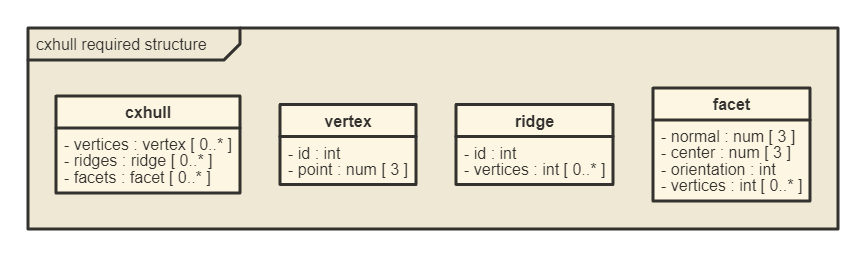
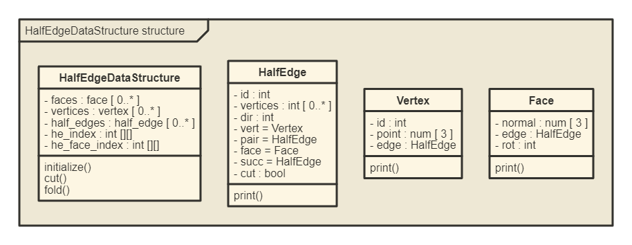

<!-- README.md is generated from README.Rmd. Please edit that file -->

```{r, setup, include=FALSE}
knitr::opts_chunk$set(fig.path = "./man/figures/README-")
library(nomnoml)
```

# halfedgedatastructr

The goal of **halfedgedatastructr** is to implement in R material from the informal discussions of the half-edge data structure at https://jerryyin.info/geometry-processing-algorithms/half-edge/ and
at https://www.flipcode.com/archives/The_Half-Edge_Data_Structure.shtml, together with additional support for spanning trees.


## Structure

This R implementation ingests information in the following form, which is a subset of the form produced by the cxhull::cxhull function (https://cran.r-project.org/package=cxhull):

```{r required, echo=FALSE, out.width = '80%'}

```


An instance of this structure is the following tetetrahedron, using the coordinates from https://en.wikipedia.org/wiki/Tetrahedron#Cartesian_coordinates.

```{r}
tet <- list(
  vertices = list(
    list(id = 1, point = c(1,1,1)),
    list(id = 2, point = c(1,-1,-1)),
    list(id = 3, point = c(-1,1,-1)),
    list(id = 4, point = c(-1,-1,1))
  ),
  ridges = list(
    list(id = 1, vertices = c(1,3)), list(id = 2, vertices = c(2,3)),
    list(id = 3, vertices = c(1,2)), list(id = 4, vertices = c(3,4)),
    list(id = 5, vertices = c(1,4)), list(id = 6, vertices = c(2,4))
  ),
  facets = list(
    list(normal = c(sqrt(3)/3,sqrt(3)/3,-sqrt(3)/3), center = c(1/3,1/3,-1/3),
         orientation = -1, vertices = c(2,1,3)),
    list(normal = c(-sqrt(3)/3,sqrt(3)/3,sqrt(3)/3), center = c(-1/3,1/3,1/3),
         orientation = 1, vertices = c(4,1,3)),
    list(normal = c(-sqrt(3)/3,-sqrt(3)/3,-sqrt(3)/3), center = c(-1/3,-1/3,-1/3),
         orientation = -1, vertices = c(4,2,3)),
    list(normal = c(sqrt(3)/3,-sqrt(3)/3,sqrt(3)/3), center = c(1/3,-1/3,1/3),
         orientation = 1, vertices = c(4,2,1))
  )
)
```


This is converted into a half-edge data structure, which has the following form:
```{r provided, echo=FALSE, out.width = '80%'}

```


## Installation

You can install the development version of halfedgedatastructr from [GitHub](https://github.com/) with:

``` r
# install.packages("devtools")
devtools::install_github("JeffLansing/halfedgedatastructr")
```

