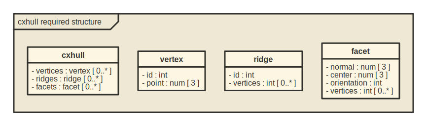
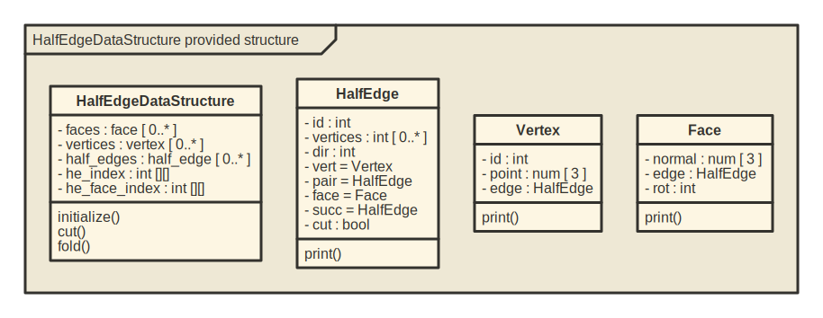

<!-- README.md is generated from README.Rmd. Please edit that file -->

# halfedgedatastructr

The goal of **halfedgedatastructr** is to implement in R material from
the informal discussions of the half-edge data structure at
<https://jerryyin.info/geometry-processing-algorithms/half-edge/> and at
<https://www.flipcode.com/archives/The_Half-Edge_Data_Structure.shtml>,
together with additional support for spanning trees.

## Structure

This R implementation ingests information in the following form, which
is a subset of the form produced by the cxhull::cxhull function
(<https://cran.r-project.org/package=cxhull>):



An instance of this structure is the following tetetrahedron, using the
coordinates from
<https://en.wikipedia.org/wiki/Tetrahedron#Cartesian_coordinates>.

``` r
tet <- list(
  vertices = list(
    list(id = 1, point = c(1,1,1)),
    list(id = 2, point = c(1,-1,-1)),
    list(id = 3, point = c(-1,1,-1)),
    list(id = 4, point = c(-1,-1,1))
  ),
  ridges = list(
    list(id = 1, vertices = c(1,3)), list(id = 2, vertices = c(2,3)),
    list(id = 3, vertices = c(1,2)), list(id = 4, vertices = c(3,4)),
    list(id = 5, vertices = c(1,4)), list(id = 6, vertices = c(2,4))
  ),
  facets = list(
    list(normal = c(sqrt(3)/3,sqrt(3)/3,-sqrt(3)/3), center = c(1/3,1/3,-1/3),
         orientation = -1, vertices = c(2,1,3)),
    list(normal = c(-sqrt(3)/3,sqrt(3)/3,sqrt(3)/3), center = c(-1/3,1/3,1/3),
         orientation = 1, vertices = c(4,1,3)),
    list(normal = c(-sqrt(3)/3,-sqrt(3)/3,-sqrt(3)/3), center = c(-1/3,-1/3,-1/3),
         orientation = -1, vertices = c(4,2,3)),
    list(normal = c(sqrt(3)/3,-sqrt(3)/3,sqrt(3)/3), center = c(1/3,-1/3,1/3),
         orientation = 1, vertices = c(4,2,1))
  )
)
```

This is converted into a half-edge data structure, which has the
following form:


Here is an example, which lists the identifiers for the half-edges in
the structure:

``` r
he_ds <- HalfEdgeDataStructure$new(tet)
hes <- he_ds$half_edges
unlist(lapply(1:length(hes), function(k) {
  hes[[k]]$ix
}))
```

    ##  [1] 103 301 203 302 102 201 304 403 104 401 204 402

## Spanning Trees

Generating spanning trees for polygons is a somewhat guarded art, and
there doesn’t seem to be code for that in R. Fortunately
[SAGE](https://doc.sagemath.org/html/en/reference/graphs/sage/graphs/spanning_tree.html#sage.graphs.spanning_tree.spanning_trees)
provides help for this. The following SAGE code (easily extended to
other polygons) generates all (and only) the spanning trees for the
tetrahedron:

<script src="https://sagecell.sagemath.org/static/embedded_sagecell.js" data-external="1"></script>
<script>sagecell.makeSagecell({"inputLocation": ".sage"});</script>
<link rel="stylesheet" type="text/css" href="https://sagecell.sagemath.org/static/sagecell_embed.css"  data-external="1">
<div class="sage">
  <script type="text/x-sage">
tet = graphs.TetrahedralGraph()
tet.relabel({0:1, 1:2, 2:3, 3:4})
tst = tet.spanning_trees()
reps = []
for i,t in enumerate(tst):
    reps.append(t.graph6_string())
print(*reps, sep = ", ")
  </script>
</div>

The output of the code is this vector of 16 graph6-encoded trees:

|     |     |     |     |     |     |     |     |     |     |     |     |     |     |     |     |
|:----|:----|:----|:----|:----|:----|:----|:----|:----|:----|:----|:----|:----|:----|:----|:----|
| CF  | CL  | CM  | CR  | CX  | CY  | CU  | C\[ | Cb  | Ch  | Ci  | Cd  | Ck  | Cp  | Cq  | Cs  |

which can be converted to the required adjacency matrix form, to then be
used by the cut and fold operations:

``` r
adj_mats <- rgraph6::adjacency_from_graph6(trees)
he_ds$cut <- adj_mats[[1]]

hes <- he_ds$half_edges
unlist(lapply(1:length(hes), function(k) {
  ifelse(hes[[k]]$cut, hes[[k]]$ix, NA)
}))
```

    ##  [1]  NA  NA  NA  NA  NA  NA 304 403 104 401 204 402

``` r
he_ds2 <- HalfEdgeDataStructure$new(tet)
he_ds2$fold <- adj_mats[[16]]

hes2 <- he_ds2$half_edges
unlist(lapply(1:length(hes2), function(k) {
  ifelse(hes2[[k]]$cut, hes2[[k]]$ix, NA)
}))
```

    ##  [1]  NA  NA  NA  NA  NA  NA 304 403 104 401 204 402

So cutting with tree 1 is the same as folding with tree 16.

This duality will be explored further in one of the vignettes.

## Installation

You can install the development version of halfedgedatastructr from
[GitHub](https://github.com/) with:

``` r
# install.packages("devtools")
devtools::install_github("JeffLansing/halfedgedatastructr")
```
