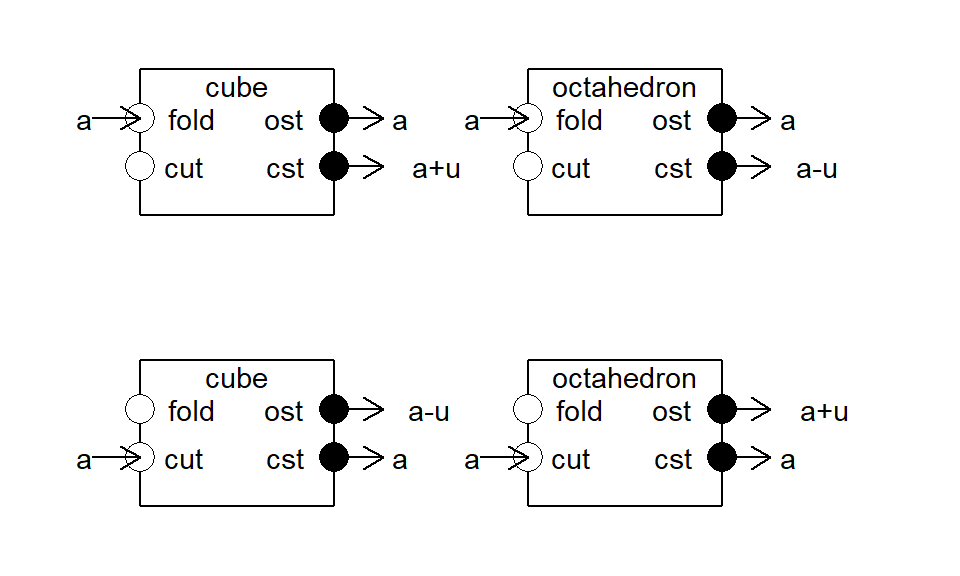
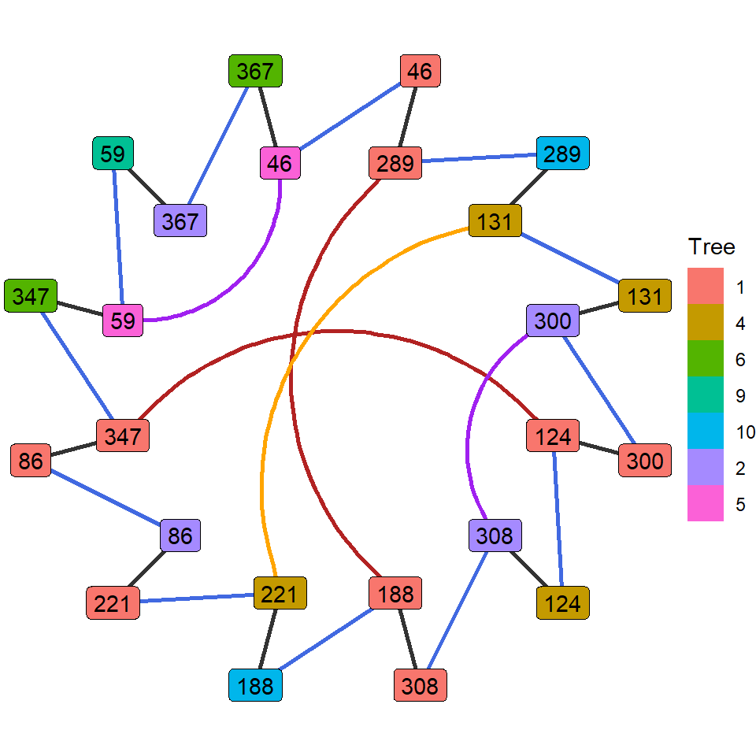

## Introduction

> "Duality in mathematics is not a theorem, but a “principle”. It has a
> simple origin, it is very powerful and useful, and has a long history going
> back hundreds of years. ...
> Fundamentally, duality gives *two different points of view of looking at
> the same object*. There are many things that have two different points
> of view and in principle they are all dualities."
-@atiyah2007duality

In this vignette we look at how the half-edge data structure exposes different sorts of duality, via the *cut* and *fold* operations:

* The duality between a polytope and its geometric dual,

* The duality between the the *cut* and *fold* operations, and

* The duality between two kinds of operations on polytopes.

## Preliminaries

We carefully choose very specific data to work with in this vignette. 
This is a limitation in that we won't know how the results that we see here might generalize to other cases, and it is a freedom since we know exactly what assumptions we are relying on. For example, in this vignette we only consider a very particular cube, and its dual octahedron. The coordinates of this cube are based on the binary representation of the integers from 0 to 7, translated to be centered on the origin, and ordered so that the dual cube of the dual octahedron is oriented the same way as the cube itself is.^[In Figure 1, the outer cube on the left has the same orientation as the inner cube on the right. This is not an accident.] These will be our (3d) polytopes.


``` r
dim = 3
len <- 2**dim
nodes <- Reduce(rbind, lapply(0:(len - 1), function(k) {
  b <- str_sub(paste(rev(as.integer(intToBits(k))), collapse = ""), -dim)
  b %>% strsplit(split = "") %>% unlist() %>% as.numeric()
})) %>% `rownames<-`(NULL)

points <- ((nodes[c(4,8,3,7,6,2,1,5),] - colMeans(nodes)) *2) %>% 
  `colnames<-`(letters[24:26])
```
<table class="table table-condensed" style="width: auto !important; margin-left: auto; margin-right: auto;">
 <thead>
  <tr>
   <th style="text-align:right;"> x </th>
   <th style="text-align:right;"> y </th>
   <th style="text-align:right;"> z </th>
  </tr>
 </thead>
<tbody>
  <tr>
   <td style="text-align:right;"> -1 </td>
   <td style="text-align:right;"> 1 </td>
   <td style="text-align:right;"> 1 </td>
  </tr>
  <tr>
   <td style="text-align:right;"> 1 </td>
   <td style="text-align:right;"> 1 </td>
   <td style="text-align:right;"> 1 </td>
  </tr>
  <tr>
   <td style="text-align:right;"> -1 </td>
   <td style="text-align:right;"> 1 </td>
   <td style="text-align:right;"> -1 </td>
  </tr>
  <tr>
   <td style="text-align:right;"> 1 </td>
   <td style="text-align:right;"> 1 </td>
   <td style="text-align:right;"> -1 </td>
  </tr>
  <tr>
   <td style="text-align:right;"> 1 </td>
   <td style="text-align:right;"> -1 </td>
   <td style="text-align:right;"> 1 </td>
  </tr>
  <tr>
   <td style="text-align:right;"> -1 </td>
   <td style="text-align:right;"> -1 </td>
   <td style="text-align:right;"> 1 </td>
  </tr>
  <tr>
   <td style="text-align:right;"> -1 </td>
   <td style="text-align:right;"> -1 </td>
   <td style="text-align:right;"> -1 </td>
  </tr>
  <tr>
   <td style="text-align:right;"> 1 </td>
   <td style="text-align:right;"> -1 </td>
   <td style="text-align:right;"> -1 </td>
  </tr>
</tbody>
</table>


We will also use some external tools to calculate some of the data used in the vignette. These are [Sage](https://www.sagemath.org/) and [GAP](https://www.gap-system.org/), which will be accessed using [Sage Cells](https://sagecell.sagemath.org/). To run the code shown in any Sage Cell, click the *Evaluate* button below the cell.

First we use the [cxhull](https://cran.r-project.org/package=cxhull) pachage to create a cube and its dual octahedron, which we then use as inputs to *HalfEdgeDataStructure$new()*.


``` r
cube <- points %>% cxhull()
# The copoints are the centers of the faces of the cube:
copoints <- Reduce(rbind, lapply(1:6, function(k) {cube[["facets"]][[k]]$center})) %>% 
  `rownames<-`(NULL) %>% `colnames<-`(letters[24:26])
# The octahedron is made with the copoints:
oct <- copoints %>% cxhull()
```

``` r
cu <- HalfEdgeDataStructure$new(cube)
c(length(cu$vertices), length(cu$faces)) 
#> [1] 8 6

oc <- HalfEdgeDataStructure$new(oct)
c(length(oc$vertices), length(oc$faces))
#> [1] 6 8
```

The following figure shows these two structures in a somewhat simplified form.^[Note that the R code for the display function, together with a few other helper functions, in contained in the file *he_ds_helpers.R*.]


``` r
list(cu, oc) %>% display_hes(c(1,2), special = TRUE)
```

<div class="figure">

```{=html}
<div id="rgl69345" style="width:480px;height:288px;" class="rglWebGL html-widget " aria-labelledby="rgl69345-aria"></div>
<script type="application/json" data-for="rgl69345">{"x":{"material":{"color":"#000000","alpha":1,"lit":true,"ambient":"#000000","specular":"#FFFFFF","emission":"#000000","shininess":50,"smooth":true,"front":"filled","back":"filled","size":3,"lwd":1,"fog":true,"point_antialias":false,"line_antialias":false,"texture":null,"textype":"rgb","texmode":"modulate","texmipmap":false,"texminfilter":"linear","texmagfilter":"linear","texenvmap":false,"depth_mask":true,"depth_test":"less","isTransparent":false,"polygon_offset":[0,0],"margin":"","floating":false,"tag":"","blend":["src_alpha","one_minus_src_alpha"]},"rootSubscene":37,"objects":{"47":{"id":47,"type":"lines","material":{"lit":false},"vertices":"0","colors":"1","centers":"2","ignoreExtent":false,"flags":32832},"48":{"id":48,"type":"lines","material":{"lit":false},"vertices":"3","colors":"4","centers":"5","ignoreExtent":false,"flags":32832},"49":{"id":49,"type":"text","material":{"lit":false},"vertices":"6","colors":"7","texts":[["v2"],["v5"],["v1"],["v2"],["v1"],["v6"],["v5"],["v6"],["v1"],["v3"],["v2"],["v4"],["v3"],["v4"],["v3"],["v7"],["v6"],["v7"],["v5"],["v8"],["v4"],["v8"],["v7"],["v8"]],"cex":[[1]],"adj":[[1.1,0.5,0.5]],"centers":"8","family":[["sans"]],"font":[[2]],"ignoreExtent":false,"flags":33808},"50":{"id":50,"type":"text","material":{"lit":false},"vertices":"9","colors":"10","texts":[["f1"],["f4"],["f1"],["f2"],["f1"],["f3"],["f1"],["f5"],["f2"],["f3"],["f2"],["f4"],["f2"],["f6"],["f3"],["f6"],["f3"],["f5"],["f4"],["f5"],["f4"],["f6"],["f5"],["f6"]],"cex":[[1]],"adj":[[1.1,0.5,0.5]],"centers":"11","family":[["sans"]],"font":[[2]],"ignoreExtent":false,"flags":33808},"51":{"id":51,"type":"lines","material":{"lit":false},"vertices":"12","colors":"13","centers":"14","ignoreExtent":false,"flags":32832},"52":{"id":52,"type":"lines","material":{"lit":false},"vertices":"15","colors":"16","centers":"17","ignoreExtent":false,"flags":32832},"53":{"id":53,"type":"text","material":{"lit":false},"vertices":"18","colors":"19","texts":[["v2"],["v3"],["v1"],["v3"],["v1"],["v2"],["v2"],["v4"],["v1"],["v4"],["v3"],["v6"],["v2"],["v6"],["v4"],["v6"],["v4"],["v5"],["v1"],["v5"],["v3"],["v5"],["v5"],["v6"]],"cex":[[1]],"adj":[[1.1,0.5,0.5]],"centers":"20","family":[["sans"]],"font":[[2]],"ignoreExtent":false,"flags":33808},"54":{"id":54,"type":"text","material":{"lit":false},"vertices":"21","colors":"22","texts":[["f1"],["f3"],["f1"],["f6"],["f1"],["f2"],["f2"],["f4"],["f2"],["f5"],["f3"],["f7"],["f3"],["f4"],["f4"],["f8"],["f5"],["f8"],["f5"],["f6"],["f6"],["f7"],["f7"],["f8"]],"cex":[[1]],"adj":[[1.1,0.5,0.5]],"centers":"23","family":[["sans"]],"font":[[2]],"ignoreExtent":false,"flags":33808},"41":{"id":41,"type":"light","vertices":[[0,0,1]],"colors":[[1,1,1,1],[1,1,1,1],[1,1,1,1]],"viewpoint":true,"finite":false},"40":{"id":40,"type":"background","material":{},"colors":"24","centers":"25","sphere":false,"fogtype":"none","fogscale":1,"flags":32768},"42":{"id":42,"type":"background","material":{"lit":false,"back":"lines"},"colors":"26","centers":"27","sphere":false,"fogtype":"none","fogscale":1,"flags":32768},"45":{"id":45,"type":"subscene","par3d":{"antialias":8,"FOV":10,"ignoreExtent":false,"listeners":45,"mouseMode":{"none":"none","left":"trackball","right":"zoom","middle":"fov","wheel":"pull"},"observer":[0,0,19.8730545043945],"modelMatrix":[[0.939692616462708,0,-0.342020124197006,0],[-0.0593911707401276,0.984807729721069,-0.163175910711288,0],[0.336824059486389,0.173648178577423,0.925416529178619,-19.8730545043945],[0,0,0,1]],"projMatrix":[[5.40587759017944,0,0,0],[0,13.4471197128296,0,0],[0,0,-11.4737129211426,-226.285690307617],[0,0,-1,0]],"skipRedraw":false,"userMatrix":[[0.939692616462708,0,-0.342020124197006,0],[-0.0593911707401276,0.984807729721069,-0.163175910711288,0],[0.336824059486389,0.173648178577423,0.925416529178619,0],[0,0,0,1]],"userProjection":[[1,0,0,0],[0,1,0,0],[0,0,1,0],[0,0,0,1]],"scale":[1,1,1],"viewport":{"x":0,"y":0,"width":0.5,"height":1},"zoom":0.850000023841858,"bbox":[-1,1,-1,1,-1,1],"windowRect":[10,100,2000,500],"family":"sans","font":2,"cex":1,"useFreeType":false,"fontname":"NULL","maxClipPlanes":2147483647,"glVersion":"NA","activeSubscene":0},"embeddings":{"viewport":"replace","projection":"replace","model":"replace","mouse":"inherit"},"objects":[47,48,49,50,41],"parent":37,"subscenes":[],"flags":34128},"46":{"id":46,"type":"subscene","par3d":{"antialias":8,"FOV":10,"ignoreExtent":false,"listeners":46,"mouseMode":{"none":"none","left":"trackball","right":"zoom","middle":"fov","wheel":"pull"},"observer":[0,0,19.8730545043945],"modelMatrix":[[0.939692616462708,0,-0.342020124197006,0],[-0.0593911707401276,0.984807729721069,-0.163175910711288,0],[0.336824059486389,0.173648178577423,0.925416529178619,-19.8730545043945],[0,0,0,1]],"projMatrix":[[5.40587759017944,0,0,0],[0,13.4471197128296,0,0],[0,0,-11.4737129211426,-226.285690307617],[0,0,-1,0]],"skipRedraw":false,"userMatrix":[[0.939692616462708,0,-0.342020124197006,0],[-0.0593911707401276,0.984807729721069,-0.163175910711288,0],[0.336824059486389,0.173648178577423,0.925416529178619,0],[0,0,0,1]],"userProjection":[[1,0,0,0],[0,1,0,0],[0,0,1,0],[0,0,0,1]],"scale":[1,1,1],"viewport":{"x":0.5,"y":0,"width":0.5,"height":1},"zoom":0.850000023841858,"bbox":[-1,1,-1,1,-1,1],"windowRect":[10,100,2000,500],"family":"sans","font":2,"cex":1,"useFreeType":false,"fontname":"NULL","maxClipPlanes":2147483647,"glVersion":"NA","activeSubscene":0},"embeddings":{"viewport":"replace","projection":"replace","model":"replace","mouse":"inherit"},"objects":[51,52,53,54,41],"parent":37,"subscenes":[],"flags":34128},"37":{"id":37,"type":"subscene","par3d":{"antialias":8,"FOV":10,"ignoreExtent":false,"listeners":37,"mouseMode":{"none":"none","left":"trackball","right":"zoom","middle":"fov","wheel":"pull"},"observer":[0,0,2444.38598632812],"modelMatrix":[[0.939692616462708,0,-0.342020124197006,0],[-0.0593911707401276,0.984807729721069,-0.163175910711288,0],[0.336824059486389,0.173648178577423,0.925416529178619,-2444.38598632812],[0,0,0,1]],"projMatrix":[[2.70293879508972,0,0,0],[0,13.4471216201782,0,0],[0,0,-11.4737157821655,-27833.1484375],[0,0,-1,0]],"skipRedraw":false,"userMatrix":[[0.939692616462708,0,-0.342020124197006,0],[-0.0593911707401276,0.984807729721069,-0.163175910711288,0],[0.336824059486389,0.173648178577423,0.925416529178619,0],[0,0,0,1]],"userProjection":[[1,0,0,0],[0,1,0,0],[0,0,1,0],[0,0,0,1]],"scale":[1,1,1],"viewport":{"x":0,"y":0,"width":1,"height":1},"zoom":0.850000023841858,"bbox":[123,-123,123,-123,123,-123],"windowRect":[10,100,2000,500],"family":"sans","font":2,"cex":1,"useFreeType":false,"fontname":"NULL","maxClipPlanes":2147483647,"glVersion":"NA","activeSubscene":0},"embeddings":{"viewport":"replace","projection":"replace","model":"replace","mouse":"replace"},"objects":[42,41,45,46],"subscenes":[45,46],"flags":34128}},"crosstalk":{"key":[],"group":[],"id":[],"options":[]},"width":480,"height":288,"buffer":{"accessors":[{"bufferView":0,"componentType":5120,"count":24,"type":"VEC3"},{"bufferView":1,"componentType":5121,"count":1,"type":"VEC4"},{"bufferView":2,"componentType":5120,"count":12,"type":"VEC3"},{"bufferView":3,"componentType":5120,"count":24,"type":"VEC3"},{"bufferView":4,"componentType":5121,"count":1,"type":"VEC4"},{"bufferView":5,"componentType":5126,"count":12,"type":"VEC3"},{"bufferView":6,"componentType":5120,"count":24,"type":"VEC3"},{"bufferView":7,"componentType":5121,"count":1,"type":"VEC4"},{"bufferView":8,"componentType":5120,"count":24,"type":"VEC3"},{"bufferView":9,"componentType":5120,"count":24,"type":"VEC3"},{"bufferView":10,"componentType":5121,"count":1,"type":"VEC4"},{"bufferView":11,"componentType":5120,"count":24,"type":"VEC3"},{"bufferView":12,"componentType":5120,"count":24,"type":"VEC3"},{"bufferView":13,"componentType":5121,"count":1,"type":"VEC4"},{"bufferView":14,"componentType":5126,"count":12,"type":"VEC3"},{"bufferView":15,"componentType":5126,"count":24,"type":"VEC3"},{"bufferView":16,"componentType":5121,"count":1,"type":"VEC4"},{"bufferView":17,"componentType":5126,"count":12,"type":"VEC3"},{"bufferView":18,"componentType":5120,"count":24,"type":"VEC3"},{"bufferView":19,"componentType":5121,"count":1,"type":"VEC4"},{"bufferView":20,"componentType":5120,"count":24,"type":"VEC3"},{"bufferView":21,"componentType":5126,"count":24,"type":"VEC3"},{"bufferView":22,"componentType":5121,"count":1,"type":"VEC4"},{"bufferView":23,"componentType":5126,"count":24,"type":"VEC3"},{"bufferView":24,"componentType":5126,"count":1,"type":"VEC4"},{"bufferView":25,"componentType":5121,"count":1,"type":"VEC3"},{"bufferView":26,"componentType":5121,"count":1,"type":"VEC4"},{"bufferView":27,"componentType":5121,"count":1,"type":"VEC3"}],"bufferViews":[{"buffer":0,"byteLength":72,"byteOffset":0},{"buffer":0,"byteLength":4,"byteOffset":72},{"buffer":0,"byteLength":36,"byteOffset":76},{"buffer":0,"byteLength":72,"byteOffset":112},{"buffer":0,"byteLength":4,"byteOffset":184},{"buffer":0,"byteLength":144,"byteOffset":188},{"buffer":0,"byteLength":72,"byteOffset":332},{"buffer":0,"byteLength":4,"byteOffset":404},{"buffer":0,"byteLength":72,"byteOffset":408},{"buffer":0,"byteLength":72,"byteOffset":480},{"buffer":0,"byteLength":4,"byteOffset":552},{"buffer":0,"byteLength":72,"byteOffset":556},{"buffer":0,"byteLength":72,"byteOffset":628},{"buffer":0,"byteLength":4,"byteOffset":700},{"buffer":0,"byteLength":144,"byteOffset":704},{"buffer":0,"byteLength":288,"byteOffset":848},{"buffer":0,"byteLength":4,"byteOffset":1136},{"buffer":0,"byteLength":144,"byteOffset":1140},{"buffer":0,"byteLength":72,"byteOffset":1284},{"buffer":0,"byteLength":4,"byteOffset":1356},{"buffer":0,"byteLength":72,"byteOffset":1360},{"buffer":0,"byteLength":288,"byteOffset":1432},{"buffer":0,"byteLength":4,"byteOffset":1720},{"buffer":0,"byteLength":288,"byteOffset":1724},{"buffer":0,"byteLength":16,"byteOffset":2012},{"buffer":0,"byteLength":3,"byteOffset":2028},{"buffer":0,"byteLength":4,"byteOffset":2031},{"buffer":0,"byteLength":3,"byteOffset":2035}],"buffers":[{"byteLength":2038,"bytes":"AQEBAf8B/wEBAQEB/wEB//8BAf8B//8B/wEB/wH/AQEBAQH//wH/AQH//wH///////8B////\nAf8BAf//AQH/Af//////Af//AAAAAQEAAQABAf8AAQD/Af8BAAEBAAAB//8A////AAH/AAEA\n/wD//wAAAQEAAAAAAQABAAAAAf8AAAAAAQD/AAABAP8AAAABAAEAAAABAAAA//8AAAAA//8A\nAAD/AAEAAAD/AAEAAAAA/wD/AAAA/wEAAAEAAAA/AAAAAAAAAD8AAAAAAAAAPwAAAD8AAAC/\nAAAAAAAAAD8AAAAAAAAAvwAAAD8AAAC/AAAAPwAAAAAAAAA/AAAAPwAAAAAAAAAAAAAAPwAA\nAL8AAAC/AAAAAAAAAL8AAAC/AAAAvwAAAAAAAAA/AAAAvwAAAAAAAAA/AAAAAAAAAL8AAAAA\nAAAAvwAAAL8BAQEB/wH/AQEBAQH/AQH//wEB/wH//wH/AQH/Af8BAQEBAf//Af8BAf//Af//\n/////wH///8B/wEB//8BAf8B//////8B//8AAAABAQEBAf8B/wEBAQEB/wEB//8BAf8B//8B\n/wEB/wH/AQEBAQH//wH/AQH//wH///////8B////Af8BAf//AQH/Af//////Af//AAABAQAA\nAAABAAEAAAAB/wAAAAABAP8AAAEA/wAAAAEAAQAAAAEAAAD//wAAAAD//wAAAP8AAQAAAP8A\nAQAAAAD/AP8AAAD/AQAAAQAAAQEAAAAAAQABAAAAAf8AAAAAAQD/AAABAP8AAAABAAEAAAAB\nAAAA//8AAAAA//8AAAD/AAEAAAD/AAEAAAAA/wD/AAAA/wABAP8AAAAAAf8AAAAAAQABAAAB\nAAEAAAAAAQEAAP8AAAAA/wABAAAA/wEAAAAA/wEAAAD/AAAAAQD/AP8AAAD/AAD/AAAA/wAA\nAAEAAAC/AAAAPwAAAAAAAAC/AAAAAAAAAD8AAAAAAAAAPwAAAD8AAAA/AAAAPwAAAAAAAAA/\nAAAAAAAAAD8AAAC/AAAAAAAAAL8AAAAAAAAAPwAAAL8AAAA/AAAAAAAAAL8AAAA/AAAAvwAA\nAAAAAAAAAAAAvwAAAD8AAAC/AAAAvwAAAAAAAAAAAAAAvwAAAL+rqqq+q6qqPquqqj6rqqq+\nq6qqPquqqr6rqqq+q6qqPquqqj6rqqq+q6qqvquqqj6rqqq+q6qqPquqqj6rqqo+q6qqPquq\nqj6rqqo+q6qqPquqqj6rqqo+q6qqPquqqr6rqqo+q6qqPquqqj6rqqo+q6qqvquqqj6rqqq+\nq6qqPquqqr6rqqq+q6qqvquqqr6rqqq+q6qqPquqqr6rqqo+q6qqPquqqr6rqqo+q6qqPquq\nqr6rqqo+q6qqvquqqr6rqqo+q6qqvquqqj6rqqo+q6qqvquqqr6rqqo+q6qqvquqqj6rqqq+\nq6qqvquqqj6rqqq+q6qqvquqqj6rqqq+q6qqvquqqr6rqqq+q6qqvquqqr6rqqo+q6qqvquq\nqr4BAAABq6qqvquqqj4AAAAAq6qqvgAAAACrqqo+AAAAAKuqqj6rqqo+q6qqPquqqj4AAAAA\nq6qqPgAAAACrqqo+q6qqvgAAAACrqqq+AAAAAKuqqj6rqqq+q6qqPgAAAACrqqq+q6qqPquq\nqr4AAAAAAAAAAKuqqr6rqqo+q6qqvquqqr4AAAAAAAAAAKuqqr6rqqq+AAEA/wAAAAAB/wAA\nAAABAAEAAAEAAQAAAAABAQAA/wAAAAD/AAEAAAD/AQAAAAD/AQAAAP8AAAABAP8A/wAAAP8A\nAP8AAAD/AAAAAQABAP8AAAAAAf8AAAAAAQABAAABAAEAAAAAAQEAAP8AAAAA/wABAAAA/wEA\nAAAA/wEAAAD/AAAAAQD/AP8AAAD/AAD/AAAA/6uqqr6rqqo+q6qqPquqqr6rqqo+q6qqvquq\nqr6rqqo+q6qqPquqqr6rqqq+q6qqPquqqr6rqqo+q6qqPquqqj6rqqo+q6qqPquqqj6rqqo+\nq6qqPquqqj6rqqo+q6qqvquqqj6rqqo+q6qqPquqqj6rqqq+q6qqPquqqr6rqqo+q6qqvquq\nqr6rqqq+q6qqvquqqr6rqqo+q6qqvquqqj6rqqo+q6qqvquqqj6rqqo+q6qqvquqqj6rqqq+\nq6qqvquqqj6rqqq+q6qqPquqqj6rqqq+q6qqvquqqj6rqqq+q6qqPquqqr6rqqq+q6qqPquq\nqr6rqqq+q6qqPquqqr6rqqq+q6qqvquqqr6rqqq+q6qqvquqqj6rqqq+q6qqvgEAAAGrqqq+\nq6qqPquqqj6rqqq+q6qqPquqqr6rqqq+q6qqPquqqj6rqqq+q6qqvquqqj6rqqq+q6qqPquq\nqj6rqqo+q6qqPquqqj6rqqo+q6qqPquqqj6rqqo+q6qqPquqqr6rqqo+q6qqPquqqj6rqqo+\nq6qqvquqqj6rqqq+q6qqPquqqr6rqqq+q6qqvquqqr6rqqq+q6qqPquqqr6rqqo+q6qqPquq\nqr6rqqo+q6qqPquqqr6rqqo+q6qqvquqqr6rqqo+q6qqvquqqj6rqqo+q6qqvquqqr6rqqo+\nq6qqvquqqj6rqqq+q6qqvquqqj6rqqq+q6qqvquqqj6rqqq+q6qqvquqqr6rqqq+q6qqvquq\nqr6rqqo+q6qqvquqqr6ZmJg+mZiYPpmYmD4AAIA/AAAAAQEBAQAAAA=="}]},"context":{"shiny":false,"rmarkdown":"rmarkdown::html_vignette"},"vertexShader":"#line 2 1\n// File 1 is the vertex shader\n#ifdef GL_ES\n#ifdef GL_FRAGMENT_PRECISION_HIGH\nprecision highp float;\n#else\nprecision mediump float;\n#endif\n#endif\n\nattribute vec3 aPos;\nattribute vec4 aCol;\nuniform mat4 mvMatrix;\nuniform mat4 prMatrix;\nvarying vec4 vCol;\nvarying vec4 vPosition;\n\n#ifdef NEEDS_VNORMAL\nattribute vec3 aNorm;\nuniform mat4 normMatrix;\nvarying vec4 vNormal;\n#endif\n\n#if defined(HAS_TEXTURE) || defined (IS_TEXT)\nattribute vec2 aTexcoord;\nvarying vec2 vTexcoord;\n#endif\n\n#ifdef FIXED_SIZE\nuniform vec3 textScale;\n#endif\n\n#ifdef FIXED_QUADS\nattribute vec3 aOfs;\n#endif\n\n#ifdef IS_TWOSIDED\n#ifdef HAS_NORMALS\nvarying float normz;\nuniform mat4 invPrMatrix;\n#else\nattribute vec3 aPos1;\nattribute vec3 aPos2;\nvarying float normz;\n#endif\n#endif // IS_TWOSIDED\n\n#ifdef FAT_LINES\nattribute vec3 aNext;\nattribute vec2 aPoint;\nvarying vec2 vPoint;\nvarying float vLength;\nuniform float uAspect;\nuniform float uLwd;\n#endif\n\n#ifdef USE_ENVMAP\nvarying vec3 vReflection;\n#endif\n\nvoid main(void) {\n  \n#ifndef IS_BRUSH\n#if defined(NCLIPPLANES) || !defined(FIXED_QUADS) || defined(HAS_FOG) || defined(USE_ENVMAP)\n  vPosition = mvMatrix * vec4(aPos, 1.);\n#endif\n  \n#ifndef FIXED_QUADS\n  gl_Position = prMatrix * vPosition;\n#endif\n#endif // !IS_BRUSH\n  \n#ifdef IS_POINTS\n  gl_PointSize = POINTSIZE;\n#endif\n  \n  vCol = aCol;\n  \n// USE_ENVMAP implies NEEDS_VNORMAL\n\n#ifdef NEEDS_VNORMAL\n  vNormal = normMatrix * vec4(-aNorm, dot(aNorm, aPos));\n#endif\n\n#ifdef USE_ENVMAP\n  vReflection = normalize(reflect(vPosition.xyz/vPosition.w, \n                        normalize(vNormal.xyz/vNormal.w)));\n#endif\n  \n#ifdef IS_TWOSIDED\n#ifdef HAS_NORMALS\n  /* normz should be calculated *after* projection */\n  normz = (invPrMatrix*vNormal).z;\n#else\n  vec4 pos1 = prMatrix*(mvMatrix*vec4(aPos1, 1.));\n  pos1 = pos1/pos1.w - gl_Position/gl_Position.w;\n  vec4 pos2 = prMatrix*(mvMatrix*vec4(aPos2, 1.));\n  pos2 = pos2/pos2.w - gl_Position/gl_Position.w;\n  normz = pos1.x*pos2.y - pos1.y*pos2.x;\n#endif\n#endif // IS_TWOSIDED\n  \n#ifdef NEEDS_VNORMAL\n  vNormal = vec4(normalize(vNormal.xyz/vNormal.w), 1);\n#endif\n  \n#if defined(HAS_TEXTURE) || defined(IS_TEXT)\n  vTexcoord = aTexcoord;\n#endif\n  \n#if defined(FIXED_SIZE) && !defined(ROTATING)\n  vec4 pos = prMatrix * mvMatrix * vec4(aPos, 1.);\n  pos = pos/pos.w;\n  gl_Position = pos + vec4(aOfs*textScale, 0.);\n#endif\n  \n#if defined(IS_SPRITES) && !defined(FIXED_SIZE)\n  vec4 pos = mvMatrix * vec4(aPos, 1.);\n  pos = pos/pos.w + vec4(aOfs,  0.);\n  gl_Position = prMatrix*pos;\n#endif\n  \n#ifdef FAT_LINES\n  /* This code was inspired by Matt Deslauriers' code in \n   https://mattdesl.svbtle.com/drawing-lines-is-hard */\n  vec2 aspectVec = vec2(uAspect, 1.0);\n  mat4 projViewModel = prMatrix * mvMatrix;\n  vec4 currentProjected = projViewModel * vec4(aPos, 1.0);\n  currentProjected = currentProjected/currentProjected.w;\n  vec4 nextProjected = projViewModel * vec4(aNext, 1.0);\n  vec2 currentScreen = currentProjected.xy * aspectVec;\n  vec2 nextScreen = (nextProjected.xy / nextProjected.w) * aspectVec;\n  float len = uLwd;\n  vec2 dir = vec2(1.0, 0.0);\n  vPoint = aPoint;\n  vLength = length(nextScreen - currentScreen)/2.0;\n  vLength = vLength/(vLength + len);\n  if (vLength > 0.0) {\n    dir = normalize(nextScreen - currentScreen);\n  }\n  vec2 normal = vec2(-dir.y, dir.x);\n  dir.x /= uAspect;\n  normal.x /= uAspect;\n  vec4 offset = vec4(len*(normal*aPoint.x*aPoint.y - dir), 0.0, 0.0);\n  gl_Position = currentProjected + offset;\n#endif\n  \n#ifdef IS_BRUSH\n  gl_Position = vec4(aPos, 1.);\n#endif\n}","fragmentShader":"#line 2 2\n// File 2 is the fragment shader\n#ifdef GL_ES\n#ifdef GL_FRAGMENT_PRECISION_HIGH\nprecision highp float;\n#else\nprecision mediump float;\n#endif\n#endif\nvarying vec4 vCol; // carries alpha\nvarying vec4 vPosition;\n#if defined(HAS_TEXTURE) || defined (IS_TEXT)\nvarying vec2 vTexcoord;\nuniform sampler2D uSampler;\n#endif\n\n#ifdef HAS_FOG\nuniform int uFogMode;\nuniform vec3 uFogColor;\nuniform vec4 uFogParms;\n#endif\n\n#if defined(IS_LIT) && !defined(FIXED_QUADS)\nvarying vec4 vNormal;\n#endif\n\n#if NCLIPPLANES > 0\nuniform vec4 vClipplane[NCLIPPLANES];\n#endif\n\n#if NLIGHTS > 0\nuniform mat4 mvMatrix;\n#endif\n\n#ifdef IS_LIT\nuniform vec3 emission;\nuniform float shininess;\n#if NLIGHTS > 0\nuniform vec3 ambient[NLIGHTS];\nuniform vec3 specular[NLIGHTS]; // light*material\nuniform vec3 diffuse[NLIGHTS];\nuniform vec3 lightDir[NLIGHTS];\nuniform bool viewpoint[NLIGHTS];\nuniform bool finite[NLIGHTS];\n#endif\n#endif // IS_LIT\n\n#ifdef IS_TWOSIDED\nuniform bool front;\nvarying float normz;\n#endif\n\n#ifdef FAT_LINES\nvarying vec2 vPoint;\nvarying float vLength;\n#endif\n\n#ifdef USE_ENVMAP\nvarying vec3 vReflection;\n#endif\n\nvoid main(void) {\n  vec4 fragColor;\n#ifdef FAT_LINES\n  vec2 point = vPoint;\n  bool neg = point.y < 0.0;\n  point.y = neg ? (point.y + vLength)/(1.0 - vLength) :\n                 -(point.y - vLength)/(1.0 - vLength);\n#if defined(IS_TRANSPARENT) && defined(IS_LINESTRIP)\n  if (neg && length(point) <= 1.0) discard;\n#endif\n  point.y = min(point.y, 0.0);\n  if (length(point) > 1.0) discard;\n#endif // FAT_LINES\n  \n#ifdef ROUND_POINTS\n  vec2 coord = gl_PointCoord - vec2(0.5);\n  if (length(coord) > 0.5) discard;\n#endif\n  \n#if NCLIPPLANES > 0\n  for (int i = 0; i < NCLIPPLANES; i++)\n    if (dot(vPosition, vClipplane[i]) < 0.0) discard;\n#endif\n    \n#ifdef FIXED_QUADS\n    vec3 n = vec3(0., 0., 1.);\n#elif defined(IS_LIT)\n    vec3 n = normalize(vNormal.xyz);\n#endif\n    \n#ifdef IS_TWOSIDED\n    if ((normz <= 0.) != front) discard;\n#endif\n\n#ifdef IS_LIT\n    vec3 eye = normalize(-vPosition.xyz/vPosition.w);\n    vec3 lightdir;\n    vec4 colDiff;\n    vec3 halfVec;\n    vec4 lighteffect = vec4(emission, 0.);\n    vec3 col;\n    float nDotL;\n#ifdef FIXED_QUADS\n    n = -faceforward(n, n, eye);\n#endif\n    \n#if NLIGHTS > 0\n    for (int i=0;i<NLIGHTS;i++) {\n      colDiff = vec4(vCol.rgb * diffuse[i], vCol.a);\n      lightdir = lightDir[i];\n      if (!viewpoint[i])\n        lightdir = (mvMatrix * vec4(lightdir, 1.)).xyz;\n      if (!finite[i]) {\n        halfVec = normalize(lightdir + eye);\n      } else {\n        lightdir = normalize(lightdir - vPosition.xyz/vPosition.w);\n        halfVec = normalize(lightdir + eye);\n      }\n      col = ambient[i];\n      nDotL = dot(n, lightdir);\n      col = col + max(nDotL, 0.) * colDiff.rgb;\n      col = col + pow(max(dot(halfVec, n), 0.), shininess) * specular[i];\n      lighteffect = lighteffect + vec4(col, colDiff.a);\n    }\n#endif\n    \n#else // not IS_LIT\n    vec4 colDiff = vCol;\n    vec4 lighteffect = colDiff;\n#endif\n    \n#ifdef IS_TEXT\n    vec4 textureColor = lighteffect*texture2D(uSampler, vTexcoord);\n#endif\n    \n#ifdef HAS_TEXTURE\n\n// These calculations use the definitions from \n// https://docs.gl/gl3/glTexEnv\n\n#ifdef USE_ENVMAP\n    float m = 2.0 * sqrt(dot(vReflection, vReflection) + 2.0*vReflection.z + 1.0);\n    vec4 textureColor = texture2D(uSampler, vReflection.xy / m + vec2(0.5, 0.5));\n#else\n    vec4 textureColor = texture2D(uSampler, vTexcoord);\n#endif\n\n#ifdef TEXTURE_rgb\n\n#if defined(TEXMODE_replace) || defined(TEXMODE_decal)\n    textureColor = vec4(textureColor.rgb, lighteffect.a);\n#endif \n\n#ifdef TEXMODE_modulate\n    textureColor = lighteffect*vec4(textureColor.rgb, 1.);\n#endif\n\n#ifdef TEXMODE_blend\n    textureColor = vec4((1. - textureColor.rgb) * lighteffect.rgb, lighteffect.a);\n#endif\n\n#ifdef TEXMODE_add\n    textureColor = vec4(lighteffect.rgb + textureColor.rgb, lighteffect.a);\n#endif\n\n#endif //TEXTURE_rgb\n        \n#ifdef TEXTURE_rgba\n\n#ifdef TEXMODE_replace\n// already done\n#endif \n\n#ifdef TEXMODE_modulate\n    textureColor = lighteffect*textureColor;\n#endif\n\n#ifdef TEXMODE_decal\n    textureColor = vec4((1. - textureColor.a)*lighteffect.rgb) +\n                     textureColor.a*textureColor.rgb, \n                     lighteffect.a);\n#endif\n\n#ifdef TEXMODE_blend\n    textureColor = vec4((1. - textureColor.rgb) * lighteffect.rgb,\n                    lighteffect.a*textureColor.a);\n#endif\n\n#ifdef TEXMODE_add\n    textureColor = vec4(lighteffect.rgb + textureColor.rgb,\n                    lighteffect.a*textureColor.a);\n#endif\n    \n#endif //TEXTURE_rgba\n    \n#ifdef TEXTURE_alpha\n#if defined(TEXMODE_replace) || defined(TEXMODE_decal)\n    textureColor = vec4(lighteffect.rgb, textureColor.a);\n#endif \n\n#if defined(TEXMODE_modulate) || defined(TEXMODE_blend) || defined(TEXMODE_add)\n    textureColor = vec4(lighteffect.rgb, lighteffect.a*textureColor.a);\n#endif\n \n#endif\n    \n// The TEXTURE_luminance values are not from that reference    \n#ifdef TEXTURE_luminance\n    float luminance = dot(vec3(1.,1.,1.),textureColor.rgb)/3.;\n\n#if defined(TEXMODE_replace) || defined(TEXMODE_decal)\n    textureColor = vec4(luminance, luminance, luminance, lighteffect.a);\n#endif \n\n#ifdef TEXMODE_modulate\n    textureColor = vec4(luminance*lighteffect.rgb, lighteffect.a);\n#endif\n\n#ifdef TEXMODE_blend\n    textureColor = vec4((1. - luminance)*lighteffect.rgb,\n                        lighteffect.a);\n#endif\n\n#ifdef TEXMODE_add\n    textureColor = vec4(luminance + lighteffect.rgb, lighteffect.a);\n#endif\n\n#endif // TEXTURE_luminance\n \n    \n#ifdef TEXTURE_luminance_alpha\n    float luminance = dot(vec3(1.,1.,1.),textureColor.rgb)/3.;\n\n#if defined(TEXMODE_replace) || defined(TEXMODE_decal)\n    textureColor = vec4(luminance, luminance, luminance, textureColor.a);\n#endif \n\n#ifdef TEXMODE_modulate\n    textureColor = vec4(luminance*lighteffect.rgb, \n                        textureColor.a*lighteffect.a);\n#endif\n\n#ifdef TEXMODE_blend\n    textureColor = vec4((1. - luminance)*lighteffect.rgb,\n                        textureColor.a*lighteffect.a);\n#endif\n\n#ifdef TEXMODE_add\n    textureColor = vec4(luminance + lighteffect.rgb, \n                        textureColor.a*lighteffect.a);\n\n#endif\n\n#endif // TEXTURE_luminance_alpha\n    \n    fragColor = textureColor;\n\n#elif defined(IS_TEXT)\n    if (textureColor.a < 0.1)\n      discard;\n    else\n      fragColor = textureColor;\n#else\n    fragColor = lighteffect;\n#endif // HAS_TEXTURE\n    \n#ifdef HAS_FOG\n    // uFogParms elements: x = near, y = far, z = fogscale, w = (1-sin(FOV/2))/(1+sin(FOV/2))\n    // In Exp and Exp2: use density = density/far\n    // fogF will be the proportion of fog\n    // Initialize it to the linear value\n    float fogF;\n    if (uFogMode > 0) {\n      fogF = (uFogParms.y - vPosition.z/vPosition.w)/(uFogParms.y - uFogParms.x);\n      if (uFogMode > 1)\n        fogF = mix(uFogParms.w, 1.0, fogF);\n      fogF = fogF*uFogParms.z;\n      if (uFogMode == 2)\n        fogF = 1.0 - exp(-fogF);\n      // Docs are wrong: use (density*c)^2, not density*c^2\n      // https://gitlab.freedesktop.org/mesa/mesa/-/blob/master/src/mesa/swrast/s_fog.c#L58\n      else if (uFogMode == 3)\n        fogF = 1.0 - exp(-fogF*fogF);\n      fogF = clamp(fogF, 0.0, 1.0);\n      gl_FragColor = vec4(mix(fragColor.rgb, uFogColor, fogF), fragColor.a);\n    } else gl_FragColor = fragColor;\n#else\n    gl_FragColor = fragColor;\n#endif // HAS_FOG\n    \n}","players":[],"webGLoptions":{"preserveDrawingBuffer":true}},"evals":[],"jsHooks":[]}</script>
```

<p class="caption" id="rgl69345-aria">Figure 1. cube and octahedron</p>
</div>
Next we would like to generate the spanning trees for these two objects.
We use the [graph6 representation](https://users.cecs.anu.edu.au/~bdm/data/formats.txt) as a convenient portable format that we can pass to Sage. These somewhat bulky lists are also stored as data in the *halfedgedatastr* package.^[Their names are *cube_span_trees*"* and *oct_span_trees*.]


``` r
cu_am <- cu %>% edgelist_from_he_ds() %>% `[`(, c(7:8)) %>% 
  edgelist_to_adjmat()
oc_am <- oc %>% edgelist_from_he_ds() %>% `[`(, c(7:8)) %>% 
  edgelist_to_adjmat()
cu_am %>% as_graph6()
#> [1] "GrQHGs"
oc_am %>%  as_graph6()
#> [1] "E}lw"
```

Now we can use the graph6 representations of the cube and otahedron in order to use Sage to get the spanning trees (also in graph6). There are 384 of each of them, as expected from Kirchhoff's matrix-tree theorem.

```{=html}
<script src="https://sagecell.sagemath.org/static/embedded_sagecell.js" data-external="1"></script>
<script>sagecell.makeSagecell({"inputLocation": ".sage"});</script>
<link rel="stylesheet" type="text/css" href="https://sagecell.sagemath.org/static/sagecell_embed.css"  data-external="1">
<div class="sage">
  <script type="text/x-sage">
cube = Graph("GrQHGs")
cst = cube.spanning_trees()
reps = []
for i,t in enumerate(cst):
    reps.append(t.graph6_string())
print(*reps, sep = "', '")
  </script>
</div>
```
```{=html}
<script src="https://sagecell.sagemath.org/static/embedded_sagecell.js" data-external="1"></script>
<script>sagecell.makeSagecell({"inputLocation": ".sage"});</script>
<link rel="stylesheet" type="text/css" href="https://sagecell.sagemath.org/static/sagecell_embed.css"  data-external="1">
<div class="sage">
  <script type="text/x-sage">
cube = Graph("E}lw")
cst = cube.spanning_trees()
reps = []
for i,t in enumerate(cst):
    reps.append(t.graph6_string())
print(*reps, sep = "', '")
  </script>
</div>
```

## Cut and Fold

In this section we want to look at the 384 (times 2) spanning trees that we produced in the previous section. We start with the first one.


``` r
cu <- HalfEdgeDataStructure$new(cube)
cu$cut <- cube_span_trees[,,1]

oc <- HalfEdgeDataStructure$new(oct)
oc$fold <- cube_span_trees[,,1]

list(cu, oc) %>% display_hes(c(1,2))
```

<div class="figure">

```{=html}
<div id="rgl46802" style="width:480px;height:288px;" class="rglWebGL html-widget " aria-labelledby="rgl46802-aria"></div>
<script type="application/json" data-for="rgl46802">{"x":{"material":{"color":"#000000","alpha":1,"lit":true,"ambient":"#000000","specular":"#FFFFFF","emission":"#000000","shininess":50,"smooth":true,"front":"filled","back":"filled","size":3,"lwd":1,"fog":true,"point_antialias":false,"line_antialias":false,"texture":null,"textype":"rgb","texmode":"modulate","texmipmap":false,"texminfilter":"linear","texmagfilter":"linear","texenvmap":false,"depth_mask":true,"depth_test":"less","isTransparent":false,"polygon_offset":[0,0],"margin":"","floating":false,"tag":"","blend":["src_alpha","one_minus_src_alpha"]},"rootSubscene":67,"objects":{"77":{"id":77,"type":"lines","material":{"lit":false},"vertices":"0","colors":"1","centers":"2","ignoreExtent":false,"flags":32832},"78":{"id":78,"type":"lines","material":{"lit":false},"vertices":"3","colors":"4","centers":"5","ignoreExtent":false,"flags":32832},"79":{"id":79,"type":"lines","material":{"lit":false},"vertices":"6","colors":"7","centers":"8","ignoreExtent":false,"flags":32832},"80":{"id":80,"type":"lines","material":{"lit":false},"vertices":"9","colors":"10","centers":"11","ignoreExtent":false,"flags":32832},"81":{"id":81,"type":"text","material":{"lit":false},"vertices":"12","colors":"13","texts":[["v2"],["v5"],["v1"],["v2"],["v1"],["v6"],["v5"],["v6"],["v1"],["v3"],["v2"],["v4"],["v3"],["v4"],["v3"],["v7"],["v6"],["v7"],["v5"],["v8"],["v4"],["v8"],["v7"],["v8"]],"cex":[[1]],"adj":[[1.1,0.5,0.5]],"centers":"14","family":[["sans"]],"font":[[2]],"ignoreExtent":false,"flags":33808},"82":{"id":82,"type":"text","material":{"lit":false},"vertices":"15","colors":"16","texts":[["f1"],["f4"],["f1"],["f2"],["f1"],["f3"],["f1"],["f5"],["f2"],["f3"],["f2"],["f4"],["f2"],["f6"],["f3"],["f6"],["f3"],["f5"],["f4"],["f5"],["f4"],["f6"],["f5"],["f6"]],"cex":[[1]],"adj":[[1.1,0.5,0.5]],"centers":"17","family":[["sans"]],"font":[[2]],"ignoreExtent":false,"flags":33808},"83":{"id":83,"type":"lines","material":{"lit":false},"vertices":"18","colors":"19","centers":"20","ignoreExtent":false,"flags":32832},"84":{"id":84,"type":"lines","material":{"lit":false},"vertices":"21","colors":"22","centers":"23","ignoreExtent":false,"flags":32832},"85":{"id":85,"type":"lines","material":{"lit":false},"vertices":"24","colors":"25","centers":"26","ignoreExtent":false,"flags":32832},"86":{"id":86,"type":"lines","material":{"lit":false},"vertices":"27","colors":"28","centers":"29","ignoreExtent":false,"flags":32832},"87":{"id":87,"type":"text","material":{"lit":false},"vertices":"30","colors":"31","texts":[["v2"],["v3"],["v1"],["v3"],["v1"],["v2"],["v2"],["v4"],["v1"],["v4"],["v3"],["v6"],["v2"],["v6"],["v4"],["v6"],["v4"],["v5"],["v1"],["v5"],["v3"],["v5"],["v5"],["v6"]],"cex":[[1]],"adj":[[1.1,0.5,0.5]],"centers":"32","family":[["sans"]],"font":[[2]],"ignoreExtent":false,"flags":33808},"88":{"id":88,"type":"text","material":{"lit":false},"vertices":"33","colors":"34","texts":[["f1"],["f3"],["f1"],["f6"],["f1"],["f2"],["f2"],["f4"],["f2"],["f5"],["f3"],["f7"],["f3"],["f4"],["f4"],["f8"],["f5"],["f8"],["f5"],["f6"],["f6"],["f7"],["f7"],["f8"]],"cex":[[1]],"adj":[[1.1,0.5,0.5]],"centers":"35","family":[["sans"]],"font":[[2]],"ignoreExtent":false,"flags":33808},"71":{"id":71,"type":"light","vertices":[[0,0,1]],"colors":[[1,1,1,1],[1,1,1,1],[1,1,1,1]],"viewpoint":true,"finite":false},"70":{"id":70,"type":"background","material":{},"colors":"36","centers":"37","sphere":false,"fogtype":"none","fogscale":1,"flags":32768},"72":{"id":72,"type":"background","material":{"lit":false,"back":"lines"},"colors":"38","centers":"39","sphere":false,"fogtype":"none","fogscale":1,"flags":32768},"75":{"id":75,"type":"subscene","par3d":{"antialias":8,"FOV":10,"ignoreExtent":false,"listeners":75,"mouseMode":{"none":"none","left":"trackball","right":"zoom","middle":"fov","wheel":"pull"},"observer":[0,0,19.8730545043945],"modelMatrix":[[0.939692616462708,0,-0.342020124197006,0],[-0.0593911707401276,0.984807729721069,-0.163175910711288,0],[0.336824059486389,0.173648178577423,0.925416529178619,-19.8730545043945],[0,0,0,1]],"projMatrix":[[5.40587759017944,0,0,0],[0,13.4471197128296,0,0],[0,0,-11.4737129211426,-226.285690307617],[0,0,-1,0]],"skipRedraw":false,"userMatrix":[[0.939692616462708,0,-0.342020124197006,0],[-0.0593911707401276,0.984807729721069,-0.163175910711288,0],[0.336824059486389,0.173648178577423,0.925416529178619,0],[0,0,0,1]],"userProjection":[[1,0,0,0],[0,1,0,0],[0,0,1,0],[0,0,0,1]],"scale":[1,1,1],"viewport":{"x":0,"y":0,"width":0.5,"height":1},"zoom":0.850000023841858,"bbox":[-1,1,-1,1,-1,1],"windowRect":[10,100,2000,500],"family":"sans","font":2,"cex":1,"useFreeType":false,"fontname":"NULL","maxClipPlanes":2147483647,"glVersion":"NA","activeSubscene":0},"embeddings":{"viewport":"replace","projection":"replace","model":"replace","mouse":"inherit"},"objects":[77,78,79,80,81,82,71],"parent":67,"subscenes":[],"flags":34128},"76":{"id":76,"type":"subscene","par3d":{"antialias":8,"FOV":10,"ignoreExtent":false,"listeners":76,"mouseMode":{"none":"none","left":"trackball","right":"zoom","middle":"fov","wheel":"pull"},"observer":[0,0,19.8730545043945],"modelMatrix":[[0.939692616462708,0,-0.342020124197006,0],[-0.0593911707401276,0.984807729721069,-0.163175910711288,0],[0.336824059486389,0.173648178577423,0.925416529178619,-19.8730545043945],[0,0,0,1]],"projMatrix":[[5.40587759017944,0,0,0],[0,13.4471197128296,0,0],[0,0,-11.4737129211426,-226.285690307617],[0,0,-1,0]],"skipRedraw":false,"userMatrix":[[0.939692616462708,0,-0.342020124197006,0],[-0.0593911707401276,0.984807729721069,-0.163175910711288,0],[0.336824059486389,0.173648178577423,0.925416529178619,0],[0,0,0,1]],"userProjection":[[1,0,0,0],[0,1,0,0],[0,0,1,0],[0,0,0,1]],"scale":[1,1,1],"viewport":{"x":0.5,"y":0,"width":0.5,"height":1},"zoom":0.850000023841858,"bbox":[-1,1,-1,1,-1,1],"windowRect":[10,100,2000,500],"family":"sans","font":2,"cex":1,"useFreeType":false,"fontname":"NULL","maxClipPlanes":2147483647,"glVersion":"NA","activeSubscene":0},"embeddings":{"viewport":"replace","projection":"replace","model":"replace","mouse":"inherit"},"objects":[83,84,85,86,87,88,71],"parent":67,"subscenes":[],"flags":34128},"67":{"id":67,"type":"subscene","par3d":{"antialias":8,"FOV":10,"ignoreExtent":false,"listeners":67,"mouseMode":{"none":"none","left":"trackball","right":"zoom","middle":"fov","wheel":"pull"},"observer":[0,0,2444.38598632812],"modelMatrix":[[0.939692616462708,0,-0.342020124197006,0],[-0.0593911707401276,0.984807729721069,-0.163175910711288,0],[0.336824059486389,0.173648178577423,0.925416529178619,-2444.38598632812],[0,0,0,1]],"projMatrix":[[2.70293879508972,0,0,0],[0,13.4471216201782,0,0],[0,0,-11.4737157821655,-27833.1484375],[0,0,-1,0]],"skipRedraw":false,"userMatrix":[[0.939692616462708,0,-0.342020124197006,0],[-0.0593911707401276,0.984807729721069,-0.163175910711288,0],[0.336824059486389,0.173648178577423,0.925416529178619,0],[0,0,0,1]],"userProjection":[[1,0,0,0],[0,1,0,0],[0,0,1,0],[0,0,0,1]],"scale":[1,1,1],"viewport":{"x":0,"y":0,"width":1,"height":1},"zoom":0.850000023841858,"bbox":[123,-123,123,-123,123,-123],"windowRect":[10,100,2000,500],"family":"sans","font":2,"cex":1,"useFreeType":false,"fontname":"NULL","maxClipPlanes":2147483647,"glVersion":"NA","activeSubscene":0},"embeddings":{"viewport":"replace","projection":"replace","model":"replace","mouse":"replace"},"objects":[72,71,75,76],"subscenes":[75,76],"flags":34128}},"crosstalk":{"key":[],"group":[],"id":[],"options":[]},"width":480,"height":288,"buffer":{"accessors":[{"bufferView":0,"componentType":5120,"count":14,"type":"VEC3"},{"bufferView":1,"componentType":5121,"count":1,"type":"VEC4"},{"bufferView":2,"componentType":5120,"count":7,"type":"VEC3"},{"bufferView":3,"componentType":5120,"count":10,"type":"VEC3"},{"bufferView":4,"componentType":5121,"count":1,"type":"VEC4"},{"bufferView":5,"componentType":5120,"count":5,"type":"VEC3"},{"bufferView":6,"componentType":5120,"count":10,"type":"VEC3"},{"bufferView":7,"componentType":5121,"count":1,"type":"VEC4"},{"bufferView":8,"componentType":5126,"count":5,"type":"VEC3"},{"bufferView":9,"componentType":5120,"count":14,"type":"VEC3"},{"bufferView":10,"componentType":5126,"count":1,"type":"VEC4"},{"bufferView":11,"componentType":5126,"count":7,"type":"VEC3"},{"bufferView":12,"componentType":5120,"count":24,"type":"VEC3"},{"bufferView":13,"componentType":5121,"count":1,"type":"VEC4"},{"bufferView":14,"componentType":5120,"count":24,"type":"VEC3"},{"bufferView":15,"componentType":5120,"count":24,"type":"VEC3"},{"bufferView":16,"componentType":5121,"count":1,"type":"VEC4"},{"bufferView":17,"componentType":5120,"count":24,"type":"VEC3"},{"bufferView":18,"componentType":5120,"count":10,"type":"VEC3"},{"bufferView":19,"componentType":5121,"count":1,"type":"VEC4"},{"bufferView":20,"componentType":5126,"count":5,"type":"VEC3"},{"bufferView":21,"componentType":5120,"count":14,"type":"VEC3"},{"bufferView":22,"componentType":5121,"count":1,"type":"VEC4"},{"bufferView":23,"componentType":5126,"count":7,"type":"VEC3"},{"bufferView":24,"componentType":5126,"count":14,"type":"VEC3"},{"bufferView":25,"componentType":5121,"count":1,"type":"VEC4"},{"bufferView":26,"componentType":5126,"count":7,"type":"VEC3"},{"bufferView":27,"componentType":5126,"count":10,"type":"VEC3"},{"bufferView":28,"componentType":5126,"count":1,"type":"VEC4"},{"bufferView":29,"componentType":5126,"count":5,"type":"VEC3"},{"bufferView":30,"componentType":5120,"count":24,"type":"VEC3"},{"bufferView":31,"componentType":5121,"count":1,"type":"VEC4"},{"bufferView":32,"componentType":5120,"count":24,"type":"VEC3"},{"bufferView":33,"componentType":5126,"count":24,"type":"VEC3"},{"bufferView":34,"componentType":5121,"count":1,"type":"VEC4"},{"bufferView":35,"componentType":5126,"count":24,"type":"VEC3"},{"bufferView":36,"componentType":5126,"count":1,"type":"VEC4"},{"bufferView":37,"componentType":5121,"count":1,"type":"VEC3"},{"bufferView":38,"componentType":5121,"count":1,"type":"VEC4"},{"bufferView":39,"componentType":5121,"count":1,"type":"VEC3"}],"bufferViews":[{"buffer":0,"byteLength":42,"byteOffset":0},{"buffer":0,"byteLength":4,"byteOffset":42},{"buffer":0,"byteLength":21,"byteOffset":46},{"buffer":0,"byteLength":30,"byteOffset":67},{"buffer":0,"byteLength":4,"byteOffset":97},{"buffer":0,"byteLength":15,"byteOffset":101},{"buffer":0,"byteLength":30,"byteOffset":116},{"buffer":0,"byteLength":4,"byteOffset":146},{"buffer":0,"byteLength":60,"byteOffset":152},{"buffer":0,"byteLength":42,"byteOffset":212},{"buffer":0,"byteLength":16,"byteOffset":256},{"buffer":0,"byteLength":84,"byteOffset":272},{"buffer":0,"byteLength":72,"byteOffset":356},{"buffer":0,"byteLength":4,"byteOffset":428},{"buffer":0,"byteLength":72,"byteOffset":432},{"buffer":0,"byteLength":72,"byteOffset":504},{"buffer":0,"byteLength":4,"byteOffset":576},{"buffer":0,"byteLength":72,"byteOffset":580},{"buffer":0,"byteLength":30,"byteOffset":652},{"buffer":0,"byteLength":4,"byteOffset":682},{"buffer":0,"byteLength":60,"byteOffset":688},{"buffer":0,"byteLength":42,"byteOffset":748},{"buffer":0,"byteLength":4,"byteOffset":790},{"buffer":0,"byteLength":84,"byteOffset":796},{"buffer":0,"byteLength":168,"byteOffset":880},{"buffer":0,"byteLength":4,"byteOffset":1048},{"buffer":0,"byteLength":84,"byteOffset":1052},{"buffer":0,"byteLength":120,"byteOffset":1136},{"buffer":0,"byteLength":16,"byteOffset":1256},{"buffer":0,"byteLength":60,"byteOffset":1272},{"buffer":0,"byteLength":72,"byteOffset":1332},{"buffer":0,"byteLength":4,"byteOffset":1404},{"buffer":0,"byteLength":72,"byteOffset":1408},{"buffer":0,"byteLength":288,"byteOffset":1480},{"buffer":0,"byteLength":4,"byteOffset":1768},{"buffer":0,"byteLength":288,"byteOffset":1772},{"buffer":0,"byteLength":16,"byteOffset":2060},{"buffer":0,"byteLength":3,"byteOffset":2076},{"buffer":0,"byteLength":4,"byteOffset":2079},{"buffer":0,"byteLength":3,"byteOffset":2083}],"buffers":[{"byteLength":2086,"bytes":"AQEBAf8B/wEB//8B/wH///////8B////Af8BAf//AQH/Af//////Af//AAAAAQEAAf8AAf8A\n////AAH/AAEA/wD///8BAQEBAQH/Af//Af8BAf8B/wEBAQEB//8B/wEB/wEBAAEAAQEA/wH/\nAQABAQAAAf8AAAEAAQAAAAEA/wAAAQD/AAAAAQABAAAAAQAAAP8BAAABAAAAAAAAAAAAPwAA\nAD8AAAAAAAAAvwAAAD8AAAC/AAAAPwAAAAAAAAA/AAAAPwAAAAAAAAAAAAAAPwAAAL8AAAEB\nAAAAAAH/AAD/AAAAAP//AAAA/wABAAAA/wABAAAAAP8A/wAAAP8AAIiHBz/Pzk4/7OtrPwAA\ngD8AAAA/AAAAAAAAAD8AAAC/AAAAAAAAAD8AAAC/AAAAAAAAAL8AAAC/AAAAvwAAAAAAAAA/\nAAAAvwAAAAAAAAA/AAAAAAAAAL8AAAAAAAAAvwAAAL8BAQEB/wH/AQEBAQH/AQH//wEB/wH/\n/wH/AQH/Af8BAQEBAf//Af8BAf//Af///////wH///8B/wEB//8BAf8B//////8B//8AAAAB\nAQEBAf8B/wEBAQEB/wEB//8BAf8B//8B/wEB/wH/AQEBAQH//wH/AQH//wH///////8B////\nAf8BAf//AQH/Af//////Af//AAABAQAAAAABAAEAAAAB/wAAAAABAP8AAAEA/wAAAAEAAQAA\nAAEAAAD//wAAAAD//wAAAP8AAQAAAP8AAQAAAAD/AP8AAAD/AQAAAQAAAQEAAAAAAQABAAAA\nAf8AAAAAAQD/AAABAP8AAAABAAEAAAABAAAA//8AAAAA//8AAAD/AAEAAAD/AAEAAAAA/wD/\nAAAA/wABAP8AAAAAAQABAAABAAEAAAABAAAA/wAAAQD/AAAAAAEAAAAAAL8AAAA/AAAAAAAA\nAAAAAAA/AAAAPwAAAD8AAAA/AAAAAAAAAAAAAAA/AAAAvwAAAAAAAAC/AAAAPwAAAf8AAAAA\nAQEAAP8AAAAA/wEAAAAA/wEAAAD/AP8AAAD/AAD/AAAA/wEBAAEAAAAAAL8AAAAAAAAAPwAA\nAD8AAAAAAAAAPwAAAL8AAAAAAAAAvwAAAD8AAAAAAAAAvwAAAD8AAAC/AAAAAAAAAL8AAAC/\nAAAAAAAAAAAAAAC/AAAAv6uqqr6rqqo+q6qqPquqqr6rqqq+q6qqPquqqj6rqqo+q6qqPquq\nqj6rqqq+q6qqPquqqr6rqqo+q6qqvquqqr6rqqq+q6qqvquqqj6rqqo+q6qqvquqqj6rqqq+\nq6qqvquqqj6rqqq+q6qqPquqqj6rqqq+q6qqvquqqr6rqqq+q6qqPquqqr6rqqq+q6qqvquq\nqr6rqqq+q6qqvquqqj6rqqq+q6qqvgEAAAGrqqq+AAAAAKuqqj6rqqo+AAAAAKuqqj6rqqq+\nAAAAAKuqqr6rqqo+AAAAAKuqqr6rqqo+q6qqvgAAAACrqqq+q6qqvgAAAAAAAAAAq6qqvquq\nqr6rqqq+q6qqPquqqj6rqqq+q6qqPquqqr6rqqq+q6qqPquqqj6rqqo+q6qqPquqqj6rqqo+\nq6qqPquqqj6rqqo+q6qqPquqqr6rqqq+q6qqPquqqr6rqqo+q6qqPquqqr6rqqo+q6qqvquq\nqj6rqqq+q6qqvquqqj6Ihwc/z85OP+zraz8AAIA/q6qqvquqqj4AAAAAAAAAAKuqqj6rqqo+\nq6qqPquqqj4AAAAAAAAAAKuqqj6rqqq+AAAAAKuqqr6rqqo+AAEA/wAAAAAB/wAAAAABAAEA\nAAEAAQAAAAABAQAA/wAAAAD/AAEAAAD/AQAAAAD/AQAAAP8AAAABAP8A/wAAAP8AAP8AAAD/\nAAAAAQABAP8AAAAAAf8AAAAAAQABAAABAAEAAAAAAQEAAP8AAAAA/wABAAAA/wEAAAAA/wEA\nAAD/AAAAAQD/AP8AAAD/AAD/AAAA/6uqqr6rqqo+q6qqPquqqr6rqqo+q6qqvquqqr6rqqo+\nq6qqPquqqr6rqqq+q6qqPquqqr6rqqo+q6qqPquqqj6rqqo+q6qqPquqqj6rqqo+q6qqPquq\nqj6rqqo+q6qqvquqqj6rqqo+q6qqPquqqj6rqqq+q6qqPquqqr6rqqo+q6qqvquqqr6rqqq+\nq6qqvquqqr6rqqo+q6qqvquqqj6rqqo+q6qqvquqqj6rqqo+q6qqvquqqj6rqqq+q6qqvquq\nqj6rqqq+q6qqPquqqj6rqqq+q6qqvquqqj6rqqq+q6qqPquqqr6rqqq+q6qqPquqqr6rqqq+\nq6qqPquqqr6rqqq+q6qqvquqqr6rqqq+q6qqvquqqj6rqqq+q6qqvgEAAAGrqqq+q6qqPquq\nqj6rqqq+q6qqPquqqr6rqqq+q6qqPquqqj6rqqq+q6qqvquqqj6rqqq+q6qqPquqqj6rqqo+\nq6qqPquqqj6rqqo+q6qqPquqqj6rqqo+q6qqPquqqr6rqqo+q6qqPquqqj6rqqo+q6qqvquq\nqj6rqqq+q6qqPquqqr6rqqq+q6qqvquqqr6rqqq+q6qqPquqqr6rqqo+q6qqPquqqr6rqqo+\nq6qqPquqqr6rqqo+q6qqvquqqr6rqqo+q6qqvquqqj6rqqo+q6qqvquqqr6rqqo+q6qqvquq\nqj6rqqq+q6qqvquqqj6rqqq+q6qqvquqqj6rqqq+q6qqvquqqr6rqqq+q6qqvquqqr6rqqo+\nq6qqvquqqr6ZmJg+mZiYPpmYmD4AAIA/AAAAAQEBAQAAAA=="}]},"context":{"shiny":false,"rmarkdown":"rmarkdown::html_vignette"},"vertexShader":"#line 2 1\n// File 1 is the vertex shader\n#ifdef GL_ES\n#ifdef GL_FRAGMENT_PRECISION_HIGH\nprecision highp float;\n#else\nprecision mediump float;\n#endif\n#endif\n\nattribute vec3 aPos;\nattribute vec4 aCol;\nuniform mat4 mvMatrix;\nuniform mat4 prMatrix;\nvarying vec4 vCol;\nvarying vec4 vPosition;\n\n#ifdef NEEDS_VNORMAL\nattribute vec3 aNorm;\nuniform mat4 normMatrix;\nvarying vec4 vNormal;\n#endif\n\n#if defined(HAS_TEXTURE) || defined (IS_TEXT)\nattribute vec2 aTexcoord;\nvarying vec2 vTexcoord;\n#endif\n\n#ifdef FIXED_SIZE\nuniform vec3 textScale;\n#endif\n\n#ifdef FIXED_QUADS\nattribute vec3 aOfs;\n#endif\n\n#ifdef IS_TWOSIDED\n#ifdef HAS_NORMALS\nvarying float normz;\nuniform mat4 invPrMatrix;\n#else\nattribute vec3 aPos1;\nattribute vec3 aPos2;\nvarying float normz;\n#endif\n#endif // IS_TWOSIDED\n\n#ifdef FAT_LINES\nattribute vec3 aNext;\nattribute vec2 aPoint;\nvarying vec2 vPoint;\nvarying float vLength;\nuniform float uAspect;\nuniform float uLwd;\n#endif\n\n#ifdef USE_ENVMAP\nvarying vec3 vReflection;\n#endif\n\nvoid main(void) {\n  \n#ifndef IS_BRUSH\n#if defined(NCLIPPLANES) || !defined(FIXED_QUADS) || defined(HAS_FOG) || defined(USE_ENVMAP)\n  vPosition = mvMatrix * vec4(aPos, 1.);\n#endif\n  \n#ifndef FIXED_QUADS\n  gl_Position = prMatrix * vPosition;\n#endif\n#endif // !IS_BRUSH\n  \n#ifdef IS_POINTS\n  gl_PointSize = POINTSIZE;\n#endif\n  \n  vCol = aCol;\n  \n// USE_ENVMAP implies NEEDS_VNORMAL\n\n#ifdef NEEDS_VNORMAL\n  vNormal = normMatrix * vec4(-aNorm, dot(aNorm, aPos));\n#endif\n\n#ifdef USE_ENVMAP\n  vReflection = normalize(reflect(vPosition.xyz/vPosition.w, \n                        normalize(vNormal.xyz/vNormal.w)));\n#endif\n  \n#ifdef IS_TWOSIDED\n#ifdef HAS_NORMALS\n  /* normz should be calculated *after* projection */\n  normz = (invPrMatrix*vNormal).z;\n#else\n  vec4 pos1 = prMatrix*(mvMatrix*vec4(aPos1, 1.));\n  pos1 = pos1/pos1.w - gl_Position/gl_Position.w;\n  vec4 pos2 = prMatrix*(mvMatrix*vec4(aPos2, 1.));\n  pos2 = pos2/pos2.w - gl_Position/gl_Position.w;\n  normz = pos1.x*pos2.y - pos1.y*pos2.x;\n#endif\n#endif // IS_TWOSIDED\n  \n#ifdef NEEDS_VNORMAL\n  vNormal = vec4(normalize(vNormal.xyz/vNormal.w), 1);\n#endif\n  \n#if defined(HAS_TEXTURE) || defined(IS_TEXT)\n  vTexcoord = aTexcoord;\n#endif\n  \n#if defined(FIXED_SIZE) && !defined(ROTATING)\n  vec4 pos = prMatrix * mvMatrix * vec4(aPos, 1.);\n  pos = pos/pos.w;\n  gl_Position = pos + vec4(aOfs*textScale, 0.);\n#endif\n  \n#if defined(IS_SPRITES) && !defined(FIXED_SIZE)\n  vec4 pos = mvMatrix * vec4(aPos, 1.);\n  pos = pos/pos.w + vec4(aOfs,  0.);\n  gl_Position = prMatrix*pos;\n#endif\n  \n#ifdef FAT_LINES\n  /* This code was inspired by Matt Deslauriers' code in \n   https://mattdesl.svbtle.com/drawing-lines-is-hard */\n  vec2 aspectVec = vec2(uAspect, 1.0);\n  mat4 projViewModel = prMatrix * mvMatrix;\n  vec4 currentProjected = projViewModel * vec4(aPos, 1.0);\n  currentProjected = currentProjected/currentProjected.w;\n  vec4 nextProjected = projViewModel * vec4(aNext, 1.0);\n  vec2 currentScreen = currentProjected.xy * aspectVec;\n  vec2 nextScreen = (nextProjected.xy / nextProjected.w) * aspectVec;\n  float len = uLwd;\n  vec2 dir = vec2(1.0, 0.0);\n  vPoint = aPoint;\n  vLength = length(nextScreen - currentScreen)/2.0;\n  vLength = vLength/(vLength + len);\n  if (vLength > 0.0) {\n    dir = normalize(nextScreen - currentScreen);\n  }\n  vec2 normal = vec2(-dir.y, dir.x);\n  dir.x /= uAspect;\n  normal.x /= uAspect;\n  vec4 offset = vec4(len*(normal*aPoint.x*aPoint.y - dir), 0.0, 0.0);\n  gl_Position = currentProjected + offset;\n#endif\n  \n#ifdef IS_BRUSH\n  gl_Position = vec4(aPos, 1.);\n#endif\n}","fragmentShader":"#line 2 2\n// File 2 is the fragment shader\n#ifdef GL_ES\n#ifdef GL_FRAGMENT_PRECISION_HIGH\nprecision highp float;\n#else\nprecision mediump float;\n#endif\n#endif\nvarying vec4 vCol; // carries alpha\nvarying vec4 vPosition;\n#if defined(HAS_TEXTURE) || defined (IS_TEXT)\nvarying vec2 vTexcoord;\nuniform sampler2D uSampler;\n#endif\n\n#ifdef HAS_FOG\nuniform int uFogMode;\nuniform vec3 uFogColor;\nuniform vec4 uFogParms;\n#endif\n\n#if defined(IS_LIT) && !defined(FIXED_QUADS)\nvarying vec4 vNormal;\n#endif\n\n#if NCLIPPLANES > 0\nuniform vec4 vClipplane[NCLIPPLANES];\n#endif\n\n#if NLIGHTS > 0\nuniform mat4 mvMatrix;\n#endif\n\n#ifdef IS_LIT\nuniform vec3 emission;\nuniform float shininess;\n#if NLIGHTS > 0\nuniform vec3 ambient[NLIGHTS];\nuniform vec3 specular[NLIGHTS]; // light*material\nuniform vec3 diffuse[NLIGHTS];\nuniform vec3 lightDir[NLIGHTS];\nuniform bool viewpoint[NLIGHTS];\nuniform bool finite[NLIGHTS];\n#endif\n#endif // IS_LIT\n\n#ifdef IS_TWOSIDED\nuniform bool front;\nvarying float normz;\n#endif\n\n#ifdef FAT_LINES\nvarying vec2 vPoint;\nvarying float vLength;\n#endif\n\n#ifdef USE_ENVMAP\nvarying vec3 vReflection;\n#endif\n\nvoid main(void) {\n  vec4 fragColor;\n#ifdef FAT_LINES\n  vec2 point = vPoint;\n  bool neg = point.y < 0.0;\n  point.y = neg ? (point.y + vLength)/(1.0 - vLength) :\n                 -(point.y - vLength)/(1.0 - vLength);\n#if defined(IS_TRANSPARENT) && defined(IS_LINESTRIP)\n  if (neg && length(point) <= 1.0) discard;\n#endif\n  point.y = min(point.y, 0.0);\n  if (length(point) > 1.0) discard;\n#endif // FAT_LINES\n  \n#ifdef ROUND_POINTS\n  vec2 coord = gl_PointCoord - vec2(0.5);\n  if (length(coord) > 0.5) discard;\n#endif\n  \n#if NCLIPPLANES > 0\n  for (int i = 0; i < NCLIPPLANES; i++)\n    if (dot(vPosition, vClipplane[i]) < 0.0) discard;\n#endif\n    \n#ifdef FIXED_QUADS\n    vec3 n = vec3(0., 0., 1.);\n#elif defined(IS_LIT)\n    vec3 n = normalize(vNormal.xyz);\n#endif\n    \n#ifdef IS_TWOSIDED\n    if ((normz <= 0.) != front) discard;\n#endif\n\n#ifdef IS_LIT\n    vec3 eye = normalize(-vPosition.xyz/vPosition.w);\n    vec3 lightdir;\n    vec4 colDiff;\n    vec3 halfVec;\n    vec4 lighteffect = vec4(emission, 0.);\n    vec3 col;\n    float nDotL;\n#ifdef FIXED_QUADS\n    n = -faceforward(n, n, eye);\n#endif\n    \n#if NLIGHTS > 0\n    for (int i=0;i<NLIGHTS;i++) {\n      colDiff = vec4(vCol.rgb * diffuse[i], vCol.a);\n      lightdir = lightDir[i];\n      if (!viewpoint[i])\n        lightdir = (mvMatrix * vec4(lightdir, 1.)).xyz;\n      if (!finite[i]) {\n        halfVec = normalize(lightdir + eye);\n      } else {\n        lightdir = normalize(lightdir - vPosition.xyz/vPosition.w);\n        halfVec = normalize(lightdir + eye);\n      }\n      col = ambient[i];\n      nDotL = dot(n, lightdir);\n      col = col + max(nDotL, 0.) * colDiff.rgb;\n      col = col + pow(max(dot(halfVec, n), 0.), shininess) * specular[i];\n      lighteffect = lighteffect + vec4(col, colDiff.a);\n    }\n#endif\n    \n#else // not IS_LIT\n    vec4 colDiff = vCol;\n    vec4 lighteffect = colDiff;\n#endif\n    \n#ifdef IS_TEXT\n    vec4 textureColor = lighteffect*texture2D(uSampler, vTexcoord);\n#endif\n    \n#ifdef HAS_TEXTURE\n\n// These calculations use the definitions from \n// https://docs.gl/gl3/glTexEnv\n\n#ifdef USE_ENVMAP\n    float m = 2.0 * sqrt(dot(vReflection, vReflection) + 2.0*vReflection.z + 1.0);\n    vec4 textureColor = texture2D(uSampler, vReflection.xy / m + vec2(0.5, 0.5));\n#else\n    vec4 textureColor = texture2D(uSampler, vTexcoord);\n#endif\n\n#ifdef TEXTURE_rgb\n\n#if defined(TEXMODE_replace) || defined(TEXMODE_decal)\n    textureColor = vec4(textureColor.rgb, lighteffect.a);\n#endif \n\n#ifdef TEXMODE_modulate\n    textureColor = lighteffect*vec4(textureColor.rgb, 1.);\n#endif\n\n#ifdef TEXMODE_blend\n    textureColor = vec4((1. - textureColor.rgb) * lighteffect.rgb, lighteffect.a);\n#endif\n\n#ifdef TEXMODE_add\n    textureColor = vec4(lighteffect.rgb + textureColor.rgb, lighteffect.a);\n#endif\n\n#endif //TEXTURE_rgb\n        \n#ifdef TEXTURE_rgba\n\n#ifdef TEXMODE_replace\n// already done\n#endif \n\n#ifdef TEXMODE_modulate\n    textureColor = lighteffect*textureColor;\n#endif\n\n#ifdef TEXMODE_decal\n    textureColor = vec4((1. - textureColor.a)*lighteffect.rgb) +\n                     textureColor.a*textureColor.rgb, \n                     lighteffect.a);\n#endif\n\n#ifdef TEXMODE_blend\n    textureColor = vec4((1. - textureColor.rgb) * lighteffect.rgb,\n                    lighteffect.a*textureColor.a);\n#endif\n\n#ifdef TEXMODE_add\n    textureColor = vec4(lighteffect.rgb + textureColor.rgb,\n                    lighteffect.a*textureColor.a);\n#endif\n    \n#endif //TEXTURE_rgba\n    \n#ifdef TEXTURE_alpha\n#if defined(TEXMODE_replace) || defined(TEXMODE_decal)\n    textureColor = vec4(lighteffect.rgb, textureColor.a);\n#endif \n\n#if defined(TEXMODE_modulate) || defined(TEXMODE_blend) || defined(TEXMODE_add)\n    textureColor = vec4(lighteffect.rgb, lighteffect.a*textureColor.a);\n#endif\n \n#endif\n    \n// The TEXTURE_luminance values are not from that reference    \n#ifdef TEXTURE_luminance\n    float luminance = dot(vec3(1.,1.,1.),textureColor.rgb)/3.;\n\n#if defined(TEXMODE_replace) || defined(TEXMODE_decal)\n    textureColor = vec4(luminance, luminance, luminance, lighteffect.a);\n#endif \n\n#ifdef TEXMODE_modulate\n    textureColor = vec4(luminance*lighteffect.rgb, lighteffect.a);\n#endif\n\n#ifdef TEXMODE_blend\n    textureColor = vec4((1. - luminance)*lighteffect.rgb,\n                        lighteffect.a);\n#endif\n\n#ifdef TEXMODE_add\n    textureColor = vec4(luminance + lighteffect.rgb, lighteffect.a);\n#endif\n\n#endif // TEXTURE_luminance\n \n    \n#ifdef TEXTURE_luminance_alpha\n    float luminance = dot(vec3(1.,1.,1.),textureColor.rgb)/3.;\n\n#if defined(TEXMODE_replace) || defined(TEXMODE_decal)\n    textureColor = vec4(luminance, luminance, luminance, textureColor.a);\n#endif \n\n#ifdef TEXMODE_modulate\n    textureColor = vec4(luminance*lighteffect.rgb, \n                        textureColor.a*lighteffect.a);\n#endif\n\n#ifdef TEXMODE_blend\n    textureColor = vec4((1. - luminance)*lighteffect.rgb,\n                        textureColor.a*lighteffect.a);\n#endif\n\n#ifdef TEXMODE_add\n    textureColor = vec4(luminance + lighteffect.rgb, \n                        textureColor.a*lighteffect.a);\n\n#endif\n\n#endif // TEXTURE_luminance_alpha\n    \n    fragColor = textureColor;\n\n#elif defined(IS_TEXT)\n    if (textureColor.a < 0.1)\n      discard;\n    else\n      fragColor = textureColor;\n#else\n    fragColor = lighteffect;\n#endif // HAS_TEXTURE\n    \n#ifdef HAS_FOG\n    // uFogParms elements: x = near, y = far, z = fogscale, w = (1-sin(FOV/2))/(1+sin(FOV/2))\n    // In Exp and Exp2: use density = density/far\n    // fogF will be the proportion of fog\n    // Initialize it to the linear value\n    float fogF;\n    if (uFogMode > 0) {\n      fogF = (uFogParms.y - vPosition.z/vPosition.w)/(uFogParms.y - uFogParms.x);\n      if (uFogMode > 1)\n        fogF = mix(uFogParms.w, 1.0, fogF);\n      fogF = fogF*uFogParms.z;\n      if (uFogMode == 2)\n        fogF = 1.0 - exp(-fogF);\n      // Docs are wrong: use (density*c)^2, not density*c^2\n      // https://gitlab.freedesktop.org/mesa/mesa/-/blob/master/src/mesa/swrast/s_fog.c#L58\n      else if (uFogMode == 3)\n        fogF = 1.0 - exp(-fogF*fogF);\n      fogF = clamp(fogF, 0.0, 1.0);\n      gl_FragColor = vec4(mix(fragColor.rgb, uFogColor, fogF), fragColor.a);\n    } else gl_FragColor = fragColor;\n#else\n    gl_FragColor = fragColor;\n#endif // HAS_FOG\n    \n}","players":[],"webGLoptions":{"preserveDrawingBuffer":true}},"evals":[],"jsHooks":[]}</script>
```

<p class="caption" id="rgl46802-aria">Figure 2. cut cube and folded octahedron</p>
</div>

Some things to notice in this figure are:

* On the left there is a black tree with 8 vertices, on the 'outside', and a
red tree with 6 vertices on the 'inside'.

* On the right there is a black tree with 6 vertices, on the 'outside', and a
red tree with 8 vertices on the 'inside'.

* Abstractly (i.e., ignoring the types of the vertices) the 'outer' tree on the left is the same as the 'inner' tree on the right, and vice versa.

All of this seems expected, and not very interesting. Somewhat more interesting is the following situation, where we look at two different spanning trees.


``` r
cu <- HalfEdgeDataStructure$new(cube)
cu$cut <- cube_span_trees[,,1]

cu2 <- HalfEdgeDataStructure$new(cube)
cu2$fold <- oct_span_trees[,,299]

list(cu, cu2) %>% display_hes(c(1,2))
```

<div class="figure">

```{=html}
<div id="rgl86217" style="width:480px;height:288px;" class="rglWebGL html-widget " aria-labelledby="rgl86217-aria"></div>
<script type="application/json" data-for="rgl86217">{"x":{"material":{"color":"#000000","alpha":1,"lit":true,"ambient":"#000000","specular":"#FFFFFF","emission":"#000000","shininess":50,"smooth":true,"front":"filled","back":"filled","size":3,"lwd":1,"fog":true,"point_antialias":false,"line_antialias":false,"texture":null,"textype":"rgb","texmode":"modulate","texmipmap":false,"texminfilter":"linear","texmagfilter":"linear","texenvmap":false,"depth_mask":true,"depth_test":"less","isTransparent":false,"polygon_offset":[0,0],"margin":"","floating":false,"tag":"","blend":["src_alpha","one_minus_src_alpha"]},"rootSubscene":95,"objects":{"105":{"id":105,"type":"lines","material":{"lit":false},"vertices":"0","colors":"1","centers":"2","ignoreExtent":false,"flags":32832},"106":{"id":106,"type":"lines","material":{"lit":false},"vertices":"3","colors":"4","centers":"5","ignoreExtent":false,"flags":32832},"107":{"id":107,"type":"lines","material":{"lit":false},"vertices":"6","colors":"7","centers":"8","ignoreExtent":false,"flags":32832},"108":{"id":108,"type":"lines","material":{"lit":false},"vertices":"9","colors":"10","centers":"11","ignoreExtent":false,"flags":32832},"109":{"id":109,"type":"text","material":{"lit":false},"vertices":"12","colors":"13","texts":[["v2"],["v5"],["v1"],["v2"],["v1"],["v6"],["v5"],["v6"],["v1"],["v3"],["v2"],["v4"],["v3"],["v4"],["v3"],["v7"],["v6"],["v7"],["v5"],["v8"],["v4"],["v8"],["v7"],["v8"]],"cex":[[1]],"adj":[[1.1,0.5,0.5]],"centers":"14","family":[["sans"]],"font":[[2]],"ignoreExtent":false,"flags":33808},"110":{"id":110,"type":"text","material":{"lit":false},"vertices":"15","colors":"16","texts":[["f1"],["f4"],["f1"],["f2"],["f1"],["f3"],["f1"],["f5"],["f2"],["f3"],["f2"],["f4"],["f2"],["f6"],["f3"],["f6"],["f3"],["f5"],["f4"],["f5"],["f4"],["f6"],["f5"],["f6"]],"cex":[[1]],"adj":[[1.1,0.5,0.5]],"centers":"17","family":[["sans"]],"font":[[2]],"ignoreExtent":false,"flags":33808},"111":{"id":111,"type":"lines","material":{"lit":false},"vertices":"18","colors":"19","centers":"20","ignoreExtent":false,"flags":32832},"112":{"id":112,"type":"lines","material":{"lit":false},"vertices":"21","colors":"22","centers":"23","ignoreExtent":false,"flags":32832},"113":{"id":113,"type":"lines","material":{"lit":false},"vertices":"24","colors":"25","centers":"26","ignoreExtent":false,"flags":32832},"114":{"id":114,"type":"lines","material":{"lit":false},"vertices":"27","colors":"28","centers":"29","ignoreExtent":false,"flags":32832},"115":{"id":115,"type":"text","material":{"lit":false},"vertices":"30","colors":"31","texts":[["v2"],["v5"],["v1"],["v2"],["v1"],["v6"],["v5"],["v6"],["v1"],["v3"],["v2"],["v4"],["v3"],["v4"],["v3"],["v7"],["v6"],["v7"],["v5"],["v8"],["v4"],["v8"],["v7"],["v8"]],"cex":[[1]],"adj":[[1.1,0.5,0.5]],"centers":"32","family":[["sans"]],"font":[[2]],"ignoreExtent":false,"flags":33808},"116":{"id":116,"type":"text","material":{"lit":false},"vertices":"33","colors":"34","texts":[["f1"],["f4"],["f1"],["f2"],["f1"],["f3"],["f1"],["f5"],["f2"],["f3"],["f2"],["f4"],["f2"],["f6"],["f3"],["f6"],["f3"],["f5"],["f4"],["f5"],["f4"],["f6"],["f5"],["f6"]],"cex":[[1]],"adj":[[1.1,0.5,0.5]],"centers":"35","family":[["sans"]],"font":[[2]],"ignoreExtent":false,"flags":33808},"99":{"id":99,"type":"light","vertices":[[0,0,1]],"colors":[[1,1,1,1],[1,1,1,1],[1,1,1,1]],"viewpoint":true,"finite":false},"98":{"id":98,"type":"background","material":{},"colors":"36","centers":"37","sphere":false,"fogtype":"none","fogscale":1,"flags":32768},"100":{"id":100,"type":"background","material":{"lit":false,"back":"lines"},"colors":"38","centers":"39","sphere":false,"fogtype":"none","fogscale":1,"flags":32768},"103":{"id":103,"type":"subscene","par3d":{"antialias":8,"FOV":10,"ignoreExtent":false,"listeners":103,"mouseMode":{"none":"none","left":"trackball","right":"zoom","middle":"fov","wheel":"pull"},"observer":[0,0,19.8730545043945],"modelMatrix":[[0.939692616462708,0,-0.342020124197006,0],[-0.0593911707401276,0.984807729721069,-0.163175910711288,0],[0.336824059486389,0.173648178577423,0.925416529178619,-19.8730545043945],[0,0,0,1]],"projMatrix":[[5.40587759017944,0,0,0],[0,13.4471197128296,0,0],[0,0,-11.4737129211426,-226.285690307617],[0,0,-1,0]],"skipRedraw":false,"userMatrix":[[0.939692616462708,0,-0.342020124197006,0],[-0.0593911707401276,0.984807729721069,-0.163175910711288,0],[0.336824059486389,0.173648178577423,0.925416529178619,0],[0,0,0,1]],"userProjection":[[1,0,0,0],[0,1,0,0],[0,0,1,0],[0,0,0,1]],"scale":[1,1,1],"viewport":{"x":0,"y":0,"width":0.5,"height":1},"zoom":0.850000023841858,"bbox":[-1,1,-1,1,-1,1],"windowRect":[10,100,2000,500],"family":"sans","font":2,"cex":1,"useFreeType":false,"fontname":"NULL","maxClipPlanes":2147483647,"glVersion":"NA","activeSubscene":0},"embeddings":{"viewport":"replace","projection":"replace","model":"replace","mouse":"inherit"},"objects":[105,106,107,108,109,110,99],"parent":95,"subscenes":[],"flags":34128},"104":{"id":104,"type":"subscene","par3d":{"antialias":8,"FOV":10,"ignoreExtent":false,"listeners":104,"mouseMode":{"none":"none","left":"trackball","right":"zoom","middle":"fov","wheel":"pull"},"observer":[0,0,19.8730545043945],"modelMatrix":[[0.939692616462708,0,-0.342020124197006,0],[-0.0593911707401276,0.984807729721069,-0.163175910711288,0],[0.336824059486389,0.173648178577423,0.925416529178619,-19.8730545043945],[0,0,0,1]],"projMatrix":[[5.40587759017944,0,0,0],[0,13.4471197128296,0,0],[0,0,-11.4737129211426,-226.285690307617],[0,0,-1,0]],"skipRedraw":false,"userMatrix":[[0.939692616462708,0,-0.342020124197006,0],[-0.0593911707401276,0.984807729721069,-0.163175910711288,0],[0.336824059486389,0.173648178577423,0.925416529178619,0],[0,0,0,1]],"userProjection":[[1,0,0,0],[0,1,0,0],[0,0,1,0],[0,0,0,1]],"scale":[1,1,1],"viewport":{"x":0.5,"y":0,"width":0.5,"height":1},"zoom":0.850000023841858,"bbox":[-1,1,-1,1,-1,1],"windowRect":[10,100,2000,500],"family":"sans","font":2,"cex":1,"useFreeType":false,"fontname":"NULL","maxClipPlanes":2147483647,"glVersion":"NA","activeSubscene":0},"embeddings":{"viewport":"replace","projection":"replace","model":"replace","mouse":"inherit"},"objects":[111,112,113,114,115,116,99],"parent":95,"subscenes":[],"flags":34128},"95":{"id":95,"type":"subscene","par3d":{"antialias":8,"FOV":10,"ignoreExtent":false,"listeners":95,"mouseMode":{"none":"none","left":"trackball","right":"zoom","middle":"fov","wheel":"pull"},"observer":[0,0,2444.38598632812],"modelMatrix":[[0.939692616462708,0,-0.342020124197006,0],[-0.0593911707401276,0.984807729721069,-0.163175910711288,0],[0.336824059486389,0.173648178577423,0.925416529178619,-2444.38598632812],[0,0,0,1]],"projMatrix":[[2.70293879508972,0,0,0],[0,13.4471216201782,0,0],[0,0,-11.4737157821655,-27833.1484375],[0,0,-1,0]],"skipRedraw":false,"userMatrix":[[0.939692616462708,0,-0.342020124197006,0],[-0.0593911707401276,0.984807729721069,-0.163175910711288,0],[0.336824059486389,0.173648178577423,0.925416529178619,0],[0,0,0,1]],"userProjection":[[1,0,0,0],[0,1,0,0],[0,0,1,0],[0,0,0,1]],"scale":[1,1,1],"viewport":{"x":0,"y":0,"width":1,"height":1},"zoom":0.850000023841858,"bbox":[123,-123,123,-123,123,-123],"windowRect":[10,100,2000,500],"family":"sans","font":2,"cex":1,"useFreeType":false,"fontname":"NULL","maxClipPlanes":2147483647,"glVersion":"NA","activeSubscene":0},"embeddings":{"viewport":"replace","projection":"replace","model":"replace","mouse":"replace"},"objects":[100,99,103,104],"subscenes":[103,104],"flags":34128}},"crosstalk":{"key":[],"group":[],"id":[],"options":[]},"width":480,"height":288,"buffer":{"accessors":[{"bufferView":0,"componentType":5120,"count":14,"type":"VEC3"},{"bufferView":1,"componentType":5121,"count":1,"type":"VEC4"},{"bufferView":2,"componentType":5120,"count":7,"type":"VEC3"},{"bufferView":3,"componentType":5120,"count":10,"type":"VEC3"},{"bufferView":4,"componentType":5121,"count":1,"type":"VEC4"},{"bufferView":5,"componentType":5120,"count":5,"type":"VEC3"},{"bufferView":6,"componentType":5120,"count":10,"type":"VEC3"},{"bufferView":7,"componentType":5121,"count":1,"type":"VEC4"},{"bufferView":8,"componentType":5126,"count":5,"type":"VEC3"},{"bufferView":9,"componentType":5120,"count":14,"type":"VEC3"},{"bufferView":10,"componentType":5126,"count":1,"type":"VEC4"},{"bufferView":11,"componentType":5126,"count":7,"type":"VEC3"},{"bufferView":12,"componentType":5120,"count":24,"type":"VEC3"},{"bufferView":13,"componentType":5121,"count":1,"type":"VEC4"},{"bufferView":14,"componentType":5120,"count":24,"type":"VEC3"},{"bufferView":15,"componentType":5120,"count":24,"type":"VEC3"},{"bufferView":16,"componentType":5121,"count":1,"type":"VEC4"},{"bufferView":17,"componentType":5120,"count":24,"type":"VEC3"},{"bufferView":18,"componentType":5120,"count":14,"type":"VEC3"},{"bufferView":19,"componentType":5121,"count":1,"type":"VEC4"},{"bufferView":20,"componentType":5120,"count":7,"type":"VEC3"},{"bufferView":21,"componentType":5120,"count":10,"type":"VEC3"},{"bufferView":22,"componentType":5121,"count":1,"type":"VEC4"},{"bufferView":23,"componentType":5120,"count":5,"type":"VEC3"},{"bufferView":24,"componentType":5120,"count":10,"type":"VEC3"},{"bufferView":25,"componentType":5121,"count":1,"type":"VEC4"},{"bufferView":26,"componentType":5126,"count":5,"type":"VEC3"},{"bufferView":27,"componentType":5120,"count":14,"type":"VEC3"},{"bufferView":28,"componentType":5126,"count":1,"type":"VEC4"},{"bufferView":29,"componentType":5126,"count":7,"type":"VEC3"},{"bufferView":30,"componentType":5120,"count":24,"type":"VEC3"},{"bufferView":31,"componentType":5121,"count":1,"type":"VEC4"},{"bufferView":32,"componentType":5120,"count":24,"type":"VEC3"},{"bufferView":33,"componentType":5120,"count":24,"type":"VEC3"},{"bufferView":34,"componentType":5121,"count":1,"type":"VEC4"},{"bufferView":35,"componentType":5120,"count":24,"type":"VEC3"},{"bufferView":36,"componentType":5126,"count":1,"type":"VEC4"},{"bufferView":37,"componentType":5121,"count":1,"type":"VEC3"},{"bufferView":38,"componentType":5121,"count":1,"type":"VEC4"},{"bufferView":39,"componentType":5121,"count":1,"type":"VEC3"}],"bufferViews":[{"buffer":0,"byteLength":42,"byteOffset":0},{"buffer":0,"byteLength":4,"byteOffset":42},{"buffer":0,"byteLength":21,"byteOffset":46},{"buffer":0,"byteLength":30,"byteOffset":67},{"buffer":0,"byteLength":4,"byteOffset":97},{"buffer":0,"byteLength":15,"byteOffset":101},{"buffer":0,"byteLength":30,"byteOffset":116},{"buffer":0,"byteLength":4,"byteOffset":146},{"buffer":0,"byteLength":60,"byteOffset":152},{"buffer":0,"byteLength":42,"byteOffset":212},{"buffer":0,"byteLength":16,"byteOffset":256},{"buffer":0,"byteLength":84,"byteOffset":272},{"buffer":0,"byteLength":72,"byteOffset":356},{"buffer":0,"byteLength":4,"byteOffset":428},{"buffer":0,"byteLength":72,"byteOffset":432},{"buffer":0,"byteLength":72,"byteOffset":504},{"buffer":0,"byteLength":4,"byteOffset":576},{"buffer":0,"byteLength":72,"byteOffset":580},{"buffer":0,"byteLength":42,"byteOffset":652},{"buffer":0,"byteLength":4,"byteOffset":694},{"buffer":0,"byteLength":21,"byteOffset":698},{"buffer":0,"byteLength":30,"byteOffset":719},{"buffer":0,"byteLength":4,"byteOffset":749},{"buffer":0,"byteLength":15,"byteOffset":753},{"buffer":0,"byteLength":30,"byteOffset":768},{"buffer":0,"byteLength":4,"byteOffset":798},{"buffer":0,"byteLength":60,"byteOffset":804},{"buffer":0,"byteLength":42,"byteOffset":864},{"buffer":0,"byteLength":16,"byteOffset":908},{"buffer":0,"byteLength":84,"byteOffset":924},{"buffer":0,"byteLength":72,"byteOffset":1008},{"buffer":0,"byteLength":4,"byteOffset":1080},{"buffer":0,"byteLength":72,"byteOffset":1084},{"buffer":0,"byteLength":72,"byteOffset":1156},{"buffer":0,"byteLength":4,"byteOffset":1228},{"buffer":0,"byteLength":72,"byteOffset":1232},{"buffer":0,"byteLength":16,"byteOffset":1304},{"buffer":0,"byteLength":3,"byteOffset":1320},{"buffer":0,"byteLength":4,"byteOffset":1323},{"buffer":0,"byteLength":3,"byteOffset":1327}],"buffers":[{"byteLength":1330,"bytes":"AQEBAf8B/wEB//8B/wH///////8B////Af8BAf//AQH/Af//////Af//AAAAAQEAAf8AAf8A\n////AAH/AAEA/wD///8BAQEBAQH/Af//Af8BAf8B/wEBAQEB//8B/wEB/wEBAAEAAQEA/wH/\nAQABAQAAAf8AAAEAAQAAAAEA/wAAAQD/AAAAAQABAAAAAQAAAP8BAAABAAAAAAAAAAAAPwAA\nAD8AAAAAAAAAvwAAAD8AAAC/AAAAPwAAAAAAAAA/AAAAPwAAAAAAAAAAAAAAPwAAAL8AAAEB\nAAAAAAH/AAD/AAAAAP//AAAA/wABAAAA/wABAAAAAP8A/wAAAP8AAIiHBz/Pzk4/7OtrPwAA\ngD8AAAA/AAAAAAAAAD8AAAC/AAAAAAAAAD8AAAC/AAAAAAAAAL8AAAC/AAAAvwAAAAAAAAA/\nAAAAvwAAAAAAAAA/AAAAAAAAAL8AAAAAAAAAvwAAAL8BAQEB/wH/AQEBAQH/AQH//wEB/wH/\n/wH/AQH/Af8BAQEBAf//Af8BAf//Af///////wH///8B/wEB//8BAf8B//////8B//8AAAAB\nAQEBAf8B/wEBAQEB/wEB//8BAf8B//8B/wEB/wH/AQEBAQH//wH/AQH//wH///////8B////\nAf8BAf//AQH/Af//////Af//AAABAQAAAAABAAEAAAAB/wAAAAABAP8AAAEA/wAAAAEAAQAA\nAAEAAAD//wAAAAD//wAAAP8AAQAAAP8AAQAAAAD/AP8AAAD/AQAAAQAAAQEAAAAAAQABAAAA\nAf8AAAAAAQD/AAABAP8AAAABAAEAAAABAAAA//8AAAAA//8AAAD/AAEAAAD/AAEAAAAA/wD/\nAAAA/wEBAQH/Af8BAf//Af8B////////Af///wH/AQH//wEB/wH//////wH//wAAAAEBAAH/\nAAH/AP///wAB/wABAP8A////AQEBAQEB/wH//wH/AQH/Af8BAQEBAf//Af8BAf8BAQABAAEB\nAP8B/wEAAQEAAAH/AAABAAEAAAABAP8AAAEA/wAAAAEAAQAAAAEAAAD/AQAAAQAAAAAAAAAA\nAD8AAAA/AAAAAAAAAL8AAAA/AAAAvwAAAD8AAAAAAAAAPwAAAD8AAAAAAAAAAAAAAD8AAAC/\nAAABAQAAAAAB/wAA/wAAAAD//wAAAP8AAQAAAP8AAQAAAAD/AP8AAAD/AACIhwc/z85OP+zr\naz8AAIA/AAAAPwAAAAAAAAA/AAAAvwAAAAAAAAA/AAAAvwAAAAAAAAC/AAAAvwAAAL8AAAAA\nAAAAPwAAAL8AAAAAAAAAPwAAAAAAAAC/AAAAAAAAAL8AAAC/AQEBAf8B/wEBAQEB/wEB//8B\nAf8B//8B/wEB/wH/AQEBAQH//wH/AQH//wH///////8B////Af8BAf//AQH/Af//////Af//\nAAAAAQEBAQH/Af8BAQEBAf8BAf//AQH/Af//Af8BAf8B/wEBAQEB//8B/wEB//8B////////\nAf///wH/AQH//wEB/wH//////wH//wAAAQEAAAAAAQABAAAAAf8AAAAAAQD/AAABAP8AAAAB\nAAEAAAABAAAA//8AAAAA//8AAAD/AAEAAAD/AAEAAAAA/wD/AAAA/wEAAAEAAAEBAAAAAAEA\nAQAAAAH/AAAAAAEA/wAAAQD/AAAAAQABAAAAAQAAAP//AAAAAP//AAAA/wABAAAA/wABAAAA\nAP8A/wAAAP+ZmJg+mZiYPpmYmD4AAIA/AAAAAQEBAQAAAA=="}]},"context":{"shiny":false,"rmarkdown":"rmarkdown::html_vignette"},"vertexShader":"#line 2 1\n// File 1 is the vertex shader\n#ifdef GL_ES\n#ifdef GL_FRAGMENT_PRECISION_HIGH\nprecision highp float;\n#else\nprecision mediump float;\n#endif\n#endif\n\nattribute vec3 aPos;\nattribute vec4 aCol;\nuniform mat4 mvMatrix;\nuniform mat4 prMatrix;\nvarying vec4 vCol;\nvarying vec4 vPosition;\n\n#ifdef NEEDS_VNORMAL\nattribute vec3 aNorm;\nuniform mat4 normMatrix;\nvarying vec4 vNormal;\n#endif\n\n#if defined(HAS_TEXTURE) || defined (IS_TEXT)\nattribute vec2 aTexcoord;\nvarying vec2 vTexcoord;\n#endif\n\n#ifdef FIXED_SIZE\nuniform vec3 textScale;\n#endif\n\n#ifdef FIXED_QUADS\nattribute vec3 aOfs;\n#endif\n\n#ifdef IS_TWOSIDED\n#ifdef HAS_NORMALS\nvarying float normz;\nuniform mat4 invPrMatrix;\n#else\nattribute vec3 aPos1;\nattribute vec3 aPos2;\nvarying float normz;\n#endif\n#endif // IS_TWOSIDED\n\n#ifdef FAT_LINES\nattribute vec3 aNext;\nattribute vec2 aPoint;\nvarying vec2 vPoint;\nvarying float vLength;\nuniform float uAspect;\nuniform float uLwd;\n#endif\n\n#ifdef USE_ENVMAP\nvarying vec3 vReflection;\n#endif\n\nvoid main(void) {\n  \n#ifndef IS_BRUSH\n#if defined(NCLIPPLANES) || !defined(FIXED_QUADS) || defined(HAS_FOG) || defined(USE_ENVMAP)\n  vPosition = mvMatrix * vec4(aPos, 1.);\n#endif\n  \n#ifndef FIXED_QUADS\n  gl_Position = prMatrix * vPosition;\n#endif\n#endif // !IS_BRUSH\n  \n#ifdef IS_POINTS\n  gl_PointSize = POINTSIZE;\n#endif\n  \n  vCol = aCol;\n  \n// USE_ENVMAP implies NEEDS_VNORMAL\n\n#ifdef NEEDS_VNORMAL\n  vNormal = normMatrix * vec4(-aNorm, dot(aNorm, aPos));\n#endif\n\n#ifdef USE_ENVMAP\n  vReflection = normalize(reflect(vPosition.xyz/vPosition.w, \n                        normalize(vNormal.xyz/vNormal.w)));\n#endif\n  \n#ifdef IS_TWOSIDED\n#ifdef HAS_NORMALS\n  /* normz should be calculated *after* projection */\n  normz = (invPrMatrix*vNormal).z;\n#else\n  vec4 pos1 = prMatrix*(mvMatrix*vec4(aPos1, 1.));\n  pos1 = pos1/pos1.w - gl_Position/gl_Position.w;\n  vec4 pos2 = prMatrix*(mvMatrix*vec4(aPos2, 1.));\n  pos2 = pos2/pos2.w - gl_Position/gl_Position.w;\n  normz = pos1.x*pos2.y - pos1.y*pos2.x;\n#endif\n#endif // IS_TWOSIDED\n  \n#ifdef NEEDS_VNORMAL\n  vNormal = vec4(normalize(vNormal.xyz/vNormal.w), 1);\n#endif\n  \n#if defined(HAS_TEXTURE) || defined(IS_TEXT)\n  vTexcoord = aTexcoord;\n#endif\n  \n#if defined(FIXED_SIZE) && !defined(ROTATING)\n  vec4 pos = prMatrix * mvMatrix * vec4(aPos, 1.);\n  pos = pos/pos.w;\n  gl_Position = pos + vec4(aOfs*textScale, 0.);\n#endif\n  \n#if defined(IS_SPRITES) && !defined(FIXED_SIZE)\n  vec4 pos = mvMatrix * vec4(aPos, 1.);\n  pos = pos/pos.w + vec4(aOfs,  0.);\n  gl_Position = prMatrix*pos;\n#endif\n  \n#ifdef FAT_LINES\n  /* This code was inspired by Matt Deslauriers' code in \n   https://mattdesl.svbtle.com/drawing-lines-is-hard */\n  vec2 aspectVec = vec2(uAspect, 1.0);\n  mat4 projViewModel = prMatrix * mvMatrix;\n  vec4 currentProjected = projViewModel * vec4(aPos, 1.0);\n  currentProjected = currentProjected/currentProjected.w;\n  vec4 nextProjected = projViewModel * vec4(aNext, 1.0);\n  vec2 currentScreen = currentProjected.xy * aspectVec;\n  vec2 nextScreen = (nextProjected.xy / nextProjected.w) * aspectVec;\n  float len = uLwd;\n  vec2 dir = vec2(1.0, 0.0);\n  vPoint = aPoint;\n  vLength = length(nextScreen - currentScreen)/2.0;\n  vLength = vLength/(vLength + len);\n  if (vLength > 0.0) {\n    dir = normalize(nextScreen - currentScreen);\n  }\n  vec2 normal = vec2(-dir.y, dir.x);\n  dir.x /= uAspect;\n  normal.x /= uAspect;\n  vec4 offset = vec4(len*(normal*aPoint.x*aPoint.y - dir), 0.0, 0.0);\n  gl_Position = currentProjected + offset;\n#endif\n  \n#ifdef IS_BRUSH\n  gl_Position = vec4(aPos, 1.);\n#endif\n}","fragmentShader":"#line 2 2\n// File 2 is the fragment shader\n#ifdef GL_ES\n#ifdef GL_FRAGMENT_PRECISION_HIGH\nprecision highp float;\n#else\nprecision mediump float;\n#endif\n#endif\nvarying vec4 vCol; // carries alpha\nvarying vec4 vPosition;\n#if defined(HAS_TEXTURE) || defined (IS_TEXT)\nvarying vec2 vTexcoord;\nuniform sampler2D uSampler;\n#endif\n\n#ifdef HAS_FOG\nuniform int uFogMode;\nuniform vec3 uFogColor;\nuniform vec4 uFogParms;\n#endif\n\n#if defined(IS_LIT) && !defined(FIXED_QUADS)\nvarying vec4 vNormal;\n#endif\n\n#if NCLIPPLANES > 0\nuniform vec4 vClipplane[NCLIPPLANES];\n#endif\n\n#if NLIGHTS > 0\nuniform mat4 mvMatrix;\n#endif\n\n#ifdef IS_LIT\nuniform vec3 emission;\nuniform float shininess;\n#if NLIGHTS > 0\nuniform vec3 ambient[NLIGHTS];\nuniform vec3 specular[NLIGHTS]; // light*material\nuniform vec3 diffuse[NLIGHTS];\nuniform vec3 lightDir[NLIGHTS];\nuniform bool viewpoint[NLIGHTS];\nuniform bool finite[NLIGHTS];\n#endif\n#endif // IS_LIT\n\n#ifdef IS_TWOSIDED\nuniform bool front;\nvarying float normz;\n#endif\n\n#ifdef FAT_LINES\nvarying vec2 vPoint;\nvarying float vLength;\n#endif\n\n#ifdef USE_ENVMAP\nvarying vec3 vReflection;\n#endif\n\nvoid main(void) {\n  vec4 fragColor;\n#ifdef FAT_LINES\n  vec2 point = vPoint;\n  bool neg = point.y < 0.0;\n  point.y = neg ? (point.y + vLength)/(1.0 - vLength) :\n                 -(point.y - vLength)/(1.0 - vLength);\n#if defined(IS_TRANSPARENT) && defined(IS_LINESTRIP)\n  if (neg && length(point) <= 1.0) discard;\n#endif\n  point.y = min(point.y, 0.0);\n  if (length(point) > 1.0) discard;\n#endif // FAT_LINES\n  \n#ifdef ROUND_POINTS\n  vec2 coord = gl_PointCoord - vec2(0.5);\n  if (length(coord) > 0.5) discard;\n#endif\n  \n#if NCLIPPLANES > 0\n  for (int i = 0; i < NCLIPPLANES; i++)\n    if (dot(vPosition, vClipplane[i]) < 0.0) discard;\n#endif\n    \n#ifdef FIXED_QUADS\n    vec3 n = vec3(0., 0., 1.);\n#elif defined(IS_LIT)\n    vec3 n = normalize(vNormal.xyz);\n#endif\n    \n#ifdef IS_TWOSIDED\n    if ((normz <= 0.) != front) discard;\n#endif\n\n#ifdef IS_LIT\n    vec3 eye = normalize(-vPosition.xyz/vPosition.w);\n    vec3 lightdir;\n    vec4 colDiff;\n    vec3 halfVec;\n    vec4 lighteffect = vec4(emission, 0.);\n    vec3 col;\n    float nDotL;\n#ifdef FIXED_QUADS\n    n = -faceforward(n, n, eye);\n#endif\n    \n#if NLIGHTS > 0\n    for (int i=0;i<NLIGHTS;i++) {\n      colDiff = vec4(vCol.rgb * diffuse[i], vCol.a);\n      lightdir = lightDir[i];\n      if (!viewpoint[i])\n        lightdir = (mvMatrix * vec4(lightdir, 1.)).xyz;\n      if (!finite[i]) {\n        halfVec = normalize(lightdir + eye);\n      } else {\n        lightdir = normalize(lightdir - vPosition.xyz/vPosition.w);\n        halfVec = normalize(lightdir + eye);\n      }\n      col = ambient[i];\n      nDotL = dot(n, lightdir);\n      col = col + max(nDotL, 0.) * colDiff.rgb;\n      col = col + pow(max(dot(halfVec, n), 0.), shininess) * specular[i];\n      lighteffect = lighteffect + vec4(col, colDiff.a);\n    }\n#endif\n    \n#else // not IS_LIT\n    vec4 colDiff = vCol;\n    vec4 lighteffect = colDiff;\n#endif\n    \n#ifdef IS_TEXT\n    vec4 textureColor = lighteffect*texture2D(uSampler, vTexcoord);\n#endif\n    \n#ifdef HAS_TEXTURE\n\n// These calculations use the definitions from \n// https://docs.gl/gl3/glTexEnv\n\n#ifdef USE_ENVMAP\n    float m = 2.0 * sqrt(dot(vReflection, vReflection) + 2.0*vReflection.z + 1.0);\n    vec4 textureColor = texture2D(uSampler, vReflection.xy / m + vec2(0.5, 0.5));\n#else\n    vec4 textureColor = texture2D(uSampler, vTexcoord);\n#endif\n\n#ifdef TEXTURE_rgb\n\n#if defined(TEXMODE_replace) || defined(TEXMODE_decal)\n    textureColor = vec4(textureColor.rgb, lighteffect.a);\n#endif \n\n#ifdef TEXMODE_modulate\n    textureColor = lighteffect*vec4(textureColor.rgb, 1.);\n#endif\n\n#ifdef TEXMODE_blend\n    textureColor = vec4((1. - textureColor.rgb) * lighteffect.rgb, lighteffect.a);\n#endif\n\n#ifdef TEXMODE_add\n    textureColor = vec4(lighteffect.rgb + textureColor.rgb, lighteffect.a);\n#endif\n\n#endif //TEXTURE_rgb\n        \n#ifdef TEXTURE_rgba\n\n#ifdef TEXMODE_replace\n// already done\n#endif \n\n#ifdef TEXMODE_modulate\n    textureColor = lighteffect*textureColor;\n#endif\n\n#ifdef TEXMODE_decal\n    textureColor = vec4((1. - textureColor.a)*lighteffect.rgb) +\n                     textureColor.a*textureColor.rgb, \n                     lighteffect.a);\n#endif\n\n#ifdef TEXMODE_blend\n    textureColor = vec4((1. - textureColor.rgb) * lighteffect.rgb,\n                    lighteffect.a*textureColor.a);\n#endif\n\n#ifdef TEXMODE_add\n    textureColor = vec4(lighteffect.rgb + textureColor.rgb,\n                    lighteffect.a*textureColor.a);\n#endif\n    \n#endif //TEXTURE_rgba\n    \n#ifdef TEXTURE_alpha\n#if defined(TEXMODE_replace) || defined(TEXMODE_decal)\n    textureColor = vec4(lighteffect.rgb, textureColor.a);\n#endif \n\n#if defined(TEXMODE_modulate) || defined(TEXMODE_blend) || defined(TEXMODE_add)\n    textureColor = vec4(lighteffect.rgb, lighteffect.a*textureColor.a);\n#endif\n \n#endif\n    \n// The TEXTURE_luminance values are not from that reference    \n#ifdef TEXTURE_luminance\n    float luminance = dot(vec3(1.,1.,1.),textureColor.rgb)/3.;\n\n#if defined(TEXMODE_replace) || defined(TEXMODE_decal)\n    textureColor = vec4(luminance, luminance, luminance, lighteffect.a);\n#endif \n\n#ifdef TEXMODE_modulate\n    textureColor = vec4(luminance*lighteffect.rgb, lighteffect.a);\n#endif\n\n#ifdef TEXMODE_blend\n    textureColor = vec4((1. - luminance)*lighteffect.rgb,\n                        lighteffect.a);\n#endif\n\n#ifdef TEXMODE_add\n    textureColor = vec4(luminance + lighteffect.rgb, lighteffect.a);\n#endif\n\n#endif // TEXTURE_luminance\n \n    \n#ifdef TEXTURE_luminance_alpha\n    float luminance = dot(vec3(1.,1.,1.),textureColor.rgb)/3.;\n\n#if defined(TEXMODE_replace) || defined(TEXMODE_decal)\n    textureColor = vec4(luminance, luminance, luminance, textureColor.a);\n#endif \n\n#ifdef TEXMODE_modulate\n    textureColor = vec4(luminance*lighteffect.rgb, \n                        textureColor.a*lighteffect.a);\n#endif\n\n#ifdef TEXMODE_blend\n    textureColor = vec4((1. - luminance)*lighteffect.rgb,\n                        textureColor.a*lighteffect.a);\n#endif\n\n#ifdef TEXMODE_add\n    textureColor = vec4(luminance + lighteffect.rgb, \n                        textureColor.a*lighteffect.a);\n\n#endif\n\n#endif // TEXTURE_luminance_alpha\n    \n    fragColor = textureColor;\n\n#elif defined(IS_TEXT)\n    if (textureColor.a < 0.1)\n      discard;\n    else\n      fragColor = textureColor;\n#else\n    fragColor = lighteffect;\n#endif // HAS_TEXTURE\n    \n#ifdef HAS_FOG\n    // uFogParms elements: x = near, y = far, z = fogscale, w = (1-sin(FOV/2))/(1+sin(FOV/2))\n    // In Exp and Exp2: use density = density/far\n    // fogF will be the proportion of fog\n    // Initialize it to the linear value\n    float fogF;\n    if (uFogMode > 0) {\n      fogF = (uFogParms.y - vPosition.z/vPosition.w)/(uFogParms.y - uFogParms.x);\n      if (uFogMode > 1)\n        fogF = mix(uFogParms.w, 1.0, fogF);\n      fogF = fogF*uFogParms.z;\n      if (uFogMode == 2)\n        fogF = 1.0 - exp(-fogF);\n      // Docs are wrong: use (density*c)^2, not density*c^2\n      // https://gitlab.freedesktop.org/mesa/mesa/-/blob/master/src/mesa/swrast/s_fog.c#L58\n      else if (uFogMode == 3)\n        fogF = 1.0 - exp(-fogF*fogF);\n      fogF = clamp(fogF, 0.0, 1.0);\n      gl_FragColor = vec4(mix(fragColor.rgb, uFogColor, fogF), fragColor.a);\n    } else gl_FragColor = fragColor;\n#else\n    gl_FragColor = fragColor;\n#endif // HAS_FOG\n    \n}","players":[],"webGLoptions":{"preserveDrawingBuffer":true}},"evals":[],"jsHooks":[]}</script>
```

<p class="caption" id="rgl86217-aria">Figure 3. two cubes, one cut and one folded</p>
</div>

Some things to notice in Figure 3 are:

* The object on the left and the object on the right are the same, and not just abstractly the same.

* What is this number 299?.

To explore the *cut/fold* duality further, it will be helpful to have some information about all ($374 \times 2$) of *the spanning trees that we have so far. In the *he_ds_helpers.R* file, there is a handy tool *hull_plus_g6* that treats the half-edge data structure as an arithmetic operator on the indices of the spanning trees.
First we apply it to 299.


``` r
# Get all the spanning trees as graph6:
cstg6 <- cube_span_trees %>% apply(3, as_graph6)
ostg6 <- oct_span_trees %>% apply(3, as_graph6)

# Look up elements of a list of g6's in the g6-encoded spanning trees:
decode <- function(g6s) {
  lapply(g6s, function(g6) {
    c(which(cstg6 == g6), which(ostg6 == g6))
  }) %>% unlist()
}

# Try out the 4 combinations of the hull_plus_g6 function, for 299
k <- 299
opk <- rbind(
  hull_plus_g6(cstg6[k], cube),
  hull_plus_g6(cstg6[k], oct),
  hull_plus_g6(ostg6[k], cube),
  hull_plus_g6(ostg6[k], oct)
)
opk
#>      el.amc   el.amf   coel.amc coel.amf
#> [1,] "GpOG?c" "GAA@GO" "Ek`W"   "EQK_"  
#> [2,] "EQK_"   "Ek`W"   "GAA@GO" "GpOG?c"
#> [3,] "G?Q@Gs" "Er?G"   "ESKw"   "Ei`?"  
#> [4,] "Ei`?"   "ESKw"   "Er?G"   "G?Q@Gs"

# Do the look up:
opk %>% apply(1, decode)
#>          [,1] [,2] [,3] [,4]
#> el.amc    299  130    1  299
#> coel.amf  130  299  299    1
```

Abstractly, this looks something like what happens in arithmetic: we have a set of numbers, we get the next one by adding some *unit*, and we get to the previous one by subtracting the *unit*.



So let's explore a little farther. Can we find something like behaves like *u* in the figure above?

``` r
# get the cube and the cube spanning trees together
cube_ixs <- Reduce(rbind, lapply(1:384, function(k) {
  cstg6[k] %>% hull_plus_g6(cube) %>%  decode()
})) 

# see a short part of them
cube_ixs %>% head(16) %>% t()
#>          init                                                            
#> el.amc      1   2   3   4   5   6   7   8   9  10  11  12  13  14  15  16
#> coel.amf  299 268 269 267 298 263 266 262 297 261 265 259 296 260 264 334

# regard them as a permutation of the first 384 integers
pm <- cube_ixs[,2] %>% as.integer() %>% permutations::as.word() %>% 
  permutations::as.cycle()
# what is the structure of that permutation?
permutations::shape(pm)
#> [1] 372  12

# separate the cycles
els <- permutations::get1(pm,drop=TRUE)
cyc1 <- permutations::get_cyc(pm,els[1]) %>% unlist()
cyc2 <- permutations::get_cyc(pm,els[2]) %>% unlist()

# Convert the first cycle to a function:
cyc1f <- permutations::get_cyc(pm,els[1]) %>% as.function()

# and apply that function to the element 1
cyc1f(1)
#> [1] 299

# Invert the first cycle and convert it to a function:
cyc1mf <- permutations::get_cyc(pm,els[1]) %>% 
  permutations::inverse() %>% as.function()

# Apply the inverse function to the element 299
cyc1mf(299)
#> [1] 1
```

We see that *299* is the result of applying the first cycle of the permutation to the element *1*. So (for now) *unit* means apply the permutation *once*. Also, we see that *minus* means invert the permutation.

Next we look at the cyclec of the permutation is more detail.


``` r
# show them
cyc1
#>   [1]   1 299 130 306 127 310 187 203 143 231  38 292 134 307 216  84 343  96 359  16 334  62 348
#>  [24]  57 355  19 321 115 234  35 295 125 330 119 284 193 147 226  44 247  73 373  51 369  91 335
#>  [47] 102 242 108 283 217  87 344  61 354  20 333  66 384   5 298 169 181 207 141 278 195 179 211
#>  [70] 114 240  75 372  94 336  65 353  17 322 164 157 271 220  82 345  55 368  95 361  14 260  30
#>  [93] 318 163 159 273 202 177 212  89 337  64 349  98 338  97 340  60 350  58 351  18 323 122 309
#> [116] 191 178 213  90 341  54 356  11 265  22 320 121 329 161 183 206 173 180 223 111 233  41 246
#> [139]  69 378   7 266  29 314 184 222  80 375  93 342 100 339  56 352  21 317 189 204 137 305 166
#> [162] 153 272 201 136 327 120 237 109 235  36 258  32 256 105 288 135 301 167 156 277 199 138 303
#> [185] 128 325 162 158 275 219 112 286 172 149 230  42 293 133 324 116 285 197 145 279 218  83 346
#> [208]  99 360  10 261  34 254  72 377   3 269  25 315 214  88 362  12 259  33 257  71 374  49 290
#> [231] 171 155 270  26 319 117 238  77 370  53 358   9 297 123 312 186 209 174 150 228  43 253 106
#> [254] 244  76 376  50 250 103 245 104 241 110 239  78 381   2 268  27 313 190 208 139 326 160 274
#> [277] 200 142 227  45 291 170 151 281 198 176 224  81 364  92 363  13 296 129 302 165 182 210 140
#> [300] 304 126 311 215 113 282 192 146 232  37 255  70 383   4 267  23 316 185 205 175 154 276 196
#> [323] 148 280 194 144 225  85 365  48 249 107 243  79 371  47 251  74 382   6 263  24 332  63 366
#> [346]  52 357  15 264  28 331 101 287 132 328 118 236  40 252  68 380   8 262  31 294 168 152 229
#> [369]  39 248  67 379
cyc2
#>  [1]  46 289 131 300 124 308 188 221  86 347  59 367
```
For illustration, we can show the effect of the second cycle on the cube.


``` r
lapply(cyc2, function(k) {
  cu <- HalfEdgeDataStructure$new(cube)
  cu$cut <- cube_span_trees[,,k]
  cu
}) %>% display_hes(c(3,4), shared = TRUE)
```

<div class="figure">

```{=html}
<div id="rgl64583" style="width:672px;height:480px;" class="rglWebGL html-widget " aria-labelledby="rgl64583-aria"></div>
<script type="application/json" data-for="rgl64583">{"x":{"material":{"color":"#000000","alpha":1,"lit":true,"ambient":"#000000","specular":"#FFFFFF","emission":"#000000","shininess":50,"smooth":true,"front":"filled","back":"filled","size":3,"lwd":1,"fog":true,"point_antialias":false,"line_antialias":false,"texture":null,"textype":"rgb","texmode":"modulate","texmipmap":false,"texminfilter":"linear","texmagfilter":"linear","texenvmap":false,"depth_mask":true,"depth_test":"less","isTransparent":false,"polygon_offset":[0,0],"margin":"","floating":false,"tag":"","blend":["src_alpha","one_minus_src_alpha"]},"rootSubscene":147,"objects":{"167":{"id":167,"type":"lines","material":{"lit":false},"vertices":"0","colors":"1","centers":"2","ignoreExtent":false,"flags":32832},"168":{"id":168,"type":"lines","material":{"lit":false},"vertices":"3","colors":"4","centers":"5","ignoreExtent":false,"flags":32832},"169":{"id":169,"type":"lines","material":{"lit":false},"vertices":"6","colors":"7","centers":"8","ignoreExtent":false,"flags":32832},"170":{"id":170,"type":"lines","material":{"lit":false},"vertices":"9","colors":"10","centers":"11","ignoreExtent":false,"flags":32832},"171":{"id":171,"type":"text","material":{"lit":false},"vertices":"12","colors":"13","texts":[["v2"],["v5"],["v1"],["v2"],["v1"],["v6"],["v5"],["v6"],["v1"],["v3"],["v2"],["v4"],["v3"],["v4"],["v3"],["v7"],["v6"],["v7"],["v5"],["v8"],["v4"],["v8"],["v7"],["v8"]],"cex":[[1]],"adj":[[1.1,0.5,0.5]],"centers":"14","family":[["sans"]],"font":[[2]],"ignoreExtent":false,"flags":33808},"172":{"id":172,"type":"text","material":{"lit":false},"vertices":"15","colors":"16","texts":[["f1"],["f4"],["f1"],["f2"],["f1"],["f3"],["f1"],["f5"],["f2"],["f3"],["f2"],["f4"],["f2"],["f6"],["f3"],["f6"],["f3"],["f5"],["f4"],["f5"],["f4"],["f6"],["f5"],["f6"]],"cex":[[1]],"adj":[[1.1,0.5,0.5]],"centers":"17","family":[["sans"]],"font":[[2]],"ignoreExtent":false,"flags":33808},"173":{"id":173,"type":"lines","material":{"lit":false},"vertices":"18","colors":"19","centers":"20","ignoreExtent":false,"flags":32832},"174":{"id":174,"type":"lines","material":{"lit":false},"vertices":"21","colors":"22","centers":"23","ignoreExtent":false,"flags":32832},"175":{"id":175,"type":"lines","material":{"lit":false},"vertices":"24","colors":"25","centers":"26","ignoreExtent":false,"flags":32832},"176":{"id":176,"type":"lines","material":{"lit":false},"vertices":"27","colors":"28","centers":"29","ignoreExtent":false,"flags":32832},"177":{"id":177,"type":"text","material":{"lit":false},"vertices":"30","colors":"31","texts":[["v2"],["v5"],["v1"],["v2"],["v1"],["v6"],["v5"],["v6"],["v1"],["v3"],["v2"],["v4"],["v3"],["v4"],["v3"],["v7"],["v6"],["v7"],["v5"],["v8"],["v4"],["v8"],["v7"],["v8"]],"cex":[[1]],"adj":[[1.1,0.5,0.5]],"centers":"32","family":[["sans"]],"font":[[2]],"ignoreExtent":false,"flags":33808},"178":{"id":178,"type":"text","material":{"lit":false},"vertices":"33","colors":"34","texts":[["f1"],["f4"],["f1"],["f2"],["f1"],["f3"],["f1"],["f5"],["f2"],["f3"],["f2"],["f4"],["f2"],["f6"],["f3"],["f6"],["f3"],["f5"],["f4"],["f5"],["f4"],["f6"],["f5"],["f6"]],"cex":[[1]],"adj":[[1.1,0.5,0.5]],"centers":"35","family":[["sans"]],"font":[[2]],"ignoreExtent":false,"flags":33808},"179":{"id":179,"type":"lines","material":{"lit":false},"vertices":"36","colors":"37","centers":"38","ignoreExtent":false,"flags":32832},"180":{"id":180,"type":"lines","material":{"lit":false},"vertices":"39","colors":"40","centers":"41","ignoreExtent":false,"flags":32832},"181":{"id":181,"type":"lines","material":{"lit":false},"vertices":"42","colors":"43","centers":"44","ignoreExtent":false,"flags":32832},"182":{"id":182,"type":"lines","material":{"lit":false},"vertices":"45","colors":"46","centers":"47","ignoreExtent":false,"flags":32832},"183":{"id":183,"type":"text","material":{"lit":false},"vertices":"48","colors":"49","texts":[["v2"],["v5"],["v1"],["v2"],["v1"],["v6"],["v5"],["v6"],["v1"],["v3"],["v2"],["v4"],["v3"],["v4"],["v3"],["v7"],["v6"],["v7"],["v5"],["v8"],["v4"],["v8"],["v7"],["v8"]],"cex":[[1]],"adj":[[1.1,0.5,0.5]],"centers":"50","family":[["sans"]],"font":[[2]],"ignoreExtent":false,"flags":33808},"184":{"id":184,"type":"text","material":{"lit":false},"vertices":"51","colors":"52","texts":[["f1"],["f4"],["f1"],["f2"],["f1"],["f3"],["f1"],["f5"],["f2"],["f3"],["f2"],["f4"],["f2"],["f6"],["f3"],["f6"],["f3"],["f5"],["f4"],["f5"],["f4"],["f6"],["f5"],["f6"]],"cex":[[1]],"adj":[[1.1,0.5,0.5]],"centers":"53","family":[["sans"]],"font":[[2]],"ignoreExtent":false,"flags":33808},"185":{"id":185,"type":"lines","material":{"lit":false},"vertices":"54","colors":"55","centers":"56","ignoreExtent":false,"flags":32832},"186":{"id":186,"type":"lines","material":{"lit":false},"vertices":"57","colors":"58","centers":"59","ignoreExtent":false,"flags":32832},"187":{"id":187,"type":"lines","material":{"lit":false},"vertices":"60","colors":"61","centers":"62","ignoreExtent":false,"flags":32832},"188":{"id":188,"type":"lines","material":{"lit":false},"vertices":"63","colors":"64","centers":"65","ignoreExtent":false,"flags":32832},"189":{"id":189,"type":"text","material":{"lit":false},"vertices":"66","colors":"67","texts":[["v2"],["v5"],["v1"],["v2"],["v1"],["v6"],["v5"],["v6"],["v1"],["v3"],["v2"],["v4"],["v3"],["v4"],["v3"],["v7"],["v6"],["v7"],["v5"],["v8"],["v4"],["v8"],["v7"],["v8"]],"cex":[[1]],"adj":[[1.1,0.5,0.5]],"centers":"68","family":[["sans"]],"font":[[2]],"ignoreExtent":false,"flags":33808},"190":{"id":190,"type":"text","material":{"lit":false},"vertices":"69","colors":"70","texts":[["f1"],["f4"],["f1"],["f2"],["f1"],["f3"],["f1"],["f5"],["f2"],["f3"],["f2"],["f4"],["f2"],["f6"],["f3"],["f6"],["f3"],["f5"],["f4"],["f5"],["f4"],["f6"],["f5"],["f6"]],"cex":[[1]],"adj":[[1.1,0.5,0.5]],"centers":"71","family":[["sans"]],"font":[[2]],"ignoreExtent":false,"flags":33808},"191":{"id":191,"type":"lines","material":{"lit":false},"vertices":"72","colors":"73","centers":"74","ignoreExtent":false,"flags":32832},"192":{"id":192,"type":"lines","material":{"lit":false},"vertices":"75","colors":"76","centers":"77","ignoreExtent":false,"flags":32832},"193":{"id":193,"type":"lines","material":{"lit":false},"vertices":"78","colors":"79","centers":"80","ignoreExtent":false,"flags":32832},"194":{"id":194,"type":"lines","material":{"lit":false},"vertices":"81","colors":"82","centers":"83","ignoreExtent":false,"flags":32832},"195":{"id":195,"type":"text","material":{"lit":false},"vertices":"84","colors":"85","texts":[["v2"],["v5"],["v1"],["v2"],["v1"],["v6"],["v5"],["v6"],["v1"],["v3"],["v2"],["v4"],["v3"],["v4"],["v3"],["v7"],["v6"],["v7"],["v5"],["v8"],["v4"],["v8"],["v7"],["v8"]],"cex":[[1]],"adj":[[1.1,0.5,0.5]],"centers":"86","family":[["sans"]],"font":[[2]],"ignoreExtent":false,"flags":33808},"196":{"id":196,"type":"text","material":{"lit":false},"vertices":"87","colors":"88","texts":[["f1"],["f4"],["f1"],["f2"],["f1"],["f3"],["f1"],["f5"],["f2"],["f3"],["f2"],["f4"],["f2"],["f6"],["f3"],["f6"],["f3"],["f5"],["f4"],["f5"],["f4"],["f6"],["f5"],["f6"]],"cex":[[1]],"adj":[[1.1,0.5,0.5]],"centers":"89","family":[["sans"]],"font":[[2]],"ignoreExtent":false,"flags":33808},"197":{"id":197,"type":"lines","material":{"lit":false},"vertices":"90","colors":"91","centers":"92","ignoreExtent":false,"flags":32832},"198":{"id":198,"type":"lines","material":{"lit":false},"vertices":"93","colors":"94","centers":"95","ignoreExtent":false,"flags":32832},"199":{"id":199,"type":"lines","material":{"lit":false},"vertices":"96","colors":"97","centers":"98","ignoreExtent":false,"flags":32832},"200":{"id":200,"type":"lines","material":{"lit":false},"vertices":"99","colors":"100","centers":"101","ignoreExtent":false,"flags":32832},"201":{"id":201,"type":"text","material":{"lit":false},"vertices":"102","colors":"103","texts":[["v2"],["v5"],["v1"],["v2"],["v1"],["v6"],["v5"],["v6"],["v1"],["v3"],["v2"],["v4"],["v3"],["v4"],["v3"],["v7"],["v6"],["v7"],["v5"],["v8"],["v4"],["v8"],["v7"],["v8"]],"cex":[[1]],"adj":[[1.1,0.5,0.5]],"centers":"104","family":[["sans"]],"font":[[2]],"ignoreExtent":false,"flags":33808},"202":{"id":202,"type":"text","material":{"lit":false},"vertices":"105","colors":"106","texts":[["f1"],["f4"],["f1"],["f2"],["f1"],["f3"],["f1"],["f5"],["f2"],["f3"],["f2"],["f4"],["f2"],["f6"],["f3"],["f6"],["f3"],["f5"],["f4"],["f5"],["f4"],["f6"],["f5"],["f6"]],"cex":[[1]],"adj":[[1.1,0.5,0.5]],"centers":"107","family":[["sans"]],"font":[[2]],"ignoreExtent":false,"flags":33808},"203":{"id":203,"type":"lines","material":{"lit":false},"vertices":"108","colors":"109","centers":"110","ignoreExtent":false,"flags":32832},"204":{"id":204,"type":"lines","material":{"lit":false},"vertices":"111","colors":"112","centers":"113","ignoreExtent":false,"flags":32832},"205":{"id":205,"type":"lines","material":{"lit":false},"vertices":"114","colors":"115","centers":"116","ignoreExtent":false,"flags":32832},"206":{"id":206,"type":"lines","material":{"lit":false},"vertices":"117","colors":"118","centers":"119","ignoreExtent":false,"flags":32832},"207":{"id":207,"type":"text","material":{"lit":false},"vertices":"120","colors":"121","texts":[["v2"],["v5"],["v1"],["v2"],["v1"],["v6"],["v5"],["v6"],["v1"],["v3"],["v2"],["v4"],["v3"],["v4"],["v3"],["v7"],["v6"],["v7"],["v5"],["v8"],["v4"],["v8"],["v7"],["v8"]],"cex":[[1]],"adj":[[1.1,0.5,0.5]],"centers":"122","family":[["sans"]],"font":[[2]],"ignoreExtent":false,"flags":33808},"208":{"id":208,"type":"text","material":{"lit":false},"vertices":"123","colors":"124","texts":[["f1"],["f4"],["f1"],["f2"],["f1"],["f3"],["f1"],["f5"],["f2"],["f3"],["f2"],["f4"],["f2"],["f6"],["f3"],["f6"],["f3"],["f5"],["f4"],["f5"],["f4"],["f6"],["f5"],["f6"]],"cex":[[1]],"adj":[[1.1,0.5,0.5]],"centers":"125","family":[["sans"]],"font":[[2]],"ignoreExtent":false,"flags":33808},"209":{"id":209,"type":"lines","material":{"lit":false},"vertices":"126","colors":"127","centers":"128","ignoreExtent":false,"flags":32832},"210":{"id":210,"type":"lines","material":{"lit":false},"vertices":"129","colors":"130","centers":"131","ignoreExtent":false,"flags":32832},"211":{"id":211,"type":"lines","material":{"lit":false},"vertices":"132","colors":"133","centers":"134","ignoreExtent":false,"flags":32832},"212":{"id":212,"type":"lines","material":{"lit":false},"vertices":"135","colors":"136","centers":"137","ignoreExtent":false,"flags":32832},"213":{"id":213,"type":"text","material":{"lit":false},"vertices":"138","colors":"139","texts":[["v2"],["v5"],["v1"],["v2"],["v1"],["v6"],["v5"],["v6"],["v1"],["v3"],["v2"],["v4"],["v3"],["v4"],["v3"],["v7"],["v6"],["v7"],["v5"],["v8"],["v4"],["v8"],["v7"],["v8"]],"cex":[[1]],"adj":[[1.1,0.5,0.5]],"centers":"140","family":[["sans"]],"font":[[2]],"ignoreExtent":false,"flags":33808},"214":{"id":214,"type":"text","material":{"lit":false},"vertices":"141","colors":"142","texts":[["f1"],["f4"],["f1"],["f2"],["f1"],["f3"],["f1"],["f5"],["f2"],["f3"],["f2"],["f4"],["f2"],["f6"],["f3"],["f6"],["f3"],["f5"],["f4"],["f5"],["f4"],["f6"],["f5"],["f6"]],"cex":[[1]],"adj":[[1.1,0.5,0.5]],"centers":"143","family":[["sans"]],"font":[[2]],"ignoreExtent":false,"flags":33808},"215":{"id":215,"type":"lines","material":{"lit":false},"vertices":"144","colors":"145","centers":"146","ignoreExtent":false,"flags":32832},"216":{"id":216,"type":"lines","material":{"lit":false},"vertices":"147","colors":"148","centers":"149","ignoreExtent":false,"flags":32832},"217":{"id":217,"type":"lines","material":{"lit":false},"vertices":"150","colors":"151","centers":"152","ignoreExtent":false,"flags":32832},"218":{"id":218,"type":"lines","material":{"lit":false},"vertices":"153","colors":"154","centers":"155","ignoreExtent":false,"flags":32832},"219":{"id":219,"type":"text","material":{"lit":false},"vertices":"156","colors":"157","texts":[["v2"],["v5"],["v1"],["v2"],["v1"],["v6"],["v5"],["v6"],["v1"],["v3"],["v2"],["v4"],["v3"],["v4"],["v3"],["v7"],["v6"],["v7"],["v5"],["v8"],["v4"],["v8"],["v7"],["v8"]],"cex":[[1]],"adj":[[1.1,0.5,0.5]],"centers":"158","family":[["sans"]],"font":[[2]],"ignoreExtent":false,"flags":33808},"220":{"id":220,"type":"text","material":{"lit":false},"vertices":"159","colors":"160","texts":[["f1"],["f4"],["f1"],["f2"],["f1"],["f3"],["f1"],["f5"],["f2"],["f3"],["f2"],["f4"],["f2"],["f6"],["f3"],["f6"],["f3"],["f5"],["f4"],["f5"],["f4"],["f6"],["f5"],["f6"]],"cex":[[1]],"adj":[[1.1,0.5,0.5]],"centers":"161","family":[["sans"]],"font":[[2]],"ignoreExtent":false,"flags":33808},"221":{"id":221,"type":"lines","material":{"lit":false},"vertices":"162","colors":"163","centers":"164","ignoreExtent":false,"flags":32832},"222":{"id":222,"type":"lines","material":{"lit":false},"vertices":"165","colors":"166","centers":"167","ignoreExtent":false,"flags":32832},"223":{"id":223,"type":"lines","material":{"lit":false},"vertices":"168","colors":"169","centers":"170","ignoreExtent":false,"flags":32832},"224":{"id":224,"type":"lines","material":{"lit":false},"vertices":"171","colors":"172","centers":"173","ignoreExtent":false,"flags":32832},"225":{"id":225,"type":"text","material":{"lit":false},"vertices":"174","colors":"175","texts":[["v2"],["v5"],["v1"],["v2"],["v1"],["v6"],["v5"],["v6"],["v1"],["v3"],["v2"],["v4"],["v3"],["v4"],["v3"],["v7"],["v6"],["v7"],["v5"],["v8"],["v4"],["v8"],["v7"],["v8"]],"cex":[[1]],"adj":[[1.1,0.5,0.5]],"centers":"176","family":[["sans"]],"font":[[2]],"ignoreExtent":false,"flags":33808},"226":{"id":226,"type":"text","material":{"lit":false},"vertices":"177","colors":"178","texts":[["f1"],["f4"],["f1"],["f2"],["f1"],["f3"],["f1"],["f5"],["f2"],["f3"],["f2"],["f4"],["f2"],["f6"],["f3"],["f6"],["f3"],["f5"],["f4"],["f5"],["f4"],["f6"],["f5"],["f6"]],"cex":[[1]],"adj":[[1.1,0.5,0.5]],"centers":"179","family":[["sans"]],"font":[[2]],"ignoreExtent":false,"flags":33808},"227":{"id":227,"type":"lines","material":{"lit":false},"vertices":"180","colors":"181","centers":"182","ignoreExtent":false,"flags":32832},"228":{"id":228,"type":"lines","material":{"lit":false},"vertices":"183","colors":"184","centers":"185","ignoreExtent":false,"flags":32832},"229":{"id":229,"type":"lines","material":{"lit":false},"vertices":"186","colors":"187","centers":"188","ignoreExtent":false,"flags":32832},"230":{"id":230,"type":"lines","material":{"lit":false},"vertices":"189","colors":"190","centers":"191","ignoreExtent":false,"flags":32832},"231":{"id":231,"type":"text","material":{"lit":false},"vertices":"192","colors":"193","texts":[["v2"],["v5"],["v1"],["v2"],["v1"],["v6"],["v5"],["v6"],["v1"],["v3"],["v2"],["v4"],["v3"],["v4"],["v3"],["v7"],["v6"],["v7"],["v5"],["v8"],["v4"],["v8"],["v7"],["v8"]],"cex":[[1]],"adj":[[1.1,0.5,0.5]],"centers":"194","family":[["sans"]],"font":[[2]],"ignoreExtent":false,"flags":33808},"232":{"id":232,"type":"text","material":{"lit":false},"vertices":"195","colors":"196","texts":[["f1"],["f4"],["f1"],["f2"],["f1"],["f3"],["f1"],["f5"],["f2"],["f3"],["f2"],["f4"],["f2"],["f6"],["f3"],["f6"],["f3"],["f5"],["f4"],["f5"],["f4"],["f6"],["f5"],["f6"]],"cex":[[1]],"adj":[[1.1,0.5,0.5]],"centers":"197","family":[["sans"]],"font":[[2]],"ignoreExtent":false,"flags":33808},"233":{"id":233,"type":"lines","material":{"lit":false},"vertices":"198","colors":"199","centers":"200","ignoreExtent":false,"flags":32832},"234":{"id":234,"type":"lines","material":{"lit":false},"vertices":"201","colors":"202","centers":"203","ignoreExtent":false,"flags":32832},"235":{"id":235,"type":"lines","material":{"lit":false},"vertices":"204","colors":"205","centers":"206","ignoreExtent":false,"flags":32832},"236":{"id":236,"type":"lines","material":{"lit":false},"vertices":"207","colors":"208","centers":"209","ignoreExtent":false,"flags":32832},"237":{"id":237,"type":"text","material":{"lit":false},"vertices":"210","colors":"211","texts":[["v2"],["v5"],["v1"],["v2"],["v1"],["v6"],["v5"],["v6"],["v1"],["v3"],["v2"],["v4"],["v3"],["v4"],["v3"],["v7"],["v6"],["v7"],["v5"],["v8"],["v4"],["v8"],["v7"],["v8"]],"cex":[[1]],"adj":[[1.1,0.5,0.5]],"centers":"212","family":[["sans"]],"font":[[2]],"ignoreExtent":false,"flags":33808},"238":{"id":238,"type":"text","material":{"lit":false},"vertices":"213","colors":"214","texts":[["f1"],["f4"],["f1"],["f2"],["f1"],["f3"],["f1"],["f5"],["f2"],["f3"],["f2"],["f4"],["f2"],["f6"],["f3"],["f6"],["f3"],["f5"],["f4"],["f5"],["f4"],["f6"],["f5"],["f6"]],"cex":[[1]],"adj":[[1.1,0.5,0.5]],"centers":"215","family":[["sans"]],"font":[[2]],"ignoreExtent":false,"flags":33808},"151":{"id":151,"type":"light","vertices":[[0,0,1]],"colors":[[1,1,1,1],[1,1,1,1],[1,1,1,1]],"viewpoint":true,"finite":false},"150":{"id":150,"type":"background","material":{},"colors":"216","centers":"217","sphere":false,"fogtype":"none","fogscale":1,"flags":32768},"152":{"id":152,"type":"background","material":{"lit":false,"back":"lines"},"colors":"218","centers":"219","sphere":false,"fogtype":"none","fogscale":1,"flags":32768},"155":{"id":155,"type":"subscene","par3d":{"antialias":8,"FOV":10,"ignoreExtent":false,"listeners":[155,156,157,158,159,160,161,162,163,164,165,166],"mouseMode":{"none":"none","left":"trackball","right":"zoom","middle":"fov","wheel":"pull"},"observer":[0,0,19.8730545043945],"modelMatrix":[[0.939692616462708,0,-0.342020124197006,0],[-0.0593911707401276,0.984807729721069,-0.163175910711288,0],[0.336824059486389,0.173648178577423,0.925416529178619,-19.8730545043945],[0,0,0,1]],"projMatrix":[[12.6083660125732,0,0,0],[0,13.4471197128296,0,0],[0,0,-11.4737129211426,-226.285690307617],[0,0,-1,0]],"skipRedraw":false,"userMatrix":[[0.939692616462708,0,-0.342020124197006,0],[-0.0593911707401276,0.984807729721069,-0.163175910711288,0],[0.336824059486389,0.173648178577423,0.925416529178619,0],[0,0,0,1]],"userProjection":[[1,0,0,0],[0,1,0,0],[0,0,1,0],[0,0,0,1]],"scale":[1,1,1],"viewport":{"x":0,"y":0.666428571428571,"width":0.249748743718593,"height":0.332857142857143},"zoom":0.850000023841858,"bbox":[-1,1,-1,1,-1,1],"windowRect":[10,100,2000,1500],"family":"sans","font":2,"cex":1,"useFreeType":false,"fontname":"NULL","maxClipPlanes":2147483647,"glVersion":"NA","activeSubscene":0},"embeddings":{"viewport":"replace","projection":"replace","model":"replace","mouse":"inherit"},"objects":[167,168,169,170,171,172,151],"parent":147,"subscenes":[],"flags":34128},"156":{"id":156,"type":"subscene","par3d":{"antialias":8,"FOV":10,"ignoreExtent":false,"listeners":[155,156,157,158,159,160,161,162,163,164,165,166],"mouseMode":{"none":"none","left":"trackball","right":"zoom","middle":"fov","wheel":"pull"},"observer":[0,0,19.8730545043945],"modelMatrix":[[0.939692616462708,0,-0.342020124197006,0],[-0.0593911707401276,0.984807729721069,-0.163175910711288,0],[0.336824059486389,0.173648178577423,0.925416529178619,-19.8730545043945],[0,0,0,1]],"projMatrix":[[12.6083660125732,0,0,0],[0,13.4471197128296,0,0],[0,0,-11.4737129211426,-226.285690307617],[0,0,-1,0]],"skipRedraw":false,"userMatrix":[[0.939692616462708,0,-0.342020124197006,0],[-0.0593911707401276,0.984807729721069,-0.163175910711288,0],[0.336824059486389,0.173648178577423,0.925416529178619,0],[0,0,0,1]],"userProjection":[[1,0,0,0],[0,1,0,0],[0,0,1,0],[0,0,0,1]],"scale":[1,1,1],"viewport":{"x":0.249748743718593,"y":0.666428571428571,"width":0.249748743718593,"height":0.332857142857143},"zoom":0.850000023841858,"bbox":[-1,1,-1,1,-1,1],"windowRect":[10,100,2000,1500],"family":"sans","font":2,"cex":1,"useFreeType":false,"fontname":"NULL","maxClipPlanes":2147483647,"glVersion":"NA","activeSubscene":0},"embeddings":{"viewport":"replace","projection":"replace","model":"replace","mouse":"inherit"},"objects":[173,174,175,176,177,178,151],"parent":147,"subscenes":[],"flags":34128},"157":{"id":157,"type":"subscene","par3d":{"antialias":8,"FOV":10,"ignoreExtent":false,"listeners":[155,156,157,158,159,160,161,162,163,164,165,166],"mouseMode":{"none":"none","left":"trackball","right":"zoom","middle":"fov","wheel":"pull"},"observer":[0,0,19.8730545043945],"modelMatrix":[[0.939692616462708,0,-0.342020124197006,0],[-0.0593911707401276,0.984807729721069,-0.163175910711288,0],[0.336824059486389,0.173648178577423,0.925416529178619,-19.8730545043945],[0,0,0,1]],"projMatrix":[[12.6083660125732,0,0,0],[0,13.4471197128296,0,0],[0,0,-11.4737129211426,-226.285690307617],[0,0,-1,0]],"skipRedraw":false,"userMatrix":[[0.939692616462708,0,-0.342020124197006,0],[-0.0593911707401276,0.984807729721069,-0.163175910711288,0],[0.336824059486389,0.173648178577423,0.925416529178619,0],[0,0,0,1]],"userProjection":[[1,0,0,0],[0,1,0,0],[0,0,1,0],[0,0,0,1]],"scale":[1,1,1],"viewport":{"x":0.5,"y":0.666428571428571,"width":0.249748743718593,"height":0.332857142857143},"zoom":0.850000023841858,"bbox":[-1,1,-1,1,-1,1],"windowRect":[10,100,2000,1500],"family":"sans","font":2,"cex":1,"useFreeType":false,"fontname":"NULL","maxClipPlanes":2147483647,"glVersion":"NA","activeSubscene":0},"embeddings":{"viewport":"replace","projection":"replace","model":"replace","mouse":"inherit"},"objects":[179,180,181,182,183,184,151],"parent":147,"subscenes":[],"flags":34128},"158":{"id":158,"type":"subscene","par3d":{"antialias":8,"FOV":10,"ignoreExtent":false,"listeners":[155,156,157,158,159,160,161,162,163,164,165,166],"mouseMode":{"none":"none","left":"trackball","right":"zoom","middle":"fov","wheel":"pull"},"observer":[0,0,19.8730545043945],"modelMatrix":[[0.939692616462708,0,-0.342020124197006,0],[-0.0593911707401276,0.984807729721069,-0.163175910711288,0],[0.336824059486389,0.173648178577423,0.925416529178619,-19.8730545043945],[0,0,0,1]],"projMatrix":[[12.6083660125732,0,0,0],[0,13.4471197128296,0,0],[0,0,-11.4737129211426,-226.285690307617],[0,0,-1,0]],"skipRedraw":false,"userMatrix":[[0.939692616462708,0,-0.342020124197006,0],[-0.0593911707401276,0.984807729721069,-0.163175910711288,0],[0.336824059486389,0.173648178577423,0.925416529178619,0],[0,0,0,1]],"userProjection":[[1,0,0,0],[0,1,0,0],[0,0,1,0],[0,0,0,1]],"scale":[1,1,1],"viewport":{"x":0.749748743718593,"y":0.666428571428571,"width":0.249748743718593,"height":0.332857142857143},"zoom":0.850000023841858,"bbox":[-1,1,-1,1,-1,1],"windowRect":[10,100,2000,1500],"family":"sans","font":2,"cex":1,"useFreeType":false,"fontname":"NULL","maxClipPlanes":2147483647,"glVersion":"NA","activeSubscene":0},"embeddings":{"viewport":"replace","projection":"replace","model":"replace","mouse":"inherit"},"objects":[185,186,187,188,189,190,151],"parent":147,"subscenes":[],"flags":34128},"159":{"id":159,"type":"subscene","par3d":{"antialias":8,"FOV":10,"ignoreExtent":false,"listeners":[155,156,157,158,159,160,161,162,163,164,165,166],"mouseMode":{"none":"none","left":"trackball","right":"zoom","middle":"fov","wheel":"pull"},"observer":[0,0,19.8730545043945],"modelMatrix":[[0.939692616462708,0,-0.342020124197006,0],[-0.0593911707401276,0.984807729721069,-0.163175910711288,0],[0.336824059486389,0.173648178577423,0.925416529178619,-19.8730545043945],[0,0,0,1]],"projMatrix":[[12.6083660125732,0,0,0],[0,13.4471197128296,0,0],[0,0,-11.4737129211426,-226.285690307617],[0,0,-1,0]],"skipRedraw":false,"userMatrix":[[0.939692616462708,0,-0.342020124197006,0],[-0.0593911707401276,0.984807729721069,-0.163175910711288,0],[0.336824059486389,0.173648178577423,0.925416529178619,0],[0,0,0,1]],"userProjection":[[1,0,0,0],[0,1,0,0],[0,0,1,0],[0,0,0,1]],"scale":[1,1,1],"viewport":{"x":0,"y":0.332857142857143,"width":0.249748743718593,"height":0.332857142857143},"zoom":0.850000023841858,"bbox":[-1,1,-1,1,-1,1],"windowRect":[10,100,2000,1500],"family":"sans","font":2,"cex":1,"useFreeType":false,"fontname":"NULL","maxClipPlanes":2147483647,"glVersion":"NA","activeSubscene":0},"embeddings":{"viewport":"replace","projection":"replace","model":"replace","mouse":"inherit"},"objects":[191,192,193,194,195,196,151],"parent":147,"subscenes":[],"flags":34128},"160":{"id":160,"type":"subscene","par3d":{"antialias":8,"FOV":10,"ignoreExtent":false,"listeners":[155,156,157,158,159,160,161,162,163,164,165,166],"mouseMode":{"none":"none","left":"trackball","right":"zoom","middle":"fov","wheel":"pull"},"observer":[0,0,19.8730545043945],"modelMatrix":[[0.939692616462708,0,-0.342020124197006,0],[-0.0593911707401276,0.984807729721069,-0.163175910711288,0],[0.336824059486389,0.173648178577423,0.925416529178619,-19.8730545043945],[0,0,0,1]],"projMatrix":[[12.6083660125732,0,0,0],[0,13.4471197128296,0,0],[0,0,-11.4737129211426,-226.285690307617],[0,0,-1,0]],"skipRedraw":false,"userMatrix":[[0.939692616462708,0,-0.342020124197006,0],[-0.0593911707401276,0.984807729721069,-0.163175910711288,0],[0.336824059486389,0.173648178577423,0.925416529178619,0],[0,0,0,1]],"userProjection":[[1,0,0,0],[0,1,0,0],[0,0,1,0],[0,0,0,1]],"scale":[1,1,1],"viewport":{"x":0.249748743718593,"y":0.332857142857143,"width":0.249748743718593,"height":0.332857142857143},"zoom":0.850000023841858,"bbox":[-1,1,-1,1,-1,1],"windowRect":[10,100,2000,1500],"family":"sans","font":2,"cex":1,"useFreeType":false,"fontname":"NULL","maxClipPlanes":2147483647,"glVersion":"NA","activeSubscene":0},"embeddings":{"viewport":"replace","projection":"replace","model":"replace","mouse":"inherit"},"objects":[197,198,199,200,201,202,151],"parent":147,"subscenes":[],"flags":34128},"161":{"id":161,"type":"subscene","par3d":{"antialias":8,"FOV":10,"ignoreExtent":false,"listeners":[155,156,157,158,159,160,161,162,163,164,165,166],"mouseMode":{"none":"none","left":"trackball","right":"zoom","middle":"fov","wheel":"pull"},"observer":[0,0,19.8730545043945],"modelMatrix":[[0.939692616462708,0,-0.342020124197006,0],[-0.0593911707401276,0.984807729721069,-0.163175910711288,0],[0.336824059486389,0.173648178577423,0.925416529178619,-19.8730545043945],[0,0,0,1]],"projMatrix":[[12.6083660125732,0,0,0],[0,13.4471197128296,0,0],[0,0,-11.4737129211426,-226.285690307617],[0,0,-1,0]],"skipRedraw":false,"userMatrix":[[0.939692616462708,0,-0.342020124197006,0],[-0.0593911707401276,0.984807729721069,-0.163175910711288,0],[0.336824059486389,0.173648178577423,0.925416529178619,0],[0,0,0,1]],"userProjection":[[1,0,0,0],[0,1,0,0],[0,0,1,0],[0,0,0,1]],"scale":[1,1,1],"viewport":{"x":0.5,"y":0.332857142857143,"width":0.249748743718593,"height":0.332857142857143},"zoom":0.850000023841858,"bbox":[-1,1,-1,1,-1,1],"windowRect":[10,100,2000,1500],"family":"sans","font":2,"cex":1,"useFreeType":false,"fontname":"NULL","maxClipPlanes":2147483647,"glVersion":"NA","activeSubscene":0},"embeddings":{"viewport":"replace","projection":"replace","model":"replace","mouse":"inherit"},"objects":[203,204,205,206,207,208,151],"parent":147,"subscenes":[],"flags":34128},"162":{"id":162,"type":"subscene","par3d":{"antialias":8,"FOV":10,"ignoreExtent":false,"listeners":[155,156,157,158,159,160,161,162,163,164,165,166],"mouseMode":{"none":"none","left":"trackball","right":"zoom","middle":"fov","wheel":"pull"},"observer":[0,0,19.8730545043945],"modelMatrix":[[0.939692616462708,0,-0.342020124197006,0],[-0.0593911707401276,0.984807729721069,-0.163175910711288,0],[0.336824059486389,0.173648178577423,0.925416529178619,-19.8730545043945],[0,0,0,1]],"projMatrix":[[12.6083660125732,0,0,0],[0,13.4471197128296,0,0],[0,0,-11.4737129211426,-226.285690307617],[0,0,-1,0]],"skipRedraw":false,"userMatrix":[[0.939692616462708,0,-0.342020124197006,0],[-0.0593911707401276,0.984807729721069,-0.163175910711288,0],[0.336824059486389,0.173648178577423,0.925416529178619,0],[0,0,0,1]],"userProjection":[[1,0,0,0],[0,1,0,0],[0,0,1,0],[0,0,0,1]],"scale":[1,1,1],"viewport":{"x":0.749748743718593,"y":0.332857142857143,"width":0.249748743718593,"height":0.332857142857143},"zoom":0.850000023841858,"bbox":[-1,1,-1,1,-1,1],"windowRect":[10,100,2000,1500],"family":"sans","font":2,"cex":1,"useFreeType":false,"fontname":"NULL","maxClipPlanes":2147483647,"glVersion":"NA","activeSubscene":0},"embeddings":{"viewport":"replace","projection":"replace","model":"replace","mouse":"inherit"},"objects":[209,210,211,212,213,214,151],"parent":147,"subscenes":[],"flags":34128},"163":{"id":163,"type":"subscene","par3d":{"antialias":8,"FOV":10,"ignoreExtent":false,"listeners":[155,156,157,158,159,160,161,162,163,164,165,166],"mouseMode":{"none":"none","left":"trackball","right":"zoom","middle":"fov","wheel":"pull"},"observer":[0,0,19.8730545043945],"modelMatrix":[[0.939692616462708,0,-0.342020124197006,0],[-0.0593911707401276,0.984807729721069,-0.163175910711288,0],[0.336824059486389,0.173648178577423,0.925416529178619,-19.8730545043945],[0,0,0,1]],"projMatrix":[[12.6083660125732,0,0,0],[0,13.4471197128296,0,0],[0,0,-11.4737129211426,-226.285690307617],[0,0,-1,0]],"skipRedraw":false,"userMatrix":[[0.939692616462708,0,-0.342020124197006,0],[-0.0593911707401276,0.984807729721069,-0.163175910711288,0],[0.336824059486389,0.173648178577423,0.925416529178619,0],[0,0,0,1]],"userProjection":[[1,0,0,0],[0,1,0,0],[0,0,1,0],[0,0,0,1]],"scale":[1,1,1],"viewport":{"x":0,"y":0,"width":0.249748743718593,"height":0.332857142857143},"zoom":0.850000023841858,"bbox":[-1,1,-1,1,-1,1],"windowRect":[10,100,2000,1500],"family":"sans","font":2,"cex":1,"useFreeType":false,"fontname":"NULL","maxClipPlanes":2147483647,"glVersion":"NA","activeSubscene":0},"embeddings":{"viewport":"replace","projection":"replace","model":"replace","mouse":"inherit"},"objects":[215,216,217,218,219,220,151],"parent":147,"subscenes":[],"flags":34128},"164":{"id":164,"type":"subscene","par3d":{"antialias":8,"FOV":10,"ignoreExtent":false,"listeners":[155,156,157,158,159,160,161,162,163,164,165,166],"mouseMode":{"none":"none","left":"trackball","right":"zoom","middle":"fov","wheel":"pull"},"observer":[0,0,19.8730545043945],"modelMatrix":[[0.939692616462708,0,-0.342020124197006,0],[-0.0593911707401276,0.984807729721069,-0.163175910711288,0],[0.336824059486389,0.173648178577423,0.925416529178619,-19.8730545043945],[0,0,0,1]],"projMatrix":[[12.6083660125732,0,0,0],[0,13.4471197128296,0,0],[0,0,-11.4737129211426,-226.285690307617],[0,0,-1,0]],"skipRedraw":false,"userMatrix":[[0.939692616462708,0,-0.342020124197006,0],[-0.0593911707401276,0.984807729721069,-0.163175910711288,0],[0.336824059486389,0.173648178577423,0.925416529178619,0],[0,0,0,1]],"userProjection":[[1,0,0,0],[0,1,0,0],[0,0,1,0],[0,0,0,1]],"scale":[1,1,1],"viewport":{"x":0.249748743718593,"y":0,"width":0.249748743718593,"height":0.332857142857143},"zoom":0.850000023841858,"bbox":[-1,1,-1,1,-1,1],"windowRect":[10,100,2000,1500],"family":"sans","font":2,"cex":1,"useFreeType":false,"fontname":"NULL","maxClipPlanes":2147483647,"glVersion":"NA","activeSubscene":0},"embeddings":{"viewport":"replace","projection":"replace","model":"replace","mouse":"inherit"},"objects":[221,222,223,224,225,226,151],"parent":147,"subscenes":[],"flags":34128},"165":{"id":165,"type":"subscene","par3d":{"antialias":8,"FOV":10,"ignoreExtent":false,"listeners":[155,156,157,158,159,160,161,162,163,164,165,166],"mouseMode":{"none":"none","left":"trackball","right":"zoom","middle":"fov","wheel":"pull"},"observer":[0,0,19.8730545043945],"modelMatrix":[[0.939692616462708,0,-0.342020124197006,0],[-0.0593911707401276,0.984807729721069,-0.163175910711288,0],[0.336824059486389,0.173648178577423,0.925416529178619,-19.8730545043945],[0,0,0,1]],"projMatrix":[[12.6083660125732,0,0,0],[0,13.4471197128296,0,0],[0,0,-11.4737129211426,-226.285690307617],[0,0,-1,0]],"skipRedraw":false,"userMatrix":[[0.939692616462708,0,-0.342020124197006,0],[-0.0593911707401276,0.984807729721069,-0.163175910711288,0],[0.336824059486389,0.173648178577423,0.925416529178619,0],[0,0,0,1]],"userProjection":[[1,0,0,0],[0,1,0,0],[0,0,1,0],[0,0,0,1]],"scale":[1,1,1],"viewport":{"x":0.5,"y":0,"width":0.249748743718593,"height":0.332857142857143},"zoom":0.850000023841858,"bbox":[-1,1,-1,1,-1,1],"windowRect":[10,100,2000,1500],"family":"sans","font":2,"cex":1,"useFreeType":false,"fontname":"NULL","maxClipPlanes":2147483647,"glVersion":"NA","activeSubscene":0},"embeddings":{"viewport":"replace","projection":"replace","model":"replace","mouse":"inherit"},"objects":[227,228,229,230,231,232,151],"parent":147,"subscenes":[],"flags":34128},"166":{"id":166,"type":"subscene","par3d":{"antialias":8,"FOV":10,"ignoreExtent":false,"listeners":[155,156,157,158,159,160,161,162,163,164,165,166],"mouseMode":{"none":"none","left":"trackball","right":"zoom","middle":"fov","wheel":"pull"},"observer":[0,0,19.8730545043945],"modelMatrix":[[0.939692616462708,0,-0.342020124197006,0],[-0.0593911707401276,0.984807729721069,-0.163175910711288,0],[0.336824059486389,0.173648178577423,0.925416529178619,-19.8730545043945],[0,0,0,1]],"projMatrix":[[12.6083660125732,0,0,0],[0,13.4471197128296,0,0],[0,0,-11.4737129211426,-226.285690307617],[0,0,-1,0]],"skipRedraw":false,"userMatrix":[[0.939692616462708,0,-0.342020124197006,0],[-0.0593911707401276,0.984807729721069,-0.163175910711288,0],[0.336824059486389,0.173648178577423,0.925416529178619,0],[0,0,0,1]],"userProjection":[[1,0,0,0],[0,1,0,0],[0,0,1,0],[0,0,0,1]],"scale":[1,1,1],"viewport":{"x":0.749748743718593,"y":0,"width":0.249748743718593,"height":0.332857142857143},"zoom":0.850000023841858,"bbox":[-1,1,-1,1,-1,1],"windowRect":[10,100,2000,1500],"family":"sans","font":2,"cex":1,"useFreeType":false,"fontname":"NULL","maxClipPlanes":2147483647,"glVersion":"NA","activeSubscene":0},"embeddings":{"viewport":"replace","projection":"replace","model":"replace","mouse":"inherit"},"objects":[233,234,235,236,237,238,151],"parent":147,"subscenes":[],"flags":34128},"147":{"id":147,"type":"subscene","par3d":{"antialias":8,"FOV":10,"ignoreExtent":false,"listeners":147,"mouseMode":{"none":"none","left":"trackball","right":"zoom","middle":"fov","wheel":"pull"},"observer":[0,0,2444.38598632812],"modelMatrix":[[0.939692616462708,0,-0.342020124197006,0],[-0.0593911707401276,0.984807729721069,-0.163175910711288,0],[0.336824059486389,0.173648178577423,0.925416529178619,-2444.38598632812],[0,0,0,1]],"projMatrix":[[9.46028614044189,0,0,0],[0,13.4471216201782,0,0],[0,0,-11.4737157821655,-27833.1484375],[0,0,-1,0]],"skipRedraw":false,"userMatrix":[[0.939692616462708,0,-0.342020124197006,0],[-0.0593911707401276,0.984807729721069,-0.163175910711288,0],[0.336824059486389,0.173648178577423,0.925416529178619,0],[0,0,0,1]],"userProjection":[[1,0,0,0],[0,1,0,0],[0,0,1,0],[0,0,0,1]],"scale":[1,1,1],"viewport":{"x":0,"y":0,"width":1,"height":1},"zoom":0.850000023841858,"bbox":[123,-123,123,-123,123,-123],"windowRect":[10,100,2000,1500],"family":"sans","font":2,"cex":1,"useFreeType":false,"fontname":"NULL","maxClipPlanes":2147483647,"glVersion":"NA","activeSubscene":0},"embeddings":{"viewport":"replace","projection":"replace","model":"replace","mouse":"replace"},"objects":[152,151,155,156,157,158,159,160,161,162,163,164,165,166],"subscenes":[155,156,157,158,159,160,161,162,163,164,165,166],"flags":34128}},"crosstalk":{"key":[],"group":[],"id":[],"options":[]},"width":672,"height":480,"buffer":{"accessors":[{"bufferView":0,"componentType":5120,"count":14,"type":"VEC3"},{"bufferView":1,"componentType":5121,"count":1,"type":"VEC4"},{"bufferView":2,"componentType":5120,"count":7,"type":"VEC3"},{"bufferView":3,"componentType":5120,"count":10,"type":"VEC3"},{"bufferView":4,"componentType":5121,"count":1,"type":"VEC4"},{"bufferView":5,"componentType":5120,"count":5,"type":"VEC3"},{"bufferView":6,"componentType":5120,"count":10,"type":"VEC3"},{"bufferView":7,"componentType":5121,"count":1,"type":"VEC4"},{"bufferView":8,"componentType":5126,"count":5,"type":"VEC3"},{"bufferView":9,"componentType":5120,"count":14,"type":"VEC3"},{"bufferView":10,"componentType":5126,"count":1,"type":"VEC4"},{"bufferView":11,"componentType":5126,"count":7,"type":"VEC3"},{"bufferView":12,"componentType":5120,"count":24,"type":"VEC3"},{"bufferView":13,"componentType":5121,"count":1,"type":"VEC4"},{"bufferView":14,"componentType":5120,"count":24,"type":"VEC3"},{"bufferView":15,"componentType":5120,"count":24,"type":"VEC3"},{"bufferView":16,"componentType":5121,"count":1,"type":"VEC4"},{"bufferView":17,"componentType":5120,"count":24,"type":"VEC3"},{"bufferView":18,"componentType":5120,"count":14,"type":"VEC3"},{"bufferView":19,"componentType":5121,"count":1,"type":"VEC4"},{"bufferView":20,"componentType":5120,"count":7,"type":"VEC3"},{"bufferView":21,"componentType":5120,"count":10,"type":"VEC3"},{"bufferView":22,"componentType":5121,"count":1,"type":"VEC4"},{"bufferView":23,"componentType":5120,"count":5,"type":"VEC3"},{"bufferView":24,"componentType":5120,"count":10,"type":"VEC3"},{"bufferView":25,"componentType":5121,"count":1,"type":"VEC4"},{"bufferView":26,"componentType":5126,"count":5,"type":"VEC3"},{"bufferView":27,"componentType":5120,"count":14,"type":"VEC3"},{"bufferView":28,"componentType":5126,"count":1,"type":"VEC4"},{"bufferView":29,"componentType":5126,"count":7,"type":"VEC3"},{"bufferView":30,"componentType":5120,"count":24,"type":"VEC3"},{"bufferView":31,"componentType":5121,"count":1,"type":"VEC4"},{"bufferView":32,"componentType":5120,"count":24,"type":"VEC3"},{"bufferView":33,"componentType":5120,"count":24,"type":"VEC3"},{"bufferView":34,"componentType":5121,"count":1,"type":"VEC4"},{"bufferView":35,"componentType":5120,"count":24,"type":"VEC3"},{"bufferView":36,"componentType":5120,"count":14,"type":"VEC3"},{"bufferView":37,"componentType":5121,"count":1,"type":"VEC4"},{"bufferView":38,"componentType":5120,"count":7,"type":"VEC3"},{"bufferView":39,"componentType":5120,"count":10,"type":"VEC3"},{"bufferView":40,"componentType":5121,"count":1,"type":"VEC4"},{"bufferView":41,"componentType":5120,"count":5,"type":"VEC3"},{"bufferView":42,"componentType":5120,"count":10,"type":"VEC3"},{"bufferView":43,"componentType":5121,"count":1,"type":"VEC4"},{"bufferView":44,"componentType":5126,"count":5,"type":"VEC3"},{"bufferView":45,"componentType":5120,"count":14,"type":"VEC3"},{"bufferView":46,"componentType":5126,"count":1,"type":"VEC4"},{"bufferView":47,"componentType":5126,"count":7,"type":"VEC3"},{"bufferView":48,"componentType":5120,"count":24,"type":"VEC3"},{"bufferView":49,"componentType":5121,"count":1,"type":"VEC4"},{"bufferView":50,"componentType":5120,"count":24,"type":"VEC3"},{"bufferView":51,"componentType":5120,"count":24,"type":"VEC3"},{"bufferView":52,"componentType":5121,"count":1,"type":"VEC4"},{"bufferView":53,"componentType":5120,"count":24,"type":"VEC3"},{"bufferView":54,"componentType":5120,"count":14,"type":"VEC3"},{"bufferView":55,"componentType":5121,"count":1,"type":"VEC4"},{"bufferView":56,"componentType":5120,"count":7,"type":"VEC3"},{"bufferView":57,"componentType":5120,"count":10,"type":"VEC3"},{"bufferView":58,"componentType":5121,"count":1,"type":"VEC4"},{"bufferView":59,"componentType":5120,"count":5,"type":"VEC3"},{"bufferView":60,"componentType":5120,"count":10,"type":"VEC3"},{"bufferView":61,"componentType":5121,"count":1,"type":"VEC4"},{"bufferView":62,"componentType":5126,"count":5,"type":"VEC3"},{"bufferView":63,"componentType":5120,"count":14,"type":"VEC3"},{"bufferView":64,"componentType":5126,"count":1,"type":"VEC4"},{"bufferView":65,"componentType":5126,"count":7,"type":"VEC3"},{"bufferView":66,"componentType":5120,"count":24,"type":"VEC3"},{"bufferView":67,"componentType":5121,"count":1,"type":"VEC4"},{"bufferView":68,"componentType":5120,"count":24,"type":"VEC3"},{"bufferView":69,"componentType":5120,"count":24,"type":"VEC3"},{"bufferView":70,"componentType":5121,"count":1,"type":"VEC4"},{"bufferView":71,"componentType":5120,"count":24,"type":"VEC3"},{"bufferView":72,"componentType":5120,"count":14,"type":"VEC3"},{"bufferView":73,"componentType":5121,"count":1,"type":"VEC4"},{"bufferView":74,"componentType":5120,"count":7,"type":"VEC3"},{"bufferView":75,"componentType":5120,"count":10,"type":"VEC3"},{"bufferView":76,"componentType":5121,"count":1,"type":"VEC4"},{"bufferView":77,"componentType":5120,"count":5,"type":"VEC3"},{"bufferView":78,"componentType":5120,"count":10,"type":"VEC3"},{"bufferView":79,"componentType":5121,"count":1,"type":"VEC4"},{"bufferView":80,"componentType":5126,"count":5,"type":"VEC3"},{"bufferView":81,"componentType":5120,"count":14,"type":"VEC3"},{"bufferView":82,"componentType":5126,"count":1,"type":"VEC4"},{"bufferView":83,"componentType":5126,"count":7,"type":"VEC3"},{"bufferView":84,"componentType":5120,"count":24,"type":"VEC3"},{"bufferView":85,"componentType":5121,"count":1,"type":"VEC4"},{"bufferView":86,"componentType":5120,"count":24,"type":"VEC3"},{"bufferView":87,"componentType":5120,"count":24,"type":"VEC3"},{"bufferView":88,"componentType":5121,"count":1,"type":"VEC4"},{"bufferView":89,"componentType":5120,"count":24,"type":"VEC3"},{"bufferView":90,"componentType":5120,"count":14,"type":"VEC3"},{"bufferView":91,"componentType":5121,"count":1,"type":"VEC4"},{"bufferView":92,"componentType":5120,"count":7,"type":"VEC3"},{"bufferView":93,"componentType":5120,"count":10,"type":"VEC3"},{"bufferView":94,"componentType":5121,"count":1,"type":"VEC4"},{"bufferView":95,"componentType":5120,"count":5,"type":"VEC3"},{"bufferView":96,"componentType":5120,"count":10,"type":"VEC3"},{"bufferView":97,"componentType":5121,"count":1,"type":"VEC4"},{"bufferView":98,"componentType":5126,"count":5,"type":"VEC3"},{"bufferView":99,"componentType":5120,"count":14,"type":"VEC3"},{"bufferView":100,"componentType":5126,"count":1,"type":"VEC4"},{"bufferView":101,"componentType":5126,"count":7,"type":"VEC3"},{"bufferView":102,"componentType":5120,"count":24,"type":"VEC3"},{"bufferView":103,"componentType":5121,"count":1,"type":"VEC4"},{"bufferView":104,"componentType":5120,"count":24,"type":"VEC3"},{"bufferView":105,"componentType":5120,"count":24,"type":"VEC3"},{"bufferView":106,"componentType":5121,"count":1,"type":"VEC4"},{"bufferView":107,"componentType":5120,"count":24,"type":"VEC3"},{"bufferView":108,"componentType":5120,"count":14,"type":"VEC3"},{"bufferView":109,"componentType":5121,"count":1,"type":"VEC4"},{"bufferView":110,"componentType":5120,"count":7,"type":"VEC3"},{"bufferView":111,"componentType":5120,"count":10,"type":"VEC3"},{"bufferView":112,"componentType":5121,"count":1,"type":"VEC4"},{"bufferView":113,"componentType":5120,"count":5,"type":"VEC3"},{"bufferView":114,"componentType":5120,"count":10,"type":"VEC3"},{"bufferView":115,"componentType":5121,"count":1,"type":"VEC4"},{"bufferView":116,"componentType":5126,"count":5,"type":"VEC3"},{"bufferView":117,"componentType":5120,"count":14,"type":"VEC3"},{"bufferView":118,"componentType":5126,"count":1,"type":"VEC4"},{"bufferView":119,"componentType":5126,"count":7,"type":"VEC3"},{"bufferView":120,"componentType":5120,"count":24,"type":"VEC3"},{"bufferView":121,"componentType":5121,"count":1,"type":"VEC4"},{"bufferView":122,"componentType":5120,"count":24,"type":"VEC3"},{"bufferView":123,"componentType":5120,"count":24,"type":"VEC3"},{"bufferView":124,"componentType":5121,"count":1,"type":"VEC4"},{"bufferView":125,"componentType":5120,"count":24,"type":"VEC3"},{"bufferView":126,"componentType":5120,"count":14,"type":"VEC3"},{"bufferView":127,"componentType":5121,"count":1,"type":"VEC4"},{"bufferView":128,"componentType":5120,"count":7,"type":"VEC3"},{"bufferView":129,"componentType":5120,"count":10,"type":"VEC3"},{"bufferView":130,"componentType":5121,"count":1,"type":"VEC4"},{"bufferView":131,"componentType":5120,"count":5,"type":"VEC3"},{"bufferView":132,"componentType":5120,"count":10,"type":"VEC3"},{"bufferView":133,"componentType":5121,"count":1,"type":"VEC4"},{"bufferView":134,"componentType":5126,"count":5,"type":"VEC3"},{"bufferView":135,"componentType":5120,"count":14,"type":"VEC3"},{"bufferView":136,"componentType":5126,"count":1,"type":"VEC4"},{"bufferView":137,"componentType":5126,"count":7,"type":"VEC3"},{"bufferView":138,"componentType":5120,"count":24,"type":"VEC3"},{"bufferView":139,"componentType":5121,"count":1,"type":"VEC4"},{"bufferView":140,"componentType":5120,"count":24,"type":"VEC3"},{"bufferView":141,"componentType":5120,"count":24,"type":"VEC3"},{"bufferView":142,"componentType":5121,"count":1,"type":"VEC4"},{"bufferView":143,"componentType":5120,"count":24,"type":"VEC3"},{"bufferView":144,"componentType":5120,"count":14,"type":"VEC3"},{"bufferView":145,"componentType":5121,"count":1,"type":"VEC4"},{"bufferView":146,"componentType":5120,"count":7,"type":"VEC3"},{"bufferView":147,"componentType":5120,"count":10,"type":"VEC3"},{"bufferView":148,"componentType":5121,"count":1,"type":"VEC4"},{"bufferView":149,"componentType":5120,"count":5,"type":"VEC3"},{"bufferView":150,"componentType":5120,"count":10,"type":"VEC3"},{"bufferView":151,"componentType":5121,"count":1,"type":"VEC4"},{"bufferView":152,"componentType":5126,"count":5,"type":"VEC3"},{"bufferView":153,"componentType":5120,"count":14,"type":"VEC3"},{"bufferView":154,"componentType":5126,"count":1,"type":"VEC4"},{"bufferView":155,"componentType":5126,"count":7,"type":"VEC3"},{"bufferView":156,"componentType":5120,"count":24,"type":"VEC3"},{"bufferView":157,"componentType":5121,"count":1,"type":"VEC4"},{"bufferView":158,"componentType":5120,"count":24,"type":"VEC3"},{"bufferView":159,"componentType":5120,"count":24,"type":"VEC3"},{"bufferView":160,"componentType":5121,"count":1,"type":"VEC4"},{"bufferView":161,"componentType":5120,"count":24,"type":"VEC3"},{"bufferView":162,"componentType":5120,"count":14,"type":"VEC3"},{"bufferView":163,"componentType":5121,"count":1,"type":"VEC4"},{"bufferView":164,"componentType":5120,"count":7,"type":"VEC3"},{"bufferView":165,"componentType":5120,"count":10,"type":"VEC3"},{"bufferView":166,"componentType":5121,"count":1,"type":"VEC4"},{"bufferView":167,"componentType":5120,"count":5,"type":"VEC3"},{"bufferView":168,"componentType":5120,"count":10,"type":"VEC3"},{"bufferView":169,"componentType":5121,"count":1,"type":"VEC4"},{"bufferView":170,"componentType":5126,"count":5,"type":"VEC3"},{"bufferView":171,"componentType":5120,"count":14,"type":"VEC3"},{"bufferView":172,"componentType":5126,"count":1,"type":"VEC4"},{"bufferView":173,"componentType":5126,"count":7,"type":"VEC3"},{"bufferView":174,"componentType":5120,"count":24,"type":"VEC3"},{"bufferView":175,"componentType":5121,"count":1,"type":"VEC4"},{"bufferView":176,"componentType":5120,"count":24,"type":"VEC3"},{"bufferView":177,"componentType":5120,"count":24,"type":"VEC3"},{"bufferView":178,"componentType":5121,"count":1,"type":"VEC4"},{"bufferView":179,"componentType":5120,"count":24,"type":"VEC3"},{"bufferView":180,"componentType":5120,"count":14,"type":"VEC3"},{"bufferView":181,"componentType":5121,"count":1,"type":"VEC4"},{"bufferView":182,"componentType":5120,"count":7,"type":"VEC3"},{"bufferView":183,"componentType":5120,"count":10,"type":"VEC3"},{"bufferView":184,"componentType":5121,"count":1,"type":"VEC4"},{"bufferView":185,"componentType":5120,"count":5,"type":"VEC3"},{"bufferView":186,"componentType":5120,"count":10,"type":"VEC3"},{"bufferView":187,"componentType":5121,"count":1,"type":"VEC4"},{"bufferView":188,"componentType":5126,"count":5,"type":"VEC3"},{"bufferView":189,"componentType":5120,"count":14,"type":"VEC3"},{"bufferView":190,"componentType":5126,"count":1,"type":"VEC4"},{"bufferView":191,"componentType":5126,"count":7,"type":"VEC3"},{"bufferView":192,"componentType":5120,"count":24,"type":"VEC3"},{"bufferView":193,"componentType":5121,"count":1,"type":"VEC4"},{"bufferView":194,"componentType":5120,"count":24,"type":"VEC3"},{"bufferView":195,"componentType":5120,"count":24,"type":"VEC3"},{"bufferView":196,"componentType":5121,"count":1,"type":"VEC4"},{"bufferView":197,"componentType":5120,"count":24,"type":"VEC3"},{"bufferView":198,"componentType":5120,"count":14,"type":"VEC3"},{"bufferView":199,"componentType":5121,"count":1,"type":"VEC4"},{"bufferView":200,"componentType":5120,"count":7,"type":"VEC3"},{"bufferView":201,"componentType":5120,"count":10,"type":"VEC3"},{"bufferView":202,"componentType":5121,"count":1,"type":"VEC4"},{"bufferView":203,"componentType":5120,"count":5,"type":"VEC3"},{"bufferView":204,"componentType":5120,"count":10,"type":"VEC3"},{"bufferView":205,"componentType":5121,"count":1,"type":"VEC4"},{"bufferView":206,"componentType":5126,"count":5,"type":"VEC3"},{"bufferView":207,"componentType":5120,"count":14,"type":"VEC3"},{"bufferView":208,"componentType":5126,"count":1,"type":"VEC4"},{"bufferView":209,"componentType":5126,"count":7,"type":"VEC3"},{"bufferView":210,"componentType":5120,"count":24,"type":"VEC3"},{"bufferView":211,"componentType":5121,"count":1,"type":"VEC4"},{"bufferView":212,"componentType":5120,"count":24,"type":"VEC3"},{"bufferView":213,"componentType":5120,"count":24,"type":"VEC3"},{"bufferView":214,"componentType":5121,"count":1,"type":"VEC4"},{"bufferView":215,"componentType":5120,"count":24,"type":"VEC3"},{"bufferView":216,"componentType":5126,"count":1,"type":"VEC4"},{"bufferView":217,"componentType":5121,"count":1,"type":"VEC3"},{"bufferView":218,"componentType":5121,"count":1,"type":"VEC4"},{"bufferView":219,"componentType":5121,"count":1,"type":"VEC3"}],"bufferViews":[{"buffer":0,"byteLength":42,"byteOffset":0},{"buffer":0,"byteLength":4,"byteOffset":42},{"buffer":0,"byteLength":21,"byteOffset":46},{"buffer":0,"byteLength":30,"byteOffset":67},{"buffer":0,"byteLength":4,"byteOffset":97},{"buffer":0,"byteLength":15,"byteOffset":101},{"buffer":0,"byteLength":30,"byteOffset":116},{"buffer":0,"byteLength":4,"byteOffset":146},{"buffer":0,"byteLength":60,"byteOffset":152},{"buffer":0,"byteLength":42,"byteOffset":212},{"buffer":0,"byteLength":16,"byteOffset":256},{"buffer":0,"byteLength":84,"byteOffset":272},{"buffer":0,"byteLength":72,"byteOffset":356},{"buffer":0,"byteLength":4,"byteOffset":428},{"buffer":0,"byteLength":72,"byteOffset":432},{"buffer":0,"byteLength":72,"byteOffset":504},{"buffer":0,"byteLength":4,"byteOffset":576},{"buffer":0,"byteLength":72,"byteOffset":580},{"buffer":0,"byteLength":42,"byteOffset":652},{"buffer":0,"byteLength":4,"byteOffset":694},{"buffer":0,"byteLength":21,"byteOffset":698},{"buffer":0,"byteLength":30,"byteOffset":719},{"buffer":0,"byteLength":4,"byteOffset":749},{"buffer":0,"byteLength":15,"byteOffset":753},{"buffer":0,"byteLength":30,"byteOffset":768},{"buffer":0,"byteLength":4,"byteOffset":798},{"buffer":0,"byteLength":60,"byteOffset":804},{"buffer":0,"byteLength":42,"byteOffset":864},{"buffer":0,"byteLength":16,"byteOffset":908},{"buffer":0,"byteLength":84,"byteOffset":924},{"buffer":0,"byteLength":72,"byteOffset":1008},{"buffer":0,"byteLength":4,"byteOffset":1080},{"buffer":0,"byteLength":72,"byteOffset":1084},{"buffer":0,"byteLength":72,"byteOffset":1156},{"buffer":0,"byteLength":4,"byteOffset":1228},{"buffer":0,"byteLength":72,"byteOffset":1232},{"buffer":0,"byteLength":42,"byteOffset":1304},{"buffer":0,"byteLength":4,"byteOffset":1346},{"buffer":0,"byteLength":21,"byteOffset":1350},{"buffer":0,"byteLength":30,"byteOffset":1371},{"buffer":0,"byteLength":4,"byteOffset":1401},{"buffer":0,"byteLength":15,"byteOffset":1405},{"buffer":0,"byteLength":30,"byteOffset":1420},{"buffer":0,"byteLength":4,"byteOffset":1450},{"buffer":0,"byteLength":60,"byteOffset":1456},{"buffer":0,"byteLength":42,"byteOffset":1516},{"buffer":0,"byteLength":16,"byteOffset":1560},{"buffer":0,"byteLength":84,"byteOffset":1576},{"buffer":0,"byteLength":72,"byteOffset":1660},{"buffer":0,"byteLength":4,"byteOffset":1732},{"buffer":0,"byteLength":72,"byteOffset":1736},{"buffer":0,"byteLength":72,"byteOffset":1808},{"buffer":0,"byteLength":4,"byteOffset":1880},{"buffer":0,"byteLength":72,"byteOffset":1884},{"buffer":0,"byteLength":42,"byteOffset":1956},{"buffer":0,"byteLength":4,"byteOffset":1998},{"buffer":0,"byteLength":21,"byteOffset":2002},{"buffer":0,"byteLength":30,"byteOffset":2023},{"buffer":0,"byteLength":4,"byteOffset":2053},{"buffer":0,"byteLength":15,"byteOffset":2057},{"buffer":0,"byteLength":30,"byteOffset":2072},{"buffer":0,"byteLength":4,"byteOffset":2102},{"buffer":0,"byteLength":60,"byteOffset":2108},{"buffer":0,"byteLength":42,"byteOffset":2168},{"buffer":0,"byteLength":16,"byteOffset":2212},{"buffer":0,"byteLength":84,"byteOffset":2228},{"buffer":0,"byteLength":72,"byteOffset":2312},{"buffer":0,"byteLength":4,"byteOffset":2384},{"buffer":0,"byteLength":72,"byteOffset":2388},{"buffer":0,"byteLength":72,"byteOffset":2460},{"buffer":0,"byteLength":4,"byteOffset":2532},{"buffer":0,"byteLength":72,"byteOffset":2536},{"buffer":0,"byteLength":42,"byteOffset":2608},{"buffer":0,"byteLength":4,"byteOffset":2650},{"buffer":0,"byteLength":21,"byteOffset":2654},{"buffer":0,"byteLength":30,"byteOffset":2675},{"buffer":0,"byteLength":4,"byteOffset":2705},{"buffer":0,"byteLength":15,"byteOffset":2709},{"buffer":0,"byteLength":30,"byteOffset":2724},{"buffer":0,"byteLength":4,"byteOffset":2754},{"buffer":0,"byteLength":60,"byteOffset":2760},{"buffer":0,"byteLength":42,"byteOffset":2820},{"buffer":0,"byteLength":16,"byteOffset":2864},{"buffer":0,"byteLength":84,"byteOffset":2880},{"buffer":0,"byteLength":72,"byteOffset":2964},{"buffer":0,"byteLength":4,"byteOffset":3036},{"buffer":0,"byteLength":72,"byteOffset":3040},{"buffer":0,"byteLength":72,"byteOffset":3112},{"buffer":0,"byteLength":4,"byteOffset":3184},{"buffer":0,"byteLength":72,"byteOffset":3188},{"buffer":0,"byteLength":42,"byteOffset":3260},{"buffer":0,"byteLength":4,"byteOffset":3302},{"buffer":0,"byteLength":21,"byteOffset":3306},{"buffer":0,"byteLength":30,"byteOffset":3327},{"buffer":0,"byteLength":4,"byteOffset":3357},{"buffer":0,"byteLength":15,"byteOffset":3361},{"buffer":0,"byteLength":30,"byteOffset":3376},{"buffer":0,"byteLength":4,"byteOffset":3406},{"buffer":0,"byteLength":60,"byteOffset":3412},{"buffer":0,"byteLength":42,"byteOffset":3472},{"buffer":0,"byteLength":16,"byteOffset":3516},{"buffer":0,"byteLength":84,"byteOffset":3532},{"buffer":0,"byteLength":72,"byteOffset":3616},{"buffer":0,"byteLength":4,"byteOffset":3688},{"buffer":0,"byteLength":72,"byteOffset":3692},{"buffer":0,"byteLength":72,"byteOffset":3764},{"buffer":0,"byteLength":4,"byteOffset":3836},{"buffer":0,"byteLength":72,"byteOffset":3840},{"buffer":0,"byteLength":42,"byteOffset":3912},{"buffer":0,"byteLength":4,"byteOffset":3954},{"buffer":0,"byteLength":21,"byteOffset":3958},{"buffer":0,"byteLength":30,"byteOffset":3979},{"buffer":0,"byteLength":4,"byteOffset":4009},{"buffer":0,"byteLength":15,"byteOffset":4013},{"buffer":0,"byteLength":30,"byteOffset":4028},{"buffer":0,"byteLength":4,"byteOffset":4058},{"buffer":0,"byteLength":60,"byteOffset":4064},{"buffer":0,"byteLength":42,"byteOffset":4124},{"buffer":0,"byteLength":16,"byteOffset":4168},{"buffer":0,"byteLength":84,"byteOffset":4184},{"buffer":0,"byteLength":72,"byteOffset":4268},{"buffer":0,"byteLength":4,"byteOffset":4340},{"buffer":0,"byteLength":72,"byteOffset":4344},{"buffer":0,"byteLength":72,"byteOffset":4416},{"buffer":0,"byteLength":4,"byteOffset":4488},{"buffer":0,"byteLength":72,"byteOffset":4492},{"buffer":0,"byteLength":42,"byteOffset":4564},{"buffer":0,"byteLength":4,"byteOffset":4606},{"buffer":0,"byteLength":21,"byteOffset":4610},{"buffer":0,"byteLength":30,"byteOffset":4631},{"buffer":0,"byteLength":4,"byteOffset":4661},{"buffer":0,"byteLength":15,"byteOffset":4665},{"buffer":0,"byteLength":30,"byteOffset":4680},{"buffer":0,"byteLength":4,"byteOffset":4710},{"buffer":0,"byteLength":60,"byteOffset":4716},{"buffer":0,"byteLength":42,"byteOffset":4776},{"buffer":0,"byteLength":16,"byteOffset":4820},{"buffer":0,"byteLength":84,"byteOffset":4836},{"buffer":0,"byteLength":72,"byteOffset":4920},{"buffer":0,"byteLength":4,"byteOffset":4992},{"buffer":0,"byteLength":72,"byteOffset":4996},{"buffer":0,"byteLength":72,"byteOffset":5068},{"buffer":0,"byteLength":4,"byteOffset":5140},{"buffer":0,"byteLength":72,"byteOffset":5144},{"buffer":0,"byteLength":42,"byteOffset":5216},{"buffer":0,"byteLength":4,"byteOffset":5258},{"buffer":0,"byteLength":21,"byteOffset":5262},{"buffer":0,"byteLength":30,"byteOffset":5283},{"buffer":0,"byteLength":4,"byteOffset":5313},{"buffer":0,"byteLength":15,"byteOffset":5317},{"buffer":0,"byteLength":30,"byteOffset":5332},{"buffer":0,"byteLength":4,"byteOffset":5362},{"buffer":0,"byteLength":60,"byteOffset":5368},{"buffer":0,"byteLength":42,"byteOffset":5428},{"buffer":0,"byteLength":16,"byteOffset":5472},{"buffer":0,"byteLength":84,"byteOffset":5488},{"buffer":0,"byteLength":72,"byteOffset":5572},{"buffer":0,"byteLength":4,"byteOffset":5644},{"buffer":0,"byteLength":72,"byteOffset":5648},{"buffer":0,"byteLength":72,"byteOffset":5720},{"buffer":0,"byteLength":4,"byteOffset":5792},{"buffer":0,"byteLength":72,"byteOffset":5796},{"buffer":0,"byteLength":42,"byteOffset":5868},{"buffer":0,"byteLength":4,"byteOffset":5910},{"buffer":0,"byteLength":21,"byteOffset":5914},{"buffer":0,"byteLength":30,"byteOffset":5935},{"buffer":0,"byteLength":4,"byteOffset":5965},{"buffer":0,"byteLength":15,"byteOffset":5969},{"buffer":0,"byteLength":30,"byteOffset":5984},{"buffer":0,"byteLength":4,"byteOffset":6014},{"buffer":0,"byteLength":60,"byteOffset":6020},{"buffer":0,"byteLength":42,"byteOffset":6080},{"buffer":0,"byteLength":16,"byteOffset":6124},{"buffer":0,"byteLength":84,"byteOffset":6140},{"buffer":0,"byteLength":72,"byteOffset":6224},{"buffer":0,"byteLength":4,"byteOffset":6296},{"buffer":0,"byteLength":72,"byteOffset":6300},{"buffer":0,"byteLength":72,"byteOffset":6372},{"buffer":0,"byteLength":4,"byteOffset":6444},{"buffer":0,"byteLength":72,"byteOffset":6448},{"buffer":0,"byteLength":42,"byteOffset":6520},{"buffer":0,"byteLength":4,"byteOffset":6562},{"buffer":0,"byteLength":21,"byteOffset":6566},{"buffer":0,"byteLength":30,"byteOffset":6587},{"buffer":0,"byteLength":4,"byteOffset":6617},{"buffer":0,"byteLength":15,"byteOffset":6621},{"buffer":0,"byteLength":30,"byteOffset":6636},{"buffer":0,"byteLength":4,"byteOffset":6666},{"buffer":0,"byteLength":60,"byteOffset":6672},{"buffer":0,"byteLength":42,"byteOffset":6732},{"buffer":0,"byteLength":16,"byteOffset":6776},{"buffer":0,"byteLength":84,"byteOffset":6792},{"buffer":0,"byteLength":72,"byteOffset":6876},{"buffer":0,"byteLength":4,"byteOffset":6948},{"buffer":0,"byteLength":72,"byteOffset":6952},{"buffer":0,"byteLength":72,"byteOffset":7024},{"buffer":0,"byteLength":4,"byteOffset":7096},{"buffer":0,"byteLength":72,"byteOffset":7100},{"buffer":0,"byteLength":42,"byteOffset":7172},{"buffer":0,"byteLength":4,"byteOffset":7214},{"buffer":0,"byteLength":21,"byteOffset":7218},{"buffer":0,"byteLength":30,"byteOffset":7239},{"buffer":0,"byteLength":4,"byteOffset":7269},{"buffer":0,"byteLength":15,"byteOffset":7273},{"buffer":0,"byteLength":30,"byteOffset":7288},{"buffer":0,"byteLength":4,"byteOffset":7318},{"buffer":0,"byteLength":60,"byteOffset":7324},{"buffer":0,"byteLength":42,"byteOffset":7384},{"buffer":0,"byteLength":16,"byteOffset":7428},{"buffer":0,"byteLength":84,"byteOffset":7444},{"buffer":0,"byteLength":72,"byteOffset":7528},{"buffer":0,"byteLength":4,"byteOffset":7600},{"buffer":0,"byteLength":72,"byteOffset":7604},{"buffer":0,"byteLength":72,"byteOffset":7676},{"buffer":0,"byteLength":4,"byteOffset":7748},{"buffer":0,"byteLength":72,"byteOffset":7752},{"buffer":0,"byteLength":16,"byteOffset":7824},{"buffer":0,"byteLength":3,"byteOffset":7840},{"buffer":0,"byteLength":4,"byteOffset":7843},{"buffer":0,"byteLength":3,"byteOffset":7847}],"buffers":[{"byteLength":7850,"bytes":"AQEBAf8B/wEB//8BAQEBAQH//wH/AQH//wH///////8B////Af8BAf//AAAAAQEAAf8AAQEB\nAAAB//8A////AAH/AP8BAQEBAQH/Af//Af8BAf8B/wEB/wH//////wH//wEBAAEAAQEA/wH/\nAQABAP8A//8AAAEAAQAAAAEA/wAAAQD/AAABAAAAAP8A/wAAAP8BAAABAAAAAAAAAAAAPwAA\nAD8AAAAAAAAAvwAAAD8AAAC/AAAAPwAAAAAAAAA/AAAAAAAAAL8AAAAAAAAAvwAAAL8AAAEB\nAAAAAAH/AAAAAQABAAAAAQAAAP//AAAAAP//AAAA/wABAAAA/wAAAIiHBz/Pzk4/7OtrPwAA\ngD8AAAA/AAAAAAAAAD8AAAC/AAAAAAAAAD8AAAA/AAAAPwAAAAAAAAAAAAAAPwAAAL8AAAC/\nAAAAAAAAAL8AAAC/AAAAvwAAAAAAAAA/AAAAvwAAAAABAQEB/wH/AQEBAQH/AQH//wEB/wH/\n/wH/AQH/Af8BAQEBAf//Af8BAf//Af///////wH///8B/wEB//8BAf8B//////8B//8AAAAB\nAQEBAf8B/wEBAQEB/wEB//8BAf8B//8B/wEB/wH/AQEBAQH//wH/AQH//wH///////8B////\nAf8BAf//AQH/Af//////Af//AAABAQAAAAABAAEAAAAB/wAAAAABAP8AAAEA/wAAAAEAAQAA\nAAEAAAD//wAAAAD//wAAAP8AAQAAAP8AAQAAAAD/AP8AAAD/AQAAAQAAAQEAAAAAAQABAAAA\nAf8AAAAAAQD/AAABAP8AAAABAAEAAAABAAAA//8AAAAA//8AAAD/AAEAAAD/AAEAAAAA/wD/\nAAAA/wEBAQH/Af8BAQEBAQH/Af//Af8BAf8B////Af///wH/AQH//wEB/wH//wAAAAEBAAEA\nAQEA/wH/AQD//wAB/wABAP//AQH//wEBAQEBAf//Af8BAf//Af////////8B//8BAQAB/wAB\nAQEAAAH//wD/AP//AAAB/wAAAAEAAQAAAAEAAAD//wAAAAD/AP8AAAD/AQAAAQAAAAAAvwAA\nAAAAAAA/AAAAPwAAAD8AAAAAAAAAAAAAAD8AAAC/AAAAvwAAAAAAAAC/AAAAAAAAAL8AAAC/\nAAABAQAAAAABAAEAAAABAP8AAAEA/wAA/wAAAP8AAQAAAP8AAQAAAAD/AACIhwc/z85OP+zr\naz8AAIA/AAAAPwAAAAAAAAA/AAAAAAAAAD8AAAA/AAAAAAAAAL8AAAA/AAAAvwAAAD8AAAAA\nAAAAvwAAAL8AAAAAAAAAPwAAAL8AAAAAAAAAPwAAAAAAAAC/AQEBAf8B/wEBAQEB/wEB//8B\nAf8B//8B/wEB/wH/AQEBAQH//wH/AQH//wH///////8B////Af8BAf//AQH/Af//////Af//\nAAAAAQEBAQH/Af8BAQEBAf8BAf//AQH/Af//Af8BAf8B/wEBAQEB//8B/wEB//8B////////\nAf///wH/AQH//wEB/wH//////wH//wAAAQEAAAAAAQABAAAAAf8AAAAAAQD/AAABAP8AAAAB\nAAEAAAABAAAA//8AAAAA//8AAAD/AAEAAAD/AAEAAAAA/wD/AAAA/wEAAAEAAAEBAAAAAAEA\nAQAAAAH/AAAAAAEA/wAAAQD/AAAAAQABAAAAAQAAAP//AAAAAP//AAAA/wABAAAA/wABAAAA\nAP8A/wAAAP//AQH//wEB/wH//wH/AQH/Af8BAQEBAf//Af8BAf///wH///8B/wEB//8AAAAB\n/wABAP8B/wEAAQEAAAH///8AAf8AAQEBAf8B/wEBAQEB/wH/////AQH/Af//////Af//AQEA\nAQEAAQABAf8A/wEA/wD//wAAAQEAAAAAAQABAP8AAAAA/wEAAAAA/wD/AAAA/wEAAAEAAAAA\nAD8AAAAAAAAAPwAAAAAAAAA/AAAAPwAAAL8AAAAAAAAAvwAAAD8AAAAAAAAAvwAAAAAAAAC/\nAAAAvwAAAf8AAAAAAQD/AAABAP8AAAABAAEAAAABAAAA//8AAAD/AAEAAAD/AAAAiIcHP8/O\nTj/s62s/AACAPwAAAL8AAAAAAAAAPwAAAAAAAAC/AAAAPwAAAL8AAAA/AAAAAAAAAD8AAAA/\nAAAAAAAAAAAAAAA/AAAAvwAAAL8AAAC/AAAAAAAAAD8AAAC/AAAAAAEBAQH/Af8BAQEBAf8B\nAf//AQH/Af//Af8BAf8B/wEBAQEB//8B/wEB//8B////////Af///wH/AQH//wEB/wH/////\n/wH//wAAAAEBAQEB/wH/AQEBAQH/AQH//wEB/wH//wH/AQH/Af8BAQEBAf//Af8BAf//Af//\n/////wH///8B/wEB//8BAf8B//////8B//8AAAEBAAAAAAEAAQAAAAH/AAAAAAEA/wAAAQD/\nAAAAAQABAAAAAQAAAP//AAAAAP//AAAA/wABAAAA/wABAAAAAP8A/wAAAP8BAAABAAABAQAA\nAAABAAEAAAAB/wAAAAABAP8AAAEA/wAAAAEAAQAAAAEAAAD//wAAAAD//wAAAP8AAQAAAP8A\nAQAAAAD/AP8AAAD/AQEBAf8B/wEBAQEBAf8B//8B/wEB/wH//wH/AQH///8B////AQH/Af//\nAAAAAQEAAQABAQD/Af8BAAAB////AAEA//8BAf//AQEBAQEB//8B/////wH/AQH//////wH/\n/wEBAAH/AAEBAQD/AP8B/wAA//8AAAH/AAAAAQABAAD/AAAAAP8BAAAA/wAA/wAAAP8BAAAB\nAAAAAAC/AAAAAAAAAD8AAAA/AAAAPwAAAAAAAAC/AAAAAAAAAL8AAAA/AAAAvwAAAAAAAAAA\nAAAAvwAAAL8AAAEBAAAAAAEAAQAAAAEA/wAAAQD/AAAAAQAAAP//AAAA/wABAAAAAP8AAIiH\nBz/Pzk4/7OtrPwAAgD8AAAA/AAAAAAAAAD8AAAAAAAAAPwAAAD8AAAAAAAAAvwAAAD8AAAC/\nAAAAPwAAAAAAAAAAAAAAPwAAAL8AAAC/AAAAvwAAAAAAAAA/AAAAAAAAAL8BAQEB/wH/AQEB\nAQH/AQH//wEB/wH//wH/AQH/Af8BAQEBAf//Af8BAf//Af///////wH///8B/wEB//8BAf8B\n//////8B//8AAAABAQEBAf8B/wEBAQEB/wEB//8BAf8B//8B/wEB/wH/AQEBAQH//wH/AQH/\n/wH///////8B////Af8BAf//AQH/Af//////Af//AAABAQAAAAABAAEAAAAB/wAAAAABAP8A\nAAEA/wAAAAEAAQAAAAEAAAD//wAAAAD//wAAAP8AAQAAAP8AAQAAAAD/AP8AAAD/AQAAAQAA\nAQEAAAAAAQABAAAAAf8AAAAAAQD/AAABAP8AAAABAAEAAAABAAAA//8AAAAA//8AAAD/AAEA\nAAD/AAEAAAAA/wD/AAAA//8BAf//AQH/Af//Af8BAf8B/wEBAQEB////Af///wH/AQH//wEB\n/wH//wAAAAH/AAEA/wH/AQABAQD//wAB/wABAP8BAQEB/wH/AQEBAQH/Af8BAf//Af//////\n//8B//8BAQABAQABAAEBAAH//wD/AP//AAABAQAAAAABAAEAAAEAAAD//wAAAAD/AP8AAAD/\nAQAAAQAAAAAAPwAAAAAAAAA/AAAAAAAAAD8AAAA/AAAAAAAAAD8AAAC/AAAAvwAAAAAAAAC/\nAAAAAAAAAL8AAAC/AAAB/wAAAAABAP8AAAEA/wAAAAEAAQAA/wAAAP8AAQAAAP8AAQAAAAD/\nAACIhwc/z85OP+zraz8AAIA/AAAAvwAAAAAAAAA/AAAAAAAAAL8AAAA/AAAAvwAAAD8AAAAA\nAAAAPwAAAD8AAAAAAAAAvwAAAL8AAAAAAAAAPwAAAL8AAAAAAAAAPwAAAAAAAAC/AQEBAf8B\n/wEBAQEB/wEB//8BAf8B//8B/wEB/wH/AQEBAQH//wH/AQH//wH///////8B////Af8BAf//\nAQH/Af//////Af//AAAAAQEBAQH/Af8BAQEBAf8BAf//AQH/Af//Af8BAf8B/wEBAQEB//8B\n/wEB//8B////////Af///wH/AQH//wEB/wH//////wH//wAAAQEAAAAAAQABAAAAAf8AAAAA\nAQD/AAABAP8AAAABAAEAAAABAAAA//8AAAAA//8AAAD/AAEAAAD/AAEAAAAA/wD/AAAA/wEA\nAAEAAAEBAAAAAAEAAQAAAAH/AAAAAAEA/wAAAQD/AAAAAQABAAAAAQAAAP//AAAAAP//AAAA\n/wABAAAA/wABAAAAAP8A/wAAAP//AQEBAQEB/wH//wH/AQH/Af8BAQEBAf///wH///8BAf8B\n//////8B//8AAAABAAEBAP8B/wEAAQEA//8AAQD/AP//AQEBAf8B/wEB//8B/wH/AQH//wH/\n////Af8BAf//AQEAAQEAAf8AAQAB//8A/wH/AAAAAQEAAAAAAf8AAAABAAAA//8AAAAA/wEA\nAAD/AAEAAAEAAAAAAD8AAAAAAAAAPwAAAL8AAAAAAAAAPwAAAAAAAAA/AAAAvwAAAL8AAAAA\nAAAAvwAAAD8AAAC/AAAAAAAAAQABAAAAAQD/AAABAP8AAAABAAEAAP8AAAD/AAEAAAAA/wD/\nAAAA/wAAiIcHP8/OTj/s62s/AACAPwAAAAAAAAA/AAAAPwAAAAAAAAC/AAAAPwAAAL8AAAA/\nAAAAAAAAAD8AAAA/AAAAAAAAAL8AAAC/AAAAAAAAAD8AAAAAAAAAvwAAAAAAAAC/AAAAvwEB\nAQH/Af8BAQEBAf8BAf//AQH/Af//Af8BAf8B/wEBAQEB//8B/wEB//8B////////Af///wH/\nAQH//wEB/wH//////wH//wAAAAEBAQEB/wH/AQEBAQH/AQH//wEB/wH//wH/AQH/Af8BAQEB\nAf//Af8BAf//Af///////wH///8B/wEB//8BAf8B//////8B//8AAAEBAAAAAAEAAQAAAAH/\nAAAAAAEA/wAAAQD/AAAAAQABAAAAAQAAAP//AAAAAP//AAAA/wABAAAA/wABAAAAAP8A/wAA\nAP8BAAABAAABAQAAAAABAAEAAAAB/wAAAAABAP8AAAEA/wAAAAEAAQAAAAEAAAD//wAAAAD/\n/wAAAP8AAQAAAP8AAQAAAAD/AP8AAAD//wEBAQEBAQEBAQH//wH/AQH//wH///////8B////\nAf8BAf//AQH/Af//AAAAAQABAQEBAAAB//8A////AAH/AAEA/wEBAQH/Af8BAf//AQH/Af//\nAf8BAf8B/////wH//wEBAAEBAAH/AAEA/wH/AQAA//8AAAEBAAAAAAH/AAAAAAEA/wAAAQD/\nAAAA/wAAAP8BAAABAAAAAAA/AAAAAAAAAD8AAAC/AAAAAAAAAD8AAAAAAAAAvwAAAD8AAAC/\nAAAAPwAAAAAAAAAAAAAAvwAAAL8AAAEAAQAAAQABAAAAAQAAAP//AAAAAP//AAAA/wABAAAA\n/wABAAAAAP8AAIiHBz/Pzk4/7OtrPwAAgD8AAAAAAAAAPwAAAD8AAAA/AAAAPwAAAAAAAAAA\nAAAAPwAAAL8AAAC/AAAAAAAAAL8AAAC/AAAAvwAAAAAAAAA/AAAAvwAAAAAAAAA/AAAAAAAA\nAL8BAQEB/wH/AQEBAQH/AQH//wEB/wH//wH/AQH/Af8BAQEBAf//Af8BAf//Af///////wH/\n//8B/wEB//8BAf8B//////8B//8AAAABAQEBAf8B/wEBAQEB/wEB//8BAf8B//8B/wEB/wH/\nAQEBAQH//wH/AQH//wH///////8B////Af8BAf//AQH/Af//////Af//AAABAQAAAAABAAEA\nAAAB/wAAAAABAP8AAAEA/wAAAAEAAQAAAAEAAAD//wAAAAD//wAAAP8AAQAAAP8AAQAAAAD/\nAP8AAAD/AQAAAQAAAQEAAAAAAQABAAAAAf8AAAAAAQD/AAABAP8AAAABAAEAAAABAAAA//8A\nAAAA//8AAAD/AAEAAAD/AAEAAAAA/wD/AAAA//8BAQEBAf8BAf//AQH/Af//Af8B/wEB//8B\n/////wH/AQH//////wH//wAAAAEAAQH/AAEA/wEAAf//AP8B/wAA//8BAQEB/wH/AQH/Af8B\nAQEBAf///wH///8BAf8B//8BAQABAQAB/wEAAQEA//8AAQD/AAABAQAAAAEA/wAAAAEAAQAA\n/wAAAP8AAQAAAAD/AQAAAQAAAAAAPwAAAAAAAAA/AAAAvwAAAD8AAAAAAAAAPwAAAD8AAAAA\nAAAAvwAAAL8AAAAAAAAAPwAAAAAAAAC/AAABAAEAAAAB/wAAAAABAP8AAAEAAAD//wAAAAD/\nAQAAAP8AAP8AAAD/AACIhwc/z85OP+zraz8AAIA/AAAAAAAAAD8AAAA/AAAAvwAAAAAAAAA/\nAAAAAAAAAL8AAAA/AAAAAAAAAD8AAAC/AAAAvwAAAAAAAAC/AAAAPwAAAL8AAAAAAAAAAAAA\nAL8AAAC/AQEBAf8B/wEBAQEB/wEB//8BAf8B//8B/wEB/wH/AQEBAQH//wH/AQH//wH/////\n//8B////Af8BAf//AQH/Af//////Af//AAAAAQEBAQH/Af8BAQEBAf8BAf//AQH/Af//Af8B\nAf8B/wEBAQEB//8B/wEB//8B////////Af///wH/AQH//wEB/wH//////wH//wAAAQEAAAAA\nAQABAAAAAf8AAAAAAQD/AAABAP8AAAABAAEAAAABAAAA//8AAAAA//8AAAD/AAEAAAD/AAEA\nAAAA/wD/AAAA/wEAAAEAAAEBAAAAAAEAAQAAAAH/AAAAAAEA/wAAAQD/AAAAAQABAAAAAQAA\nAP//AAAAAP//AAAA/wABAAAA/wABAAAAAP8A/wAAAP8BAQEB/wEB/wH//wH/AQH/Af8BAQEB\nAf//Af////8BAf8B//////8B//8AAAABAQABAP8B/wEAAQEA/wD/AQD/AP///wEBAQEB/wEB\n//8B/wH/AQH///8B////Af8BAf//AQEAAQABAf8AAQAB////AAH/AAAAAQABAAAAAf8AAAAB\nAAAA//8AAAD/AAEAAAD/AAEAAAEAAAAAAAAAAAA/AAAAPwAAAL8AAAAAAAAAPwAAAAAAAAA/\nAAAAvwAAAL8AAAC/AAAAAAAAAD8AAAC/AAAAAAAAAQEAAAAAAQD/AAABAP8AAAABAAEAAP8A\nAAAA/wEAAAAA/wD/AAAA/wAAiIcHP8/OTj/s62s/AACAPwAAAD8AAAAAAAAAPwAAAAAAAAC/\nAAAAPwAAAL8AAAA/AAAAAAAAAD8AAAA/AAAAAAAAAL8AAAAAAAAAvwAAAD8AAAAAAAAAvwAA\nAAAAAAC/AAAAvwEBAQH/Af8BAQEBAf8BAf//AQH/Af//Af8BAf8B/wEBAQEB//8B/wEB//8B\n////////Af///wH/AQH//wEB/wH//////wH//wAAAAEBAQEB/wH/AQEBAQH/AQH//wEB/wH/\n/wH/AQH/Af8BAQEBAf//Af8BAf//Af///////wH///8B/wEB//8BAf8B//////8B//8AAAEB\nAAAAAAEAAQAAAAH/AAAAAAEA/wAAAQD/AAAAAQABAAAAAQAAAP//AAAAAP//AAAA/wABAAAA\n/wABAAAAAP8A/wAAAP8BAAABAAABAQAAAAABAAEAAAAB/wAAAAABAP8AAAEA/wAAAAEAAQAA\nAAEAAAD//wAAAAD//wAAAP8AAQAAAP8AAQAAAAD/AP8AAAD//wEBAQEB/wEB//8BAf8B//8B\n/wEB/wH//wH/AQH//wH/////////Af//AAAAAQABAf8AAQD/Af8BAAAB//8A/wD//wEBAQH/\nAQEBAQEB////Af///wH/AQH//wEB/wH//wEBAAEBAAEBAQD//wAB/wABAP8AAAEBAAAAAQAB\nAAD/AAAA/wABAAAA/wABAAAAAP8BAAABAAAAAAA/AAAAAAAAAD8AAAA/AAAAPwAAAAAAAAC/\nAAAAvwAAAAAAAAA/AAAAvwAAAAAAAAA/AAAAAAAAAL8AAAEAAQAAAAH/AAAAAAEA/wAAAQD/\nAAAAAQAAAP//AAAAAP8A/wAAAP8AAIiHBz/Pzk4/7OtrPwAAgD8AAAAAAAAAPwAAAD8AAAC/\nAAAAAAAAAD8AAAAAAAAAvwAAAD8AAAC/AAAAPwAAAAAAAAAAAAAAPwAAAL8AAAC/AAAAAAAA\nAL8AAAAAAAAAvwAAAL8BAQEB/wH/AQEBAQH/AQH//wEB/wH//wH/AQH/Af8BAQEBAf//Af8B\nAf//Af///////wH///8B/wEB//8BAf8B//////8B//8AAAABAQEBAf8B/wEBAQEB/wEB//8B\nAf8B//8B/wEB/wH/AQEBAQH//wH/AQH//wH///////8B////Af8BAf//AQH/Af//////Af//\nAAABAQAAAAABAAEAAAAB/wAAAAABAP8AAAEA/wAAAAEAAQAAAAEAAAD//wAAAAD//wAAAP8A\nAQAAAP8AAQAAAAD/AP8AAAD/AQAAAQAAAQEAAAAAAQABAAAAAf8AAAAAAQD/AAABAP8AAAAB\nAAEAAAABAAAA//8AAAAA//8AAAD/AAEAAAD/AAEAAAAA/wD/AAAA/wEBAQH/Af8BAf8B//8B\n/wEB//8B////////Af///wH/AQH//////wH//wAAAAEBAAH/AQAAAf//AP///wAB/wAA////\nAQEBAQH/AQH//wEB/wH//wEBAQEBAf8BAf8B//8BAQABAAEB/wABAP8BAQEAAQD/AAABAAEA\nAAAB/wAAAAABAP8AAAEAAQAAAQAAAAD/AQAAAQAAAAAAAAAAAD8AAAA/AAAAvwAAAAAAAAA/\nAAAAAAAAAL8AAAA/AAAAPwAAAD8AAAAAAAAAPwAAAAAAAAC/AAABAQAAAAEA/wAAAAEAAAD/\n/wAAAAD//wAAAP8AAQAAAP8AAP8AAAD/AACIhwc/z85OP+zraz8AAIA/AAAAPwAAAAAAAAA/\nAAAAvwAAAD8AAAAAAAAAAAAAAD8AAAC/AAAAvwAAAAAAAAC/AAAAvwAAAL8AAAAAAAAAPwAA\nAL8AAAAAAAAAAAAAAL8AAAC/AQEBAf8B/wEBAQEB/wEB//8BAf8B//8B/wEB/wH/AQEBAQH/\n/wH/AQH//wH///////8B////Af8BAf//AQH/Af//////Af//AAAAAQEBAQH/Af8BAQEBAf8B\nAf//AQH/Af//Af8BAf8B/wEBAQEB//8B/wEB//8B////////Af///wH/AQH//wEB/wH/////\n/wH//wAAAQEAAAAAAQABAAAAAf8AAAAAAQD/AAABAP8AAAABAAEAAAABAAAA//8AAAAA//8A\nAAD/AAEAAAD/AAEAAAAA/wD/AAAA/wEAAAEAAAEBAAAAAAEAAQAAAAH/AAAAAAEA/wAAAQD/\nAAAAAQABAAAAAQAAAP//AAAAAP//AAAA/wABAAAA/wABAAAAAP8A/wAAAP//AQEBAQH/AQH/\n/wEB/wH//wH/AQH/Af8BAQEBAf///wH///8B/wEB//8AAAABAAEB/wABAP8B/wEAAQEA//8A\nAf8AAQEBAf8B/wH/AQH//wH/////AQH/Af//////Af//AQEAAQEAAQAB//8A/wEA/wD//wAA\nAQEAAAABAAAA//8AAAAA/wEAAAAA/wD/AAAA/wEAAAEAAAAAAD8AAAAAAAAAPwAAAAAAAAA/\nAAAAvwAAAL8AAAAAAAAAvwAAAD8AAAAAAAAAvwAAAAAAAAC/AAAAvwAAAQABAAAAAf8AAAAA\nAQD/AAABAP8AAAABAAEAAP8AAAD/AAEAAAD/AAAAiIcHP8/OTj/s62s/AACAPwAAAAAAAAA/\nAAAAPwAAAL8AAAAAAAAAPwAAAAAAAAC/AAAAPwAAAL8AAAA/AAAAAAAAAD8AAAA/AAAAAAAA\nAL8AAAC/AAAAAAAAAD8AAAC/AAAAAAEBAQH/Af8BAQEBAf8BAf//AQH/Af//Af8BAf8B/wEB\nAQEB//8B/wEB//8B////////Af///wH/AQH//wEB/wH//////wH//wAAAAEBAQEB/wH/AQEB\nAQH/AQH//wEB/wH//wH/AQH/Af8BAQEBAf//Af8BAf//Af///////wH///8B/wEB//8BAf8B\n//////8B//8AAAEBAAAAAAEAAQAAAAH/AAAAAAEA/wAAAQD/AAAAAQABAAAAAQAAAP//AAAA\nAP//AAAA/wABAAAA/wABAAAAAP8A/wAAAP8BAAABAAABAQAAAAABAAEAAAAB/wAAAAABAP8A\nAAEA/wAAAAEAAQAAAAEAAAD//wAAAAD//wAAAP8AAQAAAP8AAQAAAAD/AP8AAAD/mZiYPpmY\nmD6ZmJg+AACAPwAAAAEBAQEAAAA="}]},"context":{"shiny":false,"rmarkdown":"rmarkdown::html_vignette"},"vertexShader":"#line 2 1\n// File 1 is the vertex shader\n#ifdef GL_ES\n#ifdef GL_FRAGMENT_PRECISION_HIGH\nprecision highp float;\n#else\nprecision mediump float;\n#endif\n#endif\n\nattribute vec3 aPos;\nattribute vec4 aCol;\nuniform mat4 mvMatrix;\nuniform mat4 prMatrix;\nvarying vec4 vCol;\nvarying vec4 vPosition;\n\n#ifdef NEEDS_VNORMAL\nattribute vec3 aNorm;\nuniform mat4 normMatrix;\nvarying vec4 vNormal;\n#endif\n\n#if defined(HAS_TEXTURE) || defined (IS_TEXT)\nattribute vec2 aTexcoord;\nvarying vec2 vTexcoord;\n#endif\n\n#ifdef FIXED_SIZE\nuniform vec3 textScale;\n#endif\n\n#ifdef FIXED_QUADS\nattribute vec3 aOfs;\n#endif\n\n#ifdef IS_TWOSIDED\n#ifdef HAS_NORMALS\nvarying float normz;\nuniform mat4 invPrMatrix;\n#else\nattribute vec3 aPos1;\nattribute vec3 aPos2;\nvarying float normz;\n#endif\n#endif // IS_TWOSIDED\n\n#ifdef FAT_LINES\nattribute vec3 aNext;\nattribute vec2 aPoint;\nvarying vec2 vPoint;\nvarying float vLength;\nuniform float uAspect;\nuniform float uLwd;\n#endif\n\n#ifdef USE_ENVMAP\nvarying vec3 vReflection;\n#endif\n\nvoid main(void) {\n  \n#ifndef IS_BRUSH\n#if defined(NCLIPPLANES) || !defined(FIXED_QUADS) || defined(HAS_FOG) || defined(USE_ENVMAP)\n  vPosition = mvMatrix * vec4(aPos, 1.);\n#endif\n  \n#ifndef FIXED_QUADS\n  gl_Position = prMatrix * vPosition;\n#endif\n#endif // !IS_BRUSH\n  \n#ifdef IS_POINTS\n  gl_PointSize = POINTSIZE;\n#endif\n  \n  vCol = aCol;\n  \n// USE_ENVMAP implies NEEDS_VNORMAL\n\n#ifdef NEEDS_VNORMAL\n  vNormal = normMatrix * vec4(-aNorm, dot(aNorm, aPos));\n#endif\n\n#ifdef USE_ENVMAP\n  vReflection = normalize(reflect(vPosition.xyz/vPosition.w, \n                        normalize(vNormal.xyz/vNormal.w)));\n#endif\n  \n#ifdef IS_TWOSIDED\n#ifdef HAS_NORMALS\n  /* normz should be calculated *after* projection */\n  normz = (invPrMatrix*vNormal).z;\n#else\n  vec4 pos1 = prMatrix*(mvMatrix*vec4(aPos1, 1.));\n  pos1 = pos1/pos1.w - gl_Position/gl_Position.w;\n  vec4 pos2 = prMatrix*(mvMatrix*vec4(aPos2, 1.));\n  pos2 = pos2/pos2.w - gl_Position/gl_Position.w;\n  normz = pos1.x*pos2.y - pos1.y*pos2.x;\n#endif\n#endif // IS_TWOSIDED\n  \n#ifdef NEEDS_VNORMAL\n  vNormal = vec4(normalize(vNormal.xyz/vNormal.w), 1);\n#endif\n  \n#if defined(HAS_TEXTURE) || defined(IS_TEXT)\n  vTexcoord = aTexcoord;\n#endif\n  \n#if defined(FIXED_SIZE) && !defined(ROTATING)\n  vec4 pos = prMatrix * mvMatrix * vec4(aPos, 1.);\n  pos = pos/pos.w;\n  gl_Position = pos + vec4(aOfs*textScale, 0.);\n#endif\n  \n#if defined(IS_SPRITES) && !defined(FIXED_SIZE)\n  vec4 pos = mvMatrix * vec4(aPos, 1.);\n  pos = pos/pos.w + vec4(aOfs,  0.);\n  gl_Position = prMatrix*pos;\n#endif\n  \n#ifdef FAT_LINES\n  /* This code was inspired by Matt Deslauriers' code in \n   https://mattdesl.svbtle.com/drawing-lines-is-hard */\n  vec2 aspectVec = vec2(uAspect, 1.0);\n  mat4 projViewModel = prMatrix * mvMatrix;\n  vec4 currentProjected = projViewModel * vec4(aPos, 1.0);\n  currentProjected = currentProjected/currentProjected.w;\n  vec4 nextProjected = projViewModel * vec4(aNext, 1.0);\n  vec2 currentScreen = currentProjected.xy * aspectVec;\n  vec2 nextScreen = (nextProjected.xy / nextProjected.w) * aspectVec;\n  float len = uLwd;\n  vec2 dir = vec2(1.0, 0.0);\n  vPoint = aPoint;\n  vLength = length(nextScreen - currentScreen)/2.0;\n  vLength = vLength/(vLength + len);\n  if (vLength > 0.0) {\n    dir = normalize(nextScreen - currentScreen);\n  }\n  vec2 normal = vec2(-dir.y, dir.x);\n  dir.x /= uAspect;\n  normal.x /= uAspect;\n  vec4 offset = vec4(len*(normal*aPoint.x*aPoint.y - dir), 0.0, 0.0);\n  gl_Position = currentProjected + offset;\n#endif\n  \n#ifdef IS_BRUSH\n  gl_Position = vec4(aPos, 1.);\n#endif\n}","fragmentShader":"#line 2 2\n// File 2 is the fragment shader\n#ifdef GL_ES\n#ifdef GL_FRAGMENT_PRECISION_HIGH\nprecision highp float;\n#else\nprecision mediump float;\n#endif\n#endif\nvarying vec4 vCol; // carries alpha\nvarying vec4 vPosition;\n#if defined(HAS_TEXTURE) || defined (IS_TEXT)\nvarying vec2 vTexcoord;\nuniform sampler2D uSampler;\n#endif\n\n#ifdef HAS_FOG\nuniform int uFogMode;\nuniform vec3 uFogColor;\nuniform vec4 uFogParms;\n#endif\n\n#if defined(IS_LIT) && !defined(FIXED_QUADS)\nvarying vec4 vNormal;\n#endif\n\n#if NCLIPPLANES > 0\nuniform vec4 vClipplane[NCLIPPLANES];\n#endif\n\n#if NLIGHTS > 0\nuniform mat4 mvMatrix;\n#endif\n\n#ifdef IS_LIT\nuniform vec3 emission;\nuniform float shininess;\n#if NLIGHTS > 0\nuniform vec3 ambient[NLIGHTS];\nuniform vec3 specular[NLIGHTS]; // light*material\nuniform vec3 diffuse[NLIGHTS];\nuniform vec3 lightDir[NLIGHTS];\nuniform bool viewpoint[NLIGHTS];\nuniform bool finite[NLIGHTS];\n#endif\n#endif // IS_LIT\n\n#ifdef IS_TWOSIDED\nuniform bool front;\nvarying float normz;\n#endif\n\n#ifdef FAT_LINES\nvarying vec2 vPoint;\nvarying float vLength;\n#endif\n\n#ifdef USE_ENVMAP\nvarying vec3 vReflection;\n#endif\n\nvoid main(void) {\n  vec4 fragColor;\n#ifdef FAT_LINES\n  vec2 point = vPoint;\n  bool neg = point.y < 0.0;\n  point.y = neg ? (point.y + vLength)/(1.0 - vLength) :\n                 -(point.y - vLength)/(1.0 - vLength);\n#if defined(IS_TRANSPARENT) && defined(IS_LINESTRIP)\n  if (neg && length(point) <= 1.0) discard;\n#endif\n  point.y = min(point.y, 0.0);\n  if (length(point) > 1.0) discard;\n#endif // FAT_LINES\n  \n#ifdef ROUND_POINTS\n  vec2 coord = gl_PointCoord - vec2(0.5);\n  if (length(coord) > 0.5) discard;\n#endif\n  \n#if NCLIPPLANES > 0\n  for (int i = 0; i < NCLIPPLANES; i++)\n    if (dot(vPosition, vClipplane[i]) < 0.0) discard;\n#endif\n    \n#ifdef FIXED_QUADS\n    vec3 n = vec3(0., 0., 1.);\n#elif defined(IS_LIT)\n    vec3 n = normalize(vNormal.xyz);\n#endif\n    \n#ifdef IS_TWOSIDED\n    if ((normz <= 0.) != front) discard;\n#endif\n\n#ifdef IS_LIT\n    vec3 eye = normalize(-vPosition.xyz/vPosition.w);\n    vec3 lightdir;\n    vec4 colDiff;\n    vec3 halfVec;\n    vec4 lighteffect = vec4(emission, 0.);\n    vec3 col;\n    float nDotL;\n#ifdef FIXED_QUADS\n    n = -faceforward(n, n, eye);\n#endif\n    \n#if NLIGHTS > 0\n    for (int i=0;i<NLIGHTS;i++) {\n      colDiff = vec4(vCol.rgb * diffuse[i], vCol.a);\n      lightdir = lightDir[i];\n      if (!viewpoint[i])\n        lightdir = (mvMatrix * vec4(lightdir, 1.)).xyz;\n      if (!finite[i]) {\n        halfVec = normalize(lightdir + eye);\n      } else {\n        lightdir = normalize(lightdir - vPosition.xyz/vPosition.w);\n        halfVec = normalize(lightdir + eye);\n      }\n      col = ambient[i];\n      nDotL = dot(n, lightdir);\n      col = col + max(nDotL, 0.) * colDiff.rgb;\n      col = col + pow(max(dot(halfVec, n), 0.), shininess) * specular[i];\n      lighteffect = lighteffect + vec4(col, colDiff.a);\n    }\n#endif\n    \n#else // not IS_LIT\n    vec4 colDiff = vCol;\n    vec4 lighteffect = colDiff;\n#endif\n    \n#ifdef IS_TEXT\n    vec4 textureColor = lighteffect*texture2D(uSampler, vTexcoord);\n#endif\n    \n#ifdef HAS_TEXTURE\n\n// These calculations use the definitions from \n// https://docs.gl/gl3/glTexEnv\n\n#ifdef USE_ENVMAP\n    float m = 2.0 * sqrt(dot(vReflection, vReflection) + 2.0*vReflection.z + 1.0);\n    vec4 textureColor = texture2D(uSampler, vReflection.xy / m + vec2(0.5, 0.5));\n#else\n    vec4 textureColor = texture2D(uSampler, vTexcoord);\n#endif\n\n#ifdef TEXTURE_rgb\n\n#if defined(TEXMODE_replace) || defined(TEXMODE_decal)\n    textureColor = vec4(textureColor.rgb, lighteffect.a);\n#endif \n\n#ifdef TEXMODE_modulate\n    textureColor = lighteffect*vec4(textureColor.rgb, 1.);\n#endif\n\n#ifdef TEXMODE_blend\n    textureColor = vec4((1. - textureColor.rgb) * lighteffect.rgb, lighteffect.a);\n#endif\n\n#ifdef TEXMODE_add\n    textureColor = vec4(lighteffect.rgb + textureColor.rgb, lighteffect.a);\n#endif\n\n#endif //TEXTURE_rgb\n        \n#ifdef TEXTURE_rgba\n\n#ifdef TEXMODE_replace\n// already done\n#endif \n\n#ifdef TEXMODE_modulate\n    textureColor = lighteffect*textureColor;\n#endif\n\n#ifdef TEXMODE_decal\n    textureColor = vec4((1. - textureColor.a)*lighteffect.rgb) +\n                     textureColor.a*textureColor.rgb, \n                     lighteffect.a);\n#endif\n\n#ifdef TEXMODE_blend\n    textureColor = vec4((1. - textureColor.rgb) * lighteffect.rgb,\n                    lighteffect.a*textureColor.a);\n#endif\n\n#ifdef TEXMODE_add\n    textureColor = vec4(lighteffect.rgb + textureColor.rgb,\n                    lighteffect.a*textureColor.a);\n#endif\n    \n#endif //TEXTURE_rgba\n    \n#ifdef TEXTURE_alpha\n#if defined(TEXMODE_replace) || defined(TEXMODE_decal)\n    textureColor = vec4(lighteffect.rgb, textureColor.a);\n#endif \n\n#if defined(TEXMODE_modulate) || defined(TEXMODE_blend) || defined(TEXMODE_add)\n    textureColor = vec4(lighteffect.rgb, lighteffect.a*textureColor.a);\n#endif\n \n#endif\n    \n// The TEXTURE_luminance values are not from that reference    \n#ifdef TEXTURE_luminance\n    float luminance = dot(vec3(1.,1.,1.),textureColor.rgb)/3.;\n\n#if defined(TEXMODE_replace) || defined(TEXMODE_decal)\n    textureColor = vec4(luminance, luminance, luminance, lighteffect.a);\n#endif \n\n#ifdef TEXMODE_modulate\n    textureColor = vec4(luminance*lighteffect.rgb, lighteffect.a);\n#endif\n\n#ifdef TEXMODE_blend\n    textureColor = vec4((1. - luminance)*lighteffect.rgb,\n                        lighteffect.a);\n#endif\n\n#ifdef TEXMODE_add\n    textureColor = vec4(luminance + lighteffect.rgb, lighteffect.a);\n#endif\n\n#endif // TEXTURE_luminance\n \n    \n#ifdef TEXTURE_luminance_alpha\n    float luminance = dot(vec3(1.,1.,1.),textureColor.rgb)/3.;\n\n#if defined(TEXMODE_replace) || defined(TEXMODE_decal)\n    textureColor = vec4(luminance, luminance, luminance, textureColor.a);\n#endif \n\n#ifdef TEXMODE_modulate\n    textureColor = vec4(luminance*lighteffect.rgb, \n                        textureColor.a*lighteffect.a);\n#endif\n\n#ifdef TEXMODE_blend\n    textureColor = vec4((1. - luminance)*lighteffect.rgb,\n                        textureColor.a*lighteffect.a);\n#endif\n\n#ifdef TEXMODE_add\n    textureColor = vec4(luminance + lighteffect.rgb, \n                        textureColor.a*lighteffect.a);\n\n#endif\n\n#endif // TEXTURE_luminance_alpha\n    \n    fragColor = textureColor;\n\n#elif defined(IS_TEXT)\n    if (textureColor.a < 0.1)\n      discard;\n    else\n      fragColor = textureColor;\n#else\n    fragColor = lighteffect;\n#endif // HAS_TEXTURE\n    \n#ifdef HAS_FOG\n    // uFogParms elements: x = near, y = far, z = fogscale, w = (1-sin(FOV/2))/(1+sin(FOV/2))\n    // In Exp and Exp2: use density = density/far\n    // fogF will be the proportion of fog\n    // Initialize it to the linear value\n    float fogF;\n    if (uFogMode > 0) {\n      fogF = (uFogParms.y - vPosition.z/vPosition.w)/(uFogParms.y - uFogParms.x);\n      if (uFogMode > 1)\n        fogF = mix(uFogParms.w, 1.0, fogF);\n      fogF = fogF*uFogParms.z;\n      if (uFogMode == 2)\n        fogF = 1.0 - exp(-fogF);\n      // Docs are wrong: use (density*c)^2, not density*c^2\n      // https://gitlab.freedesktop.org/mesa/mesa/-/blob/master/src/mesa/swrast/s_fog.c#L58\n      else if (uFogMode == 3)\n        fogF = 1.0 - exp(-fogF*fogF);\n      fogF = clamp(fogF, 0.0, 1.0);\n      gl_FragColor = vec4(mix(fragColor.rgb, uFogColor, fogF), fragColor.a);\n    } else gl_FragColor = fragColor;\n#else\n    gl_FragColor = fragColor;\n#endif // HAS_FOG\n    \n}","players":[],"webGLoptions":{"preserveDrawingBuffer":true}},"evals":[],"jsHooks":[]}</script>
```

<p class="caption" id="rgl64583-aria">Figure 4. twelve cubes which are selected by the 2nd cycle</p>
</div>

What is interesting here? At least the following 3 things:

* If we ignore their geometry, the spanning trees are just a subset of the set of trees with 6 vertices (5 of 6), and of trees with 8 vertices (6 of 23).

* The pairs of trees repeat.

* Some, but not all  of the cubes in Figure 4 can be rotated and reflected to look like other ones.

These things are easy to see with the tree in the upper right corner of the figure and the one in the lower left. Focus on the one missing edge that would turn the tree into a Hamiltonian cycle: **v7,v8** and **f1,f2** at the upper right, **v1,v6** and **f4,f6** at the lower right.

The following Figure 5 summarizes these things from Figure 4.

<div class="figure">

<p class="caption">Figure 5. trees, permutations, and rotoreflections for the 2nd cycle</p>
</div>

## Half-Edges and Geometry

## References
